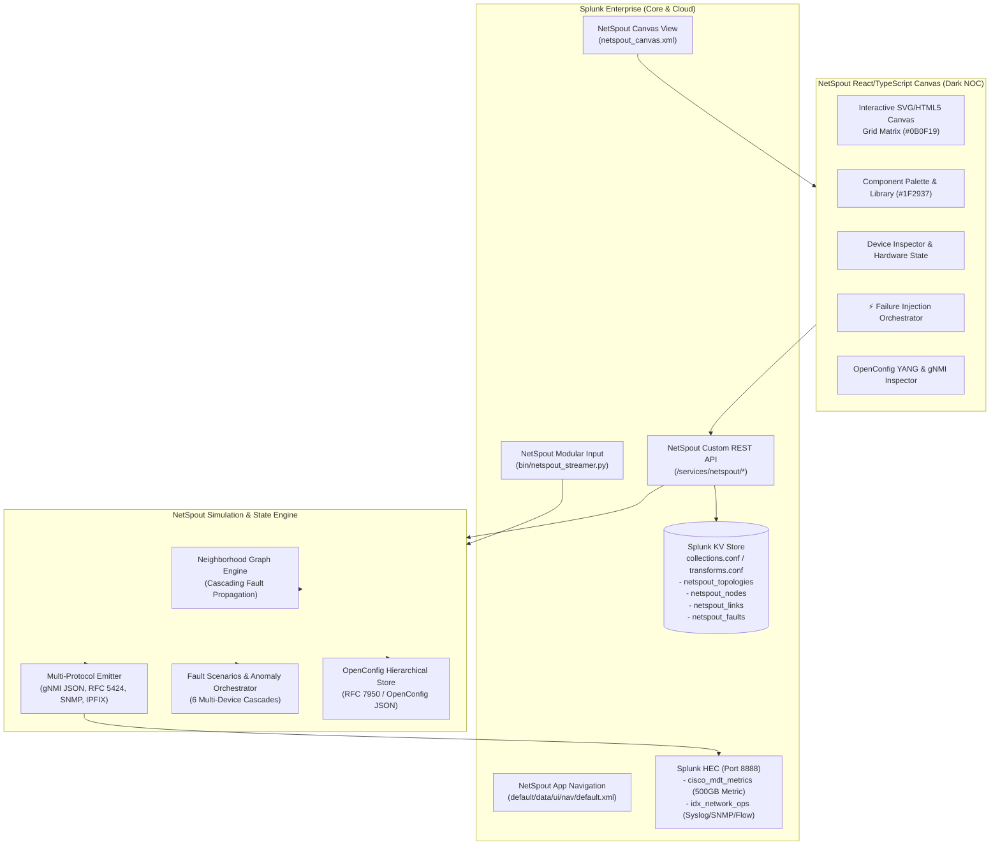

# NetSpout ⚡

**Native Splunk Network Telemetry Simulator, OpenConfig MDT Engine & Dynamic Failure Orchestrator**

[](https://www.splunk.com/)
[](LICENSE)
[](https://www.openconfig.net/)
[](https://www.typescriptlang.org/)
[](https://fastapi.tiangolo.com/)

NetSpout is a native Splunk application and network simulation platform engineered for network engineers, SOC analysts, and SREs. It pairs a visual, drag-and-drop network topology canvas with a high-throughput multi-protocol telemetry generation engine, OpenConfig model-driven telemetry (MDT), and dynamic failure injection with cross-device graph cascades.

---

## Key Capabilities

1. **Splunk-Native Dark NOC Canvas (`#0B0F19`)**:
   - Interactive drag-and-drop topology workspace designed to seamlessly blend into Splunk Enterprise Dark Mode.
   - Deep Slate Charcoal background with high-precision dot-matrix alignment grid (`#1E293B`).
   - Lighter Slate panels and sidebars (`#1F2937`) with fine borders (`#374151`).
   - Standardized Semantic Alert Palette:
     - **Critical / Down / Severe**: Vivid Crimson (`#EF4444`)
     - **Warning / Degraded / High CPU**: Amber (`#F59E0B`)
     - **Healthy / Operational / Active**: Emerald Green (`#10B981`)
     - **Telemetry Stream Active**: Electric Blue / Violet (`#8B5CF6`)

2. **OpenConfig YANG State Engine & Mock gNMI Telemetry**:
   - Maintains RFC 7950 hierarchical operational trees across all nodes:
     - `openconfig-interfaces`: Interface operational status, high-capacity octet counters, error rates, and carrier transitions.
     - `openconfig-bgp`: BGP peer state machine, prefixes received, prefixes advertised, and hold timer status.
     - `openconfig-platform`: Component state, CPU load, virtual memory load, and sensor temperatures.
     - `openconfig-system`: Device identity, hostnames, and boot times.
   - Dual gNMI subscription modes:
     - **`SAMPLE`**: Periodic batch telemetry emission to Splunk metric stores.
     - **`ON_CHANGE`**: Real-time event-driven pushes triggered immediately upon state changes.

3. **Topology-Aware Neighborhood Graph & Cascades**:
   - Nodes maintain neighbor relationships across physical and logical links.
   - State changes cascade across adjacent devices: cutting a fiber link automatically triggers interface carrier loss (`carrier.transitions +1`), drops BGP adjacencies (`ESTABLISHED -> IDLE`), and tears down OSPF neighbor states.

4. **Dynamic Fault Injection Engine**:
   - 6 production failure scenarios:
     1. **Physical Link Sever (`link_cut`)**: Fiber cut triggering interface LOS, SNMP `linkDown`, and BGP/OSPF teardown.
     2. **Hardware Resource Saturation (`hardware_exhaustion`)**: 98.4% CPU and 95.2% memory saturation with buffer overflow alarms.
     3. **BGP Route Flapping (`bgp_route_flap`)**: Peer notification 4/0, HoldTimer expiration, and route withdrawals.
     4. **Volumetric DDoS SYN Flood (`ddos_syn_flood`)**: 120,000 pps state-table saturation with firewall session drops.
     5. **Lateral Movement & Credential Abuse (`lateral_movement`)**: MITRE ATT&CK T1021.002 / T1078 SMB/RPC traversal.
     6. **Optical Transponder Degradation (`optical_ber_degradation`)**: Rx power fade (-24.8 dBm) and pre-FEC BER escalation.

5. **Splunk KV Store Persistence**:
   - Persists all topology diagrams, node positions, interface attributes, and fault audit records directly inside Splunk KV Store collections (`collections.conf`, `transforms.conf`).

---

## Architecture



---

## Quickstart & Installation

### Option 1: Native Splunk App Deployment

1. Clone or copy the `netspout/` folder into your Splunk Enterprise apps directory:
   ```bash
   cp -r netspout/ $SPLUNK_HOME/etc/apps/netspout
   ```
2. Restart Splunk or reload endpoints:
   ```bash
   $SPLUNK_HOME/bin/splunk restart
   ```
3. Navigate to Splunk Web:
   ```
   http://localhost:8000/en-US/app/netspout/netspout_canvas
   ```

### Option 2: Standalone Fast Simulation Mode

1. Navigate to the backend directory and activate Python virtual environment:
   ```bash
   cd backend
   python3 -m venv venv
   source venv/bin/activate
   pip install -r requirements.txt
   ```
2. Launch the backend microservice:
   ```bash
   python3 run.py
   ```
3. Access the visual NOC canvas at `http://localhost:8081`.

---

## Splunk SPL Analytics Examples

### Query OpenConfig Streaming Metrics
```spl
| mstats avg(_value) WHERE index=cisco_mdt_metrics metric_name=* BY metric_name
```

### Timechart Interface Traffic & Carrier Flaps
```spl
| mstats rate(interface.octets.in) AS in_bps, rate(interface.octets.out) AS out_bps, sum(carrier.transitions) AS flaps 
  WHERE index=cisco_mdt_metrics span=10s BY host
```

### Audit Fault Injection Cascades
```spl
index=idx_network_ops (sourcetype="cisco:ios:syslog" OR sourcetype="juniper:junos") "%LINK-3-UPDOWN" OR "%BGP-5-ADJCHANGE" OR "%OSPF-5-ADJCHG"
| stats count BY host, message
```

---

## Author & License

- **Author**: Mahamud Chowdhury ([mchowdhury@splunk.com](mailto:mchowdhury@splunk.com))
- **Repository**: [https://github.com/machowdhury/NetSpout](https://github.com/machowdhury/NetSpout)
- **License**: Apache-2.0
