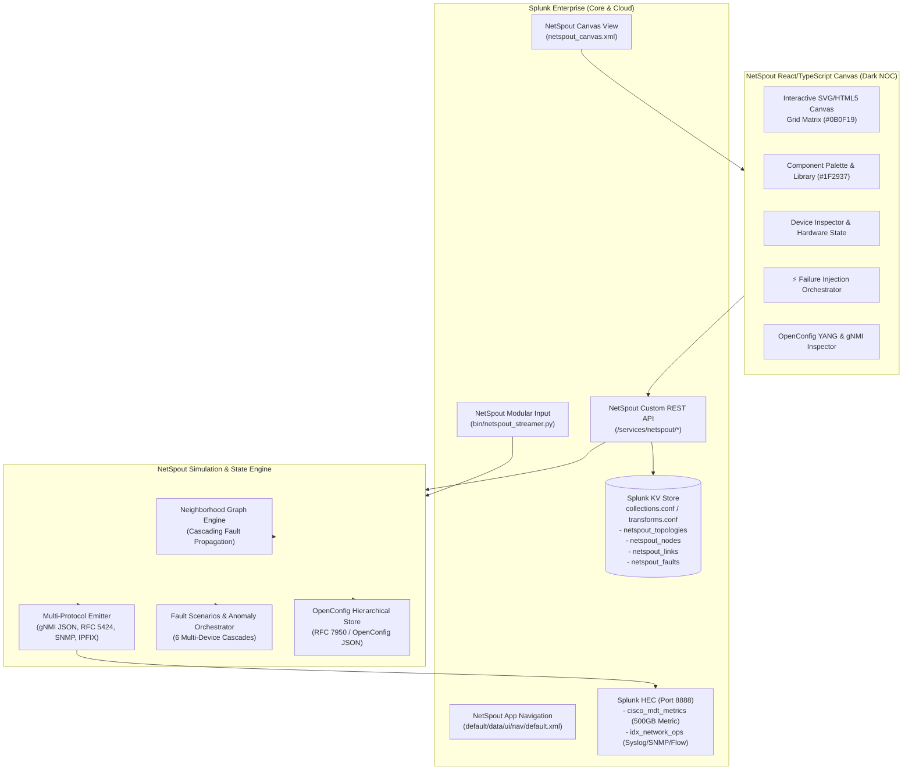

# NetSpout ⚡

**Native Splunk Network Telemetry Simulator, OpenConfig MDT Engine & Dynamic Failure Orchestrator**

[](https://www.splunk.com/)
[](LICENSE)
[](https://www.openconfig.net/)
[](https://www.typescriptlang.org/)
[](https://fastapi.tiangolo.com/)

NetSpout is a native Splunk application and network simulation platform engineered for network engineers, SOC analysts, and SREs. It pairs a visual, drag-and-drop network topology canvas with a high-throughput multi-protocol telemetry generation engine, OpenConfig model-driven telemetry (MDT), and dynamic failure injection with cross-device graph cascades.

---

## Key Capabilities

1. **Splunk-Native Dark NOC Canvas (`#0B0F19`)**:
   - Interactive drag-and-drop topology workspace designed to seamlessly blend into Splunk Enterprise Dark Mode.
   - Deep Slate Charcoal background with high-precision dot-matrix alignment grid (`#1E293B`).
   - Lighter Slate panels and sidebars (`#1F2937`) with fine borders (`#374151`).
   - Standardized Semantic Alert Palette:
     - **Critical / Down / Severe**: Vivid Crimson (`#EF4444`)
     - **Warning / Degraded / High CPU**: Amber (`#F59E0B`)
     - **Healthy / Operational / Active**: Emerald Green (`#10B981`)
     - **Telemetry Stream Active**: Electric Blue / Violet (`#8B5CF6`)

2. **OpenConfig YANG State Engine & Mock gNMI Telemetry**:
   - Maintains RFC 7950 hierarchical operational trees across all nodes:
     - `openconfig-interfaces`: Interface operational status, high-capacity octet counters, error rates, and carrier transitions.
     - `openconfig-bgp`: BGP peer state machine, prefixes received, prefixes advertised, and hold timer status.
     - `openconfig-platform`: Component state, CPU load, virtual memory load, and sensor temperatures.
     - `openconfig-system`: Device identity, hostnames, and boot times.
   - Dual gNMI subscription modes:
     - **`SAMPLE`**: Periodic batch telemetry emission to Splunk metric stores.
     - **`ON_CHANGE`**: Real-time event-driven pushes triggered immediately upon state changes.

3. **Topology-Aware Neighborhood Graph & Cascades**:
   - Nodes maintain neighbor relationships across physical and logical links.
   - State changes cascade across adjacent devices: cutting a fiber link automatically triggers interface carrier loss (`carrier.transitions +1`), drops BGP adjacencies (`ESTABLISHED -> IDLE`), and tears down OSPF neighbor states.

4. **Dynamic Fault Injection Engine**:
   - 6 production failure scenarios:
     1. **Physical Link Sever (`link_cut`)**: Fiber cut triggering interface LOS, SNMP `linkDown`, and BGP/OSPF teardown.
     2. **Hardware Resource Saturation (`hardware_exhaustion`)**: 98.4% CPU and 95.2% memory saturation with buffer overflow alarms.
     3. **BGP Route Flapping (`bgp_route_flap`)**: Peer notification 4/0, HoldTimer expiration, and route withdrawals.
     4. **Volumetric DDoS SYN Flood (`ddos_syn_flood`)**: 120,000 pps state-table saturation with firewall session drops.
     5. **Lateral Movement & Credential Abuse (`lateral_movement`)**: MITRE ATT&CK T1021.002 / T1078 SMB/RPC traversal.
     6. **Optical Transponder Degradation (`optical_ber_degradation`)**: Rx power fade (-24.8 dBm) and pre-FEC BER escalation.

5. **Splunk KV Store Persistence**:
   - Persists all topology diagrams, node positions, interface attributes, and fault audit records directly inside Splunk KV Store collections (`collections.conf`, `transforms.conf`).

---

## Architecture



---

## Quickstart & Installation

### Option 1: Native Splunk App Deployment

1. Clone or copy the `netspout/` folder into your Splunk Enterprise apps directory:
   ```bash
   cp -r netspout/ $SPLUNK_HOME/etc/apps/netspout
   ```
2. Restart Splunk or reload endpoints:
   ```bash
   $SPLUNK_HOME/bin/splunk restart
   ```
3. Navigate to Splunk Web:
   ```
   http://localhost:8000/en-US/app/netspout/netspout_canvas
   ```

### Option 2: Standalone Fast Simulation Mode (Docker All-In-One)

You can run the complete platform—**Splunk Enterprise 10.2, the NetSpout App, pre-configured 500GB metric tier, pre-compiled Dark NOC UI, 333 SC4SNMP MIBs, and the Fast Simulation Companion Service**—inside a single, zero-configuration Docker container.

#### Method A: Single Command `docker run`
```bash
docker run -d \
  --name splunk-netspout-standalone \
  -p 8000:8000 \
  -p 8088:8088 \
  -p 8089:8089 \
  -p 8081:8081 \
  -p 514:514/udp \
  -p 514:514/tcp \
  -e SPLUNK_START_ARGS="--accept-license" \
  -e SPLUNK_GENERAL_TERMS="--accept-sgt-current-at-splunk-com" \
  -e SPLUNK_PASSWORD="SplunkPassword123!" \
  netspout:standalone
```

#### Method B: Docker Compose (with OTel Collector Contrib)
```bash
docker compose -f docker-compose.standalone.yml up -d
```

Once running, access:
- **Splunk Web & NetSpout Canvas**: `http://localhost:8000` (User: `admin` / Password: `SplunkPassword123!`)
- **Fast Simulation Microservice**: `http://localhost:8081`
- **Splunk HEC Ingestion**: `https://localhost:8088/services/collector` (Pre-configured Token: `00000000-0000-0000-0000-000000000000`)
- **OTel Collector Ingestion**: `http://localhost:4318/v1/metrics` and `http://localhost:4318/v1/logs`

#### Method C: Local Host Python Service
1. Navigate to the backend directory and activate Python virtual environment:
   ```bash
   cd backend
   python3 -m venv venv
   source venv/bin/activate
   pip install -r requirements.txt
   ```
2. Launch the backend microservice:
   ```bash
   python3 run.py --port 8081
   ```
3. Access the visual NOC canvas at `http://localhost:8081`.

---

## Splunk Technology Add-on (TA) Architecture & Directory

NetSpout generates 100% schema-accurate vendor raw events and OpenConfig/SC4SNMP metrics **without bundling third-party TAs** inside the app package. This keeps the distribution lightweight (~5MB vs. multiple gigabytes), eliminates library version drift, and satisfies strict **Splunk Cloud AppInspect vetting**.

To enable Common Information Model (CIM) field extractions, install the corresponding official vendor TA from Splunkbase:

| Vendor / Platform | Recommended Splunkbase Add-on | App ID | Target NetSpout Sourcetypes |
| :--- | :--- | :---: | :--- |
| **Cisco Catalyst Center** | [Splunk Add-on for Cisco Catalyst Center](https://splunkbase.splunk.com/app/5580) | `5580` | `cisco:catalyst:devicehealth`, `cisco:catalyst:issue`, `cisco:dnac:*` |
| **Cisco SD-WAN** | [Cisco SD-WAN Add-on for Splunk](https://splunkbase.splunk.com/app/7538) | `7538` | `cisco:sdwan:linkhealth`, `cisco:sdwan:BGP-5-ADJCHANGE`, `cisco:sdwan:*` |
| **Cisco Identity (ISE)** | [Splunk Add-on for Cisco ISE](https://splunkbase.splunk.com/app/1924) | `1924` | `cisco:ise:syslog`, `cisco:ise:tacacs-policyset` |
| **Cisco Secure Firewall** | [Cisco Security Cloud Add-on for Splunk](https://splunkbase.splunk.com/app/6259) | `6259` | `cisco:sfw:estreamer`, `cisco:sfw:policy`, `cisco:ftd:syslog` |
| **Palo Alto Networks** | [Palo Alto Networks Add-on for Splunk](https://splunkbase.splunk.com/app/2757) | `2757` | `pan:traffic`, `pan:threat`, `pan:system` |
| **Fortinet FortiGate** | [Fortinet FortiGate Add-on for Splunk](https://splunkbase.splunk.com/app/2800) | `2800` | `fortinet:fortigate:traffic`, `fortinet:fortigate:sdwan:alert` |
| **Arista EOS** | [Arista Networks EOS Add-on for Splunk](https://splunkbase.splunk.com/app/3350) | `3350` | `arista:eos:syslog`, `arista:metrics:telemetry` |
| **Juniper Junos** | [Splunk Add-on for Juniper](https://splunkbase.splunk.com/app/2855) | `2855` | `juniper:syslog` |
| **SNMP Engine** | [Splunk Connect for SNMP (SC4SNMP)](https://splunk.github.io/splunk-connect-for-snmp/) | `SC4SNMP` | `sc4snmp:metric`, `sc4snmp:event` |

---

## Production SPL Analytics Reference

### 1. Metric Indexes (`cisco_mdt_metrics` - 500GB Tier)

#### Explore All Streaming Metric Channels
```spl
| mstats avg(_value) WHERE index=cisco_mdt_metrics metric_name=* BY metric_name
```

#### Real-Time Interface Throughput & Carrier Flap Rate
```spl
| mstats rate(interface.octets.in) AS rx_bps, rate(interface.octets.out) AS tx_bps, sum(carrier.transitions) AS flaps 
  WHERE index=cisco_mdt_metrics span=10s BY host, interface
```

#### Device Hardware Health (CPU & Virtual Memory Saturation)
```spl
| mstats latest(platform.cpu.utilization) AS cpu_pct, latest(platform.memory.utilization) AS mem_pct 
  WHERE index=cisco_mdt_metrics span=10s BY host
```

#### BGP Peer Finite State Machine (FSM) & Routing Table Size
```spl
| mstats latest(bgp.peer.state) AS fsm_state, latest(bgp.prefixes.received) AS prefixes 
  WHERE index=cisco_mdt_metrics BY host, peer
```

#### SC4SNMP 64-Bit High-Capacity Octets Polling
```spl
| mstats rate(ifHCInOctets) AS in_bps, rate(ifHCOutOctets) AS out_bps 
  WHERE index=cisco_mdt_metrics span=15s BY host, ifIndex
```

### 2. Event Indexes (`idx_network_ops`, `cisco_secure_fw`, `sdwan`)

#### SC4SNMP Trap Alarms & Decoded Varbinds
```spl
index=idx_network_ops sourcetype="sc4snmp:event" snmp_trap_name=*
| table _time, host, snmp_trap_name, snmp_trap_oid, severity, varbinds.ifDescr
```

#### Cross-Device Cascading Fault Analysis (Link Loss & Route Teardowns)
```spl
index=idx_network_ops (sourcetype="cisco:ios:syslog" OR sourcetype="juniper:syslog") ("%LINK-3-UPDOWN" OR "%BGP-5-ADJCHANGE" OR "%OSPF-5-ADJCHG")
| stats count, values(message) AS alarm_text BY host
```

#### Next-Gen Firewall Traffic Drops & SYN Flood Tracking
```spl
index=idx_security_fw (sourcetype="pan:traffic" OR sourcetype="cisco:sfw:estreamer") action="drop"
| timechart span=1m count BY app
```

#### Cisco Catalyst Device Health Score Analytics
```spl
index=idx_network_ops sourcetype="cisco:catalyst:devicehealth"
| spath path=healthScore output=score
| stats avg(score) AS avg_score, min(score) AS min_score BY host
```

---

## Author & License

- **Creator & Lead Architect**: Mahamudul Chowdhury ([mchowdhury@splunk.com](mailto:mchowdhury@splunk.com))
- **Repository**: [https://github.com/machowdhury/NetSpout](https://github.com/machowdhury/NetSpout)
- **License**: Apache-2.0
