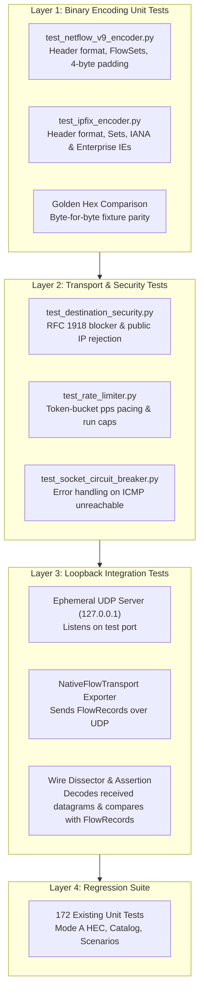

# NETSPOUT GATE 11B TEST PLAN: NATIVE TRANSPORT & PROTOCOL VERIFICATION

**Gate:** NetSpout Gate 11 (Native Transport Architecture & NetFlow/IPFIX Protocol Definition)  
**Target Milestone:** Gate 11B (Native Flow Transport Implementation)  
**Author:** Mahamudul Chowdhury (`machowdhury@yahoo.com`)  
**Repository:** [https://github.com/machowdhury/NetSpout](https://github.com/machowdhury/NetSpout)  

---

## 1. Objective & Scope

Gate 11 establishes the architectural foundation, protocol specifications, and threat model for NetSpout Native Transport.  
**Gate 11B** will implement the Python standard-library packet encoders (`NetFlowV9Encoder`, `IPFIXEncoder`), the safe UDP transport engine (`NativeFlowTransport`), and integration with NetSpout's telemetry dispatch pipeline.

This Test Plan specifies the rigorous four-layer testing strategy that will validate Gate 11B before any code is merged:
1. **Layer 1: Binary Encoding Unit Tests:** Byte-level validation of RFC 3954 and RFC 7011/7012 datagrams against static golden hex fixtures.
2. **Layer 2: Transport & Security Unit Tests:** Validation of RFC 1918 safe-by-default destination blockers, token-bucket rate limiting, run caps, and socket lifecycle management.
3. **Layer 3: Local Loopback Integration Tests:** In-memory loopback UDP listener tests validating that serialized datagrams can be received, framed, and correctly decoded back into flow records.
4. **Layer 4: Full Regression Suite Execution:** Ensuring all 172 existing NetSpout test cases continue to pass with zero failures or performance degradation.

---

## 2. Test Architecture & Four-Layer Strategy



---

## 3. Layer 1: Binary Encoding Unit Tests

File targets: `tests/test_netflow_v9_encoder.py`, `tests/test_ipfix_encoder.py`

### 3.1. NetFlow v9 Encoder Verification Matrix
| Test Case ID | Test Name | Invariant / Property Under Test | Success Criteria |
| :--- | :--- | :--- | :--- |
| **NF9-UNIT-01** | `test_header_format` | 16-byte header fields: Version (`9`), Count, sysUpTime, UNIX secs, Sequence, Source ID. | `len(header) == 16`; `struct.unpack('!HHIIII', header)[0] == 9`. |
| **NF9-UNIT-02** | `test_template_flowset_structure` | Template FlowSet ID (`0`), Length, Template ID (`256`), Field Count (`16`), field type/length pairs. | FlowSet length field exactly matches encoded byte size; 4-byte aligned. |
| **NF9-UNIT-03** | `test_data_flowset_padding` | Data FlowSet carries records and pads correctly to a 4-byte boundary. | `len(data_flowset) % 4 == 0`; padding bytes are `0x00`. |
| **NF9-UNIT-04** | `test_sequence_number_tracking` | Cumulative sequence number increments by the number of flow records exported, not the number of packets. | After exporting 3 datagrams of 10 records each, sequence number is 30. |
| **NF9-UNIT-05** | `test_golden_fixture_byte_parity`| Exact byte comparison of generated datagram against the Gate 11 NetFlow v9 Golden Hex Fixture. | `encoded_bytes == GOLDEN_HEX_NF9`. |

### 3.2. IPFIX Encoder Verification Matrix
| Test Case ID | Test Name | Invariant / Property Under Test | Success Criteria |
| :--- | :--- | :--- | :--- |
| **IPFIX-UNIT-01**| `test_header_format` | 16-byte header fields: Version (`10`), Length, Export Time, Sequence Number, Observation Domain ID. | `len(header) == 16`; `struct.unpack('!HHIII', header)[0] == 10`. |
| **IPFIX-UNIT-02**| `test_header_length_field` | Header length field indicates total IPFIX message size in octets (including 16-byte header). | `length_field == len(encoded_message)`. |
| **IPFIX-UNIT-03**| `test_standard_template_set` | Template Set ID (`2`), Template ID (`256`), 15 core IANA field specifiers. | `len(set) % 4 == 0`; all Enterprise bits (`bit 0`) are `0`. |
| **IPFIX-UNIT-04**| `test_enterprise_template_set`| Enterprise field specifiers set `bit 0 == 1` (`0x8000`) and append 4-byte Private Enterprise Number (PEN). | Field specifier length is 8 bytes; PEN matches configured value. |
| **IPFIX-UNIT-05**| `test_variable_length_fields` | RFC 7011 Section 7 variable-length encoding (<255 bytes prefix with 1 byte; >=255 bytes prefix with 3 bytes). | Correct prefix byte and string payload encoding. |
| **IPFIX-UNIT-06**| `test_data_record_sequence` | Sequence number counts only Data Records, strictly excluding Template Records. | Sequence number increments by 1 per data record. |
| **IPFIX-UNIT-07**| `test_golden_fixture_byte_parity`| Exact byte comparison of generated datagram against the Gate 11 IPFIX Golden Hex Fixture. | `encoded_bytes == GOLDEN_HEX_IPFIX`. |

---

## 4. Layer 2: Transport & Security Unit Tests

File target: `tests/test_native_flow_transport.py`

| Test Case ID | Test Name | Condition / Input | Expected Result |
| :--- | :--- | :--- | :--- |
| **SEC-UNIT-01** | `test_allow_loopback_destinations` | Destination `127.0.0.1` or `::1` | Allowed; socket initializes successfully. |
| **SEC-UNIT-02** | `test_allow_rfc1918_destinations` | Destinations `10.1.2.3`, `172.20.0.1`, `192.168.1.100` | Allowed; socket initializes successfully. |
| **SEC-UNIT-03** | `test_block_public_destination_by_default` | Destination `8.8.8.8` or `1.1.1.1` (without env override) | Immediately raises `DestinationSecurityException`; zero packets emitted. |
| **SEC-UNIT-04** | `test_public_destination_override` | Destination `8.8.8.8` with `NETSPOUT_ALLOW_PUBLIC_EXPORT=true` | Emits critical audit log warning and permits export. |
| **SEC-UNIT-05** | `test_rate_limiter_pacing` | Exporter emits 50 packets at 10 pps | Total duration is approximately 5.0 seconds (within ±10% margin). |
| **SEC-UNIT-06** | `test_scenario_run_cap` | Scenario generates 15,000 records; cap set to 500 packets | Exporter terminates exactly at 500 packets and logs a ceiling cap warning. |
| **SEC-UNIT-07** | `test_socket_error_circuit_breaker` | Destination socket returns `ECONNREFUSED` consecutively | Terminates transmission after 5 consecutive errors without unhandled exception. |

---

## 5. Layer 3: Local Loopback Integration Tests

File target: `tests/test_native_flow_loopback.py`

### 5.1. Integration Test Workflow
```python
import socket
import unittest
from netspout_core.models import FlowRecord
from netspout_core.transport.native_flow import NativeFlowTransport

class TestNativeFlowLoopback(unittest.TestCase):
    def test_loopback_e2e_ipfix_exchange(self):
        # 1. Bind ephemeral UDP receiver on 127.0.0.1
        rx_sock = socket.socket(socket.AF_INET, socket.SOCK_DGRAM)
        rx_sock.bind(("127.0.0.1", 0))
        _, port = rx_sock.getsockname()
        rx_sock.settimeout(2.0)

        # 2. Instantiate NativeFlowTransport targeting local receiver
        transport = NativeFlowTransport(
            target_host="127.0.0.1",
            target_port=port,
            protocol="IPFIX"
        )

        # 3. Create canonical FlowRecord
        record = FlowRecord(
            src_ip="10.0.1.10",
            dst_ip="10.0.2.20",
            src_port=49153,
            dst_port=443,
            protocol=6,
            packet_count=1024,
            byte_count=524288
        )

        # 4. Transmit flow record
        transport.send_flow_records([record])

        # 5. Receive datagram on local receiver
        data, _ = rx_sock.recvfrom(2048)
        rx_sock.close()

        # 6. Validate wire packet framing
        self.assertGreaterEqual(len(data), 16)
        version, length, export_time, seq_no, obs_id = struct.unpack("!HHIII", data[:16])
        self.assertEqual(version, 10)
        self.assertEqual(length, len(data))
```

---

## 6. External Tool Verification Guide (Wireshark / TShark)

To ensure NetSpout output is 100% interoperable with standard packet analysis tools, Gate 11B includes an automated PCAP fixture capture and dissection check:

```bash
# Capture exported packets to pcap
sudo tcpdump -i lo0 -w /tmp/netspout_flow_test.pcap "udp port 2055 or udp port 4739" &
TCPDUMP_PID=$!

# Run NetSpout loopback export test
python3 -m unittest tests/test_native_flow_loopback.py

# Terminate tcpdump
kill -INT $TCPDUMP_PID

# Validate dissection using tshark
tshark -r /tmp/netspout_flow_test.pcap -V -Y "cflow or ipfix" > /tmp/tshark_dissection.txt

# Verify zero malformed packet warnings
grep -i "malformed" /tmp/tshark_dissection.txt && echo "FAIL: Dissector detected malformed packets" || echo "PASS: Clean wire dissection"
```

---

## 7. Gate 11B Acceptance Criteria Checklist

Before Gate 11B can be certified:
- [ ] Layer 1: Unit tests for `NetFlowV9Encoder` pass with 100% test coverage.
- [ ] Layer 1: Unit tests for `IPFIXEncoder` pass with 100% test coverage.
- [ ] Layer 1: Golden hex fixture tests verify byte-for-byte parity.
- [ ] Layer 2: RFC 1918 safe-by-default destination tests pass.
- [ ] Layer 2: Rate limiter and run cap unit tests pass.
- [ ] Layer 3: Loopback UDP exchange integration test passes.
- [ ] Layer 4: All 172 existing NetSpout unit tests continue to pass without error.
- [ ] AppInspect test passes: `splunk-appinspect inspect netspout.spl` has 0 manual/automated failures.
