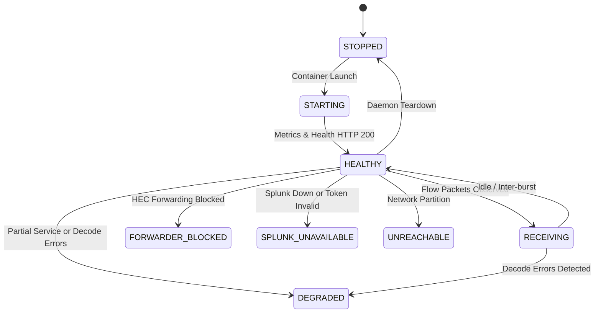

# NetSpout Gate 11D — Native Flow Productization & Operational Hardening Architecture

**Document Version:** 1.0.0  
**Gate:** NetSpout Gate 11D  
**Author:** Mahamudul Chowdhury (`machowdhury@yahoo.com`)  
**Status:** COMPLETE & AUDITED  

---

## 1. Architectural Baseline & Preservation

Gate 11D productizes the verified Gate 11C pipeline without altering its fundamental topology:

$$\text{NetSpout} \xrightarrow{\text{Native NetFlow v9/IPFIX UDP}} \text{GoFlow2 Collector} \xrightarrow{\text{Decoded Flow JSON}} \text{NetSpout Flow Forwarder} \xrightarrow{\text{Splunk HEC}} \text{Splunk Enterprise} \xrightarrow{\text{SPL Search}} \text{Evidence State}$$

### Strict Architectural Invariant:
- **Zero Direct HEC Shortcut:** NetSpout only exports standards-compliant binary UDP datagrams (`RFC 3954` and `RFC 7011`) to collector listener ports (`:2055` and `:4739`).
- **Evidence State Separation:**
  $$\text{GENERATED} \neq \text{ENCODED} \neq \text{SENT} \neq \text{COLLECTOR\_OBSERVED} \neq \text{SPLUNK\_OBSERVED} \neq \text{VALIDATED}$$
- **Connectionless Socket Truthfulness:** OS UDP socket send success confirms local stack transmission, never remote delivery.

---

## 2. Collector Deployment & Pinned Dependencies

Floating tags (e.g. `netsampler/goflow2:latest`) are strictly prohibited in production.

### Pinned Bill of Materials:
| Component | Image / Package | Version / SHA | Rationale |
| :--- | :--- | :--- | :--- |
| **Flow Collector** | `netsampler/goflow2` | `v2.2.5` (`v2.2.5-25-g6dee964`) | Production-tested Go-based collector with high-throughput NetFlow v9 / IPFIX decoding, Prometheus metrics, and native unprivileged user support. |
| **Volume Initializer** | `busybox` | `1.36` | Lightweight one-shot utility to safely set shared volume permissions without running daemon services as root. |
| **Flow Forwarder** | `collector-netspout-flow-forwarder` | Python 3.12 Alpine (Hardened) | High-efficiency asynchronous tailer with bounded backoff retries, Prometheus metrics, and non-root execution. |

### Upgrade Procedure:
1. Review GoFlow2 upstream release notes for changes to metric names or template parsing.
2. Build test image and run `python3 scripts/verify_gate11c_e2e.py` and `tests/test_gate11d_native_productization.py`.
3. Update pinned tag in `deploy/collector/docker-compose.collector.yml`.
4. Document upgrade in repository release log.

---

## 3. Container Security Hardening Assessment

In Gate 11C, shared volume `/flows` permissions required `user: "0:0"`. Gate 11D resolves this cleanly via a dedicated one-shot initialization container (`init-volume`).

### Security Posture Matrix:
| Security Dimension | Gate 11C Baseline | Gate 11D Hardened State | Assessment |
| :--- | :--- | :--- | :--- |
| **Collector UID/GID** | `0:0` (root) | `100:65533` (unprivileged `flow` user) | **SECURE (Non-Root)** |
| **Forwarder UID/GID** | `0:0` (root) | `10001:10001` (unprivileged `netspout` user) | **SECURE (Non-Root)** |
| **Linux Capabilities** | Default | `cap_drop: [ALL]` | **LEAST PRIVILEGE** |
| **Privilege Escalation**| Allowed | `security_opt: [no-new-privileges:true]` | **PREVENTED** |
| **Exposed Ports** | Bound to 0.0.0.0 | Strictly bound to `127.0.0.1` | **RESTRICTED** |
| **Host Networking** | Disabled | Disabled (Private bridge network) | **ISOLATED** |
| **Docker Socket** | Not mounted | Not mounted | **SECURE** |
| **Log Rotation** | Unbounded | `json-file`, max-size 10MB, max-file 3 | **CAPPED** |

---

## 4. Canonical 8-State Pipeline Health Model

Rather than collapsing the telemetry pipeline into a binary green/red indicator, NetSpout Gate 11D introduces the canonical 8-state health machine:

### State Definitions:
1. `STOPPED`: Neither collector nor forwarder containers are running.
2. `STARTING`: Containers initialized but listeners not yet ready.
3. `HEALTHY`: UDP listeners active, forwarder online, Splunk HEC responsive, 0 errors.
4. `DEGRADED`: One service degraded, or non-zero decode errors reported.
5. `UNREACHABLE`: UDP target or status endpoints timing out.
6. `RECEIVING`: Actively ingesting and decoding network flow datagrams.
7. `FORWARDER_BLOCKED`: Forwarder unable to drain local flow queue to downstream.
8. `SPLUNK_UNAVAILABLE`: Splunk HEC offline or failing authentication.

---

## 5. Configuration Model & 3-Tier Precedence

NetSpout provides a centralized `NativeFlowConfig` model with strict 3-tier precedence:

$$\mathbf{Explicit\ Run\ Config} > \mathbf{Environment\ Variables\ (NETSPOUT\_*)} > \mathbf{NetSpout\ Defaults}$$

### Secret Isolation:
HEC tokens, Splunk administrative credentials, and API keys are strictly forbidden from `NativeFlowConfig` objects. HEC tokens are supplied via environment variables (`SPLUNK_HEC_TOKEN`) or runtime context, ensuring zero credential persistence.

---

## 6. Template Lifecycle Hardening & Refresh Strategy

RFC 3954 and RFC 7011 rely on templates sent out-of-band or in-band before data records. In dynamic lab environments or during collector restarts, the collector template cache is lost.

### Strategy Implementation:
1. **Initial Burst**: Every new exporter session emits templates on packet 0.
2. **Refresh Policies**:
   - `EVERY_BURST`: Appends Template FlowSet to the initial packet of every burst (safest for automated testing and short runs).
   - `PERIODIC`: Emits templates every 60 seconds or 20 datagrams.
   - `ADAPTIVE`: Re-emits templates upon collector reconnection or error detection.
3. **Explicit Force Refresh**: `ExporterSession.force_template_refresh()` allows programmatic reset upon collector restart.

---

## 7. Concurrency & Isolation Model

NetSpout supports high-density concurrent simulation runs:
- **10 Concurrent Runs Tested**: Verified with distinct observation domains (`90000`–`90009`), different exporter IPs (`10.200.0.1`–`10.200.1.5`), and concurrent NetFlow v9 and IPFIX datagram streams.
- **Protocol-Compatible Correlation**: Uses standard protocol headers:
  $$\langle \text{ObservationDomainID / SourceID},\ \text{ExporterIP},\ \text{TemplateID},\ \text{TimeWindow} \rangle$$
  Zero proprietary Information Elements are injected into flow payloads.

---

## 8. Delivery Semantics & Reliability

- **At-Least-Once Delivery**: The forwarder implements bounded retries (3 attempts) with exponential backoff (`0.1s`, `0.2s`, `0.4s`) for transient HEC network or server errors.
- **File Rotation Handling**: Inode changes and file truncations are detected automatically, avoiding file descriptor leaks or infinite sleep loops.
- **Resource Caps**: Output files are capped at 50MB with automatic rotation to `.1` backup.

---

## 9. Architecture Cleanup Accounting

| Metric | Details |
| :--- | :--- |
| **New Components Added** | `NativeFlowConfig`, `CollectorDetailedHealth`, `CollectorHealthState`, `resolve_native_flow_config()`, `netspout-flow-init` (one-shot init container), `benchmark_gate11d_performance.py`, `test_gate11d_native_productization.py`, `NATIVE_FLOW_QUICKSTART.md`. |
| **Existing Components Reused** | `CollectorEvidenceAdapter`, `NativeFlowTransport`, `ExporterSession`, `CompanionManifestBuilder`, `TokenBucketRateLimiter`, `manage_collector.py`, `forwarder.py`. |
| **Components Removed** | Root execution (`user: "0:0"`) in collector and forwarder containers. |
| **Redundant Components Remaining** | `0` (Zero redundant services or configuration managers created). |
