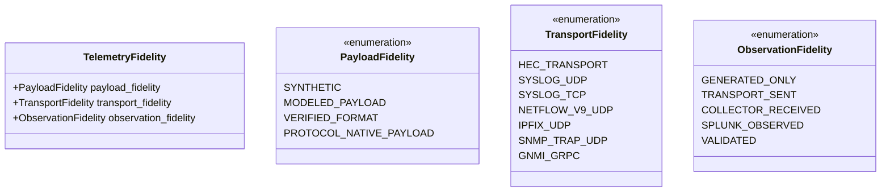

# NETSPOUT GATE 11 — NATIVE TRANSPORT ARCHITECTURE SPECIFICATION

**Gate:** NetSpout Gate 11 (Native Transport Architecture & NetFlow/IPFIX Protocol Definition)  
**Status:** ARCHITECTURE APPROVED FOR IMPLEMENTATION (GATE 11B)  
**Author:** Mahamudul Chowdhury (`machowdhury@yahoo.com`)  
**Repository:** [https://github.com/machowdhury/NetSpout](https://github.com/machowdhury/NetSpout)  
**Target Protocols:** Cisco NetFlow v9 (RFC 3954) & IETF IPFIX (RFC 7011 / RFC 7012)  

---

## 1. Executive Summary & Product Principle

NetSpout was designed to enable network, security, and observability engineers to investigate and validate complex network behavior in Splunk without owning physical infrastructure. Through Gates 1 to 10.6, NetSpout perfected **Mode A (Direct-to-Splunk)**, emitting modeled syslog, metric, and event telemetry directly to Splunk HTTP Event Collector (HEC).

Gate 11 establishes the architectural foundation for **Mode B (Native Transport)**, enabling NetSpout to act as a **true network telemetry exporter** transmitting wire-accurate binary datagrams over UDP to standard collection tiers (such as Splunk Stream, ElastiFlow, or nProbe) before reaching Splunk.

```mermaid
graph TD
    subgraph ModeA ["MODE A: DIRECT-TO-SPLUNK (Demo & Fast Proof)"]
        A1[NetSpout Simulation Engine] -->|Modeled JSON / Syslog via HEC| A2[Splunk HEC :8888]
        A2 -->|Index Write| A3[(idx_network_ops / cisco_mdt_metrics)]
        A3 -->|SPL Verification| A4[Step 5: Prove]
    end

    subgraph ModeB ["MODE B: NATIVE TRANSPORT (Pipeline & Collector Test)"]
        B1[NetSpout Simulation Engine] -->|FlowRecord Primitives| B2[Native Flow Transport Engine]
        B2 -->|NetFlow v9 / IPFIX over UDP :2055 / :4739| B3[Real Flow Collector e.g. Splunk Stream]
        B3 -->|Parsed Flow Telemetry| B4[Splunk Ingestion Pipeline]
        B4 -->|Index Write| B5[(Flow Index e.g. stream:netflow)]
        B1 -.->|Companion Control Manifest via HEC| B5
        B5 -->|Unified Audit & Verification| B6[Step 5: Prove]
    end
```



### The Dual-Mode Coexistence Invariant
1. **Mode A (Direct-to-Splunk)** remains the default, fast-start, zero-infrastructure path for training, demonstrations, and baseline Golden Path executions.
2. **Mode B (Native Transport)** is an opt-in, highly realistic transport path designed to validate whether a customer's collection infrastructure, firewall rules, parsing logic, and indexing pipelines behave correctly when receiving actual network flow packets.
3. Neither mode displaces the other. Scenario logic and telemetry generators remain completely decoupled from transport mechanics.

---

## 2. Current Transport Forensics & Extension Point

### 2.1. Current State in NetSpout
A thorough forensic audit of the NetSpout codebase revealed:
- `src/netspout_core/telemetry_dispatcher.py` handles multi-pipeline dispatch: `emit_hec()`, `emit_otel()`, `emit_telegraf()`, and `emit_syslog()` (RFC 5424/3164 text over UDP/TCP).
- Flow telemetry is currently represented in `src/netspout_core/log_engine.py` via `format_arista_ipfix_log()` (JSON-wrapped simulated IPFIX record) and `format_ipfix_flow()` (key-value text line), both stamped as `LogEntry` objects and dispatched over HEC.
- In `catalog/telemetry_protocols.json`, 8 protocols are cataloged (`syslog_rfc5424`, `syslog_rfc3164`, `hec_event`, `hec_metric`, `snmp_sc4snmp`, `gnmi_openconfig`, `otlp_http`, `telegraf_influx`). Neither `netflow_v9` nor `ipfix` is currently registered as a native binary wire transport.

### 2.2. Architectural Extension Point
The extension point for Native Transport must be strictly situated at the **Transport Boundary**, downstream of scenario generation:

```
[Scenario Contract]
        │
        ▼
[Scenario Runner]
        │
        ▼
[Event / Flow Generators]  ──────────► Produces Canonical Telemetry Records (FlowRecord / LogRecord)
        │
        ▼
[Telemetry Transport Layer] ◄───────── EXTENSION POINT (Selects HEC vs UDP Wire Transport)
   ├── HECTransport (Mode A)
   └── NativeFlowTransport (Mode B)
           ├── NetFlowV9Encoder
           └── IPFIXEncoder
```

**Guardrail:** We will NEVER create `NativeScenarioRunner`, `NetFlowScenarioRunner`, or `IPFIXScenarioRunner`. Scenario progression (root fault, propagation, failover, recovery) is an invariant state machine; transport is a pluggable delivery mechanism.

---

## 3. The Three Independent Fidelity Dimensions

To eliminate ambiguity between simulated scenarios, protocol encoding, and observation proof, NetSpout establishes a strict three-dimensional taxonomy:



### 3.1. Dimension 1: Payload Fidelity
Defines the technical truth and structure of the data:
- `SYNTHETIC`: Procedurally generated mock values with minimal protocol schema.
- `MODELED_PAYLOAD`: Structured data deterministically modeling real vendor behavior (e.g. Cisco IOS-XR TI-LFA syslog, Cisco MDT YANG tree) but formatted as text/JSON.
- `VERIFIED_FORMAT`: Formatted and validated against industry standard schemas (e.g. RFC 5424, RFC 7951).
- `PROTOCOL_NATIVE_PAYLOAD`: Packed binary PDU complying strictly with IETF/vendor wire specifications (e.g. RFC 3954 NetFlow v9 FlowSets, RFC 7011 IPFIX Sets).

### 3.2. Dimension 2: Transport Fidelity
Defines the wire transmission mechanism:
- `HEC_TRANSPORT`: HTTP/HTTPS POST to Splunk REST collector endpoint.
- `SYSLOG_UDP` / `SYSLOG_TCP`: Standard syslog socket export to port 514.
- `NETFLOW_V9_UDP`: Raw binary UDP export to flow collector (default port 2055).
- `IPFIX_UDP`: Raw binary UDP export to IPFIX collector (default port 4739).
- `SNMP_TRAP_UDP`: Binary SNMP trap PDU export (default port 162).
- `GNMI_GRPC`: Native gRPC/HTTP2 transport for streaming telemetry.

### 3.3. Dimension 3: Observation Fidelity
Defines where reception was actually proven:
- `GENERATED_ONLY`: Record was created in simulator memory; no dispatch attempted.
- `TRANSPORT_SENT`: Socket `sendto()` succeeded at the OS network interface; delivery unacknowledged.
- `COLLECTOR_RECEIVED`: Real flow collector explicitly reported receipt via metrics or socket capture.
- `SPLUNK_OBSERVED`: Evidence was queried and retrieved from a Splunk index via REST search.
- `VALIDATED`: Emitted and observed telemetry satisfied all scenario contract rules.

*Example:* A run simulating an MPLS bypass failover using native IPFIX has:
- `Payload Fidelity`: `PROTOCOL_NATIVE_PAYLOAD`
- `Transport Fidelity`: `IPFIX_UDP`
- `Observation Fidelity`: `SPLUNK_OBSERVED`
- `Simulation Ground Truth`: Deterministically modeled protocol behavior (not physical hardware).

---

## 4. Native Transport Abstraction & Result Contract

### 4.1. Conceptual `TelemetryTransport` Interface
```python
class TelemetryTransport(ABC):
    """Abstract base class for all NetSpout telemetry dispatch engines."""
    
    @abstractmethod
    def send_batch(
        self,
        records: List[TelemetryRecord],
        destination: DestinationConfig,
        session: ExporterSession
    ) -> TransportResult:
        """Encodes and dispatches a batch of telemetry records."""
        pass

    @abstractmethod
    def test_connectivity(self, destination: DestinationConfig) -> Tuple[bool, str]:
        """Probes destination reachability or socket feasibility."""
        pass
```

### 4.2. Conceptual `TransportResult` Model
```python
class TransportResult(BaseModel):
    transport_type: str                   # e.g. "IPFIX_UDP", "NETFLOW_V9_UDP", "HEC"
    destination_host: str
    destination_port: int
    records_received: int                 # Count of records passed into encoder
    records_encoded: int                  # Count of records packed into flow sets
    datagrams_attempted: int              # Number of UDP packets passed to sendto()
    datagrams_sent: int                   # Number of UDP packets successfully sent by OS
    bytes_sent: int                       # Total wire bytes transmitted
    templates_sent: int                   # Number of template sets emitted
    sequence_start: int                   # Initial sequence number
    sequence_end: int                     # Final sequence number
    encoding_failures: int = 0
    send_failures: int = 0
    elapsed_ms: float = 0.0
    errors: List[str] = Field(default_factory=list)
```

---

## 5. Evidence Invariant Preservation: The 6-Stage Chain

NetSpout Gate 6 established the cardinal rule: `GENERATED ≠ DISPATCHED ≠ OBSERVED ≠ VALIDATED`.
Native UDP transport extends this into a rigorous 6-stage chain:

```
[1. RECORDS GENERATED]  -> Simulator computes flow events (e.g. 100 flow records)
         │
         ▼
[2. RECORDS ENCODED]    -> Binary encoder serializes records into FlowSets (e.g. 100 records in 4 datagrams)
         │
         ▼
[3. DATAGRAMS SENT]     -> OS socket sendto() succeeds (e.g. 4 UDP datagrams sent)
         │
         ▼
[4. COLLECTOR RECEIVED] -> Collector receives and parses datagrams (verified via collector API or tshark)
         │
         ▼
[5. SPLUNK OBSERVED]    -> Splunk indexes parsed flow events (verified via | search index=stream:netflow)
         │
         ▼
[6. VALIDATED]          -> NetSpout ValidationEngine proves fault and failover criteria
```

### UDP Semantics Rule
`sendto()` returning success proves ONLY Stage 3 (`DATAGRAMS SENT`). It **never** proves Stage 4 (`COLLECTOR RECEIVED`) or Stage 5 (`SPLUNK OBSERVED`). The NetSpout UI and API will never display "Delivered" upon socket send; it will display "Sent over UDP (Awaiting Collector/Splunk Observation)".

---

## 6. Canonical Flow Data Model: `FlowRecord`

To prevent corrupting binary flow records with log-specific abstractions, NetSpout defines `FlowRecord` as a first-class citizen alongside `LogEntry`:

```python
class FlowRecord(BaseModel):
    """Canonical network flow record representation."""
    src_ip: str                           # IPv4 or IPv6 string
    dest_ip: str                          # IPv4 or IPv6 string
    src_port: int                         # 0..65535
    dest_port: int                        # 0..65535
    protocol: int                         # 6=TCP, 17=UDP, 1=ICMP, 58=ICMPv6
    tcp_flags: int = 0                    # Bitmask (SYN=2, ACK=16, FIN=1, RST=4)
    tos_dscp: int = 0                     # DiffServ / Type of Service
    src_as: int = 0                       # Autonomous System Number
    dest_as: int = 0                      # Autonomous System Number
    input_snmp: int = 1                   # Ingress interface ifIndex
    output_snmp: int = 2                  # Egress interface ifIndex
    bytes_count: int = 0                  # Octets transferred
    packets_count: int = 0                # Packets transferred
    start_time_ms: int = 0                # Flow start (relative sysUptime or absolute epoch)
    end_time_ms: int = 0                  # Flow end
    ip_version: int = 4                   # 4 or 6
    bgp_next_hop: Optional[str] = None    # Next hop IP address
    vlan_id: Optional[int] = None         # 802.1Q tag
    flow_direction: int = 0               # 0=Ingress, 1=Egress
    # Scenario correlation tags (carried in companion manifest or IPFIX enterprise IE)
    netspout_run_id: Optional[str] = None
    netspout_scenario_id: Optional[str] = None
```

---

## 7. Exporter Identity & Stateful Session Model

Flow protocols are inherently stateful. An exporter maintains sequence numbers and template mappings. NetSpout introduces `ExporterSession`:

```python
class ExporterSession:
    """Maintains state for a simulated network device exporting flows."""
    def __init__(
        self,
        node_id: str,
        exporter_ip: str,
        observation_domain_id: int,
        source_id: int
    ):
        self.node_id = node_id
        self.exporter_ip = exporter_ip
        self.observation_domain_id = observation_domain_id  # IPFIX (32-bit)
        self.source_id = source_id                          # NetFlow v9 (32-bit)
        self.sequence_number = 0                            # Protocol-specific counter
        self.sys_uptime_base_ms = int(time.time() * 1000)
        self.active_templates: Dict[int, FlowTemplate] = {}
        self.template_last_sent_time = 0.0
        self.template_packets_sent_count = 0
        self.total_packets_sent = 0
        self.total_records_sent = 0
```

### Lifecycle Scope
- An `ExporterSession` is scoped to the **Run and Device** `(run_id, node_id)`.
- When a scenario initializes, each exporter node in the topology instantiates its own `ExporterSession`.
- Multiple concurrent runs or multiple exporter nodes maintain independent sequence numbers and source IDs, completely avoiding cross-talk.

---

## 8. Run Correlation Strategy Without Corrupting Protocols

A primary challenge in native flow simulation is maintaining correlation with `netspout_run_id` without breaking standard collector decoding:

### Correlation Approach: Dual-Path Correlation
1. **Primary Path (Collector-Safe Standard Correlation):**
   - Each simulated run assigns a distinct, deterministic Exporter IP (e.g. `10.200.0.3`) and Observation Domain / Source ID from the scenario topology.
   - The collection tier (Splunk Stream, ElastiFlow) groups records by `exporter_ip` and timestamp.
2. **Secondary Path (IPFIX Enterprise Information Elements):**
   - For IPFIX, NetSpout defines custom Enterprise-Specific Information Elements using a NetSpout Private Enterprise Number (PEN):
     - `netspoutRunId` (Enterprise IE, string)
     - `netspoutScenarioId` (Enterprise IE, string)
     - `netspoutPhase` (Enterprise IE, string)
   - If the collector supports enterprise template decoding, these fields are directly indexed.
3. **Companion HEC Control Manifest (Universal Fallback):**
   - When running in Native Transport mode, NetSpout concurrently emits a single, lightweight `RunManifest` event over Splunk HEC to `idx_network_ops`.
   - This manifest records the `run_id`, `exporter_ip`, `source_id`, `template_ids`, `expected_flow_counts`, and `time_window`.
   - Step 5 ("Prove") queries this manifest to automatically construct the exact Splunk SPL query to find the resulting flows in the collector's index!

---

## 9. Security Model & Safe Defaults

Because NetSpout will emit raw UDP packets, it must not become an accidental tool for UDP packet amplification, port scanning, or arbitrary network flooding:

1. **Private/Local Destination Restriction (Default):**
   - By default, native transport UDP export is permitted **ONLY to RFC 1918 private IP addresses** (`10.0.0.0/8`, `172.16.0.0/12`, `192.168.0.0/16`) and loopback (`127.0.0.0/8`, `::1/128`).
   - Exporting to public Internet IP addresses is strictly blocked unless the user explicitly enables `--allow-public-destinations` and confirms in the UI.
2. **Privileged Port Protection:**
   - Ports < 1024 (except standard syslog 514) require explicit confirmation. Standard flow export targets high ports (2055, 4739, 9995).
3. **Strict Rate Limiting & Packet Caps:**
   - **Simulated Traffic Rate ≠ Emission Rate:** A simulated 10 Gbps DDoS flow is represented by a controlled stream of summary flow records, NOT 10 Gbps of physical packets.
   - Hard emission cap: Default maximum of **100 datagrams per second** and **1,000 datagrams per simulation run**.
   - Token-bucket rate limiter ensures NetSpout cannot overwhelm local network interfaces or collector buffers.

---

## 10. Deployment Architecture & Splunk Cloud / AppInspect Strategy

### 10.1. The Splunk AppInspect Constraint
Splunk AppInspect and Splunk Cloud enforce strict security controls:
- Custom Python scripts inside Splunk Apps are heavily restricted from opening arbitrary outbound raw network sockets (SSRF protection, cloud perimeter security).
- Distributing binary C-extensions or external socket daemons inside a Splunk App package often causes AppInspect failures.

### 10.2. Deployment Recommendation: Backend Service Runtime
- **The Native Transport Engine executes inside the NetSpout Companion Backend Service** (`backend/run.py`), which runs in user/container space on port 8081.
- The Splunk App (`netspout.spl`) remains a lightweight, 100% compliant Splunk web app communicating with the backend over local HTTP REST.
- **Benefit:** `netspout.spl` passes 100% of Splunk AppInspect checks, while the backend has full native authority to manage UDP sockets, pacing, and rate limiting.

---

## 11. Dependency Analysis: Pure Python Standard Library

| Candidate Option | License | Dependencies | Maintenance | Splunk AppInspect Risk | Recommendation |
| :--- | :--- | :--- | :--- | :--- | :--- |
| **`scapy`** | GPLv2 | Heavy (40MB+, libpcap) | High | **HIGH (Rejection Risk)** | **REJECT** |
| **`pyflow` / PyPI libs** | MIT | Varying | Stale / Unmaintained | Medium | **REJECT** |
| **Pure Python Stdlib (`struct`, `socket`, `ipaddress`)** | PSF | **ZERO external packages** | Standard Library | **ZERO (100% Clean)** | **`ADOPT (RECOMMENDED)`** |

NetFlow v9 and IPFIX are straightforward binary packet layouts. Using Python's built-in `struct.pack('!HHIIII', ...)` ensures maximum performance, microsecond execution, deterministic testing, zero supply-chain risk, and complete cross-platform portability across macOS, Linux, and Windows.

---

## 12. First Native Golden Path Candidate: `mixed_backbone_optical`

### Recommendation: `mixed_backbone_optical` (Wave 1 Backlog)
- **Technical Rationale:**
  1. It already explicitly specifies IPFIX in its contracted schema (`arista:flow:ipfix`, Template for optical divert).
  2. The scenario progression models a physical DWDM fiber cut causing Juniper RSVP-TE Fast Reroute switchover, with Arista leaf switches tracking rerouted flow metrics.
  3. Flow telemetry is central to the operational problem: proving that traffic shifted from primary interface `HundredGigE0/1` to bypass interface `HundredGigE0/2`.
  4. Provides the most compelling before-and-after flow proof for network operations and security engineers.

---

## 13. Answers to the 20 Required Architecture Decisions

1. **Where native transport executes:** NetSpout Companion Backend Service (`backend/run.py`), keeping the Splunk App package 100% AppInspect compliant.
2. **How transport plugins/interfaces work:** Unified `TelemetryTransport` base class with `send_batch()` and `test_connectivity()` methods.
3. **Whether a new canonical TelemetryRecord abstraction is required:** **YES**. `TelemetryRecord` base class with specialized `FlowRecord` and `LogRecord` children.
4. **Whether FlowRecord is required:** **YES**. Dedicated typed dataclass for network flow primitives (IP 5-tuple, ASNs, interfaces, bytes, packets).
5. **How exporter state is maintained:** `ExporterSession` scoped to `(run_id, node_id)` tracking sequence numbers, sysUptime, and active templates.
6. **How templates are managed:** Declarative template profiles (`BASIC_IPV4_FLOW`, `EXTENDED_IPV4_FLOW`, `BASIC_IPV6_FLOW`), transmitted at run start and refreshed periodically.
7. **How sequence numbers are managed:** Strict adherence to RFC 3954 (records sent) for NetFlow v9, and RFC 7011 (data records sent) for IPFIX.
8. **How run correlation works without violating protocols:** Dual-path correlation via deterministic Exporter IP + Observation Domain, paired with an optional IPFIX Enterprise Information Element.
9. **Whether companion HEC manifests are required:** **YES (Default, opt-outable)**. Emits a companion manifest to Splunk HEC to enable automated Step 5 verification.
10. **How collector observation is distinguished from UDP send success:** `sendto()` proves only `DATAGRAMS_SENT`. `COLLECTOR_RECEIVED` is claimed only if verified via collector metrics or local capture.
11. **How Splunk observation is established:** Automated REST query against the configured flow index (e.g. `sourcetype=stream:netflow`) matching the run time window.
12. **How transport errors are classified:** Typed taxonomy (`DESTINATION_INVALID`, `SOCKET_CREATE_FAILED`, `ENCODING_FAILED`, `PACKET_TOO_LARGE`, `SEND_FAILED`, `COLLECTOR_TIMEOUT`).
13. **How rate limiting works:** Token-bucket throttled at maximum 100 datagrams/sec, capped at 1,000 datagrams per run.
14. **How public destinations are controlled:** Private RFC 1918 / loopback only by default; public IP export blocked without explicit user override.
15. **NetFlow v9 vs IPFIX implementation order:** Shared binary foundation with **IPFIX implemented first**, followed by **NetFlow v9**.
16. **Dependency/library recommendation:** **Pure Python standard library (`struct`, `socket`, `ipaddress`)** with custom binary serialization.
17. **Splunk Cloud/AppInspect deployment implications:** Zero raw socket code inside `netspout.spl`; all socket operations delegated to backend daemon.
18. **First native Golden Path candidate:** `mixed_backbone_optical` (Arista IPFIX flow diversion).
19. **Gate 11B implementation scope:** Pure stdlib binary encoder for IPFIX and NetFlow v9, `FlowRecord` model, `ExporterSession`, and Wireshark/tshark unit test harness.
20. **Explicit non-goals:** NetSpout will not become a router emulator, will not forward real packets, and will not generate 100 Gbps line-rate load.
