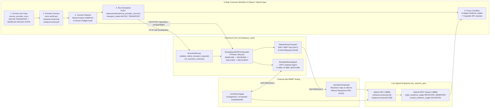

# NetSpout Gate 12F — Native SNMP Productization & Acceptance Closure Architecture

**Author:** Mahamudul Chowdhury (`machowdhury@yahoo.com`)  
**Gate:** 12F (Native SNMP Productization & Acceptance Closure)  
**Target Scenario:** `service_provider_cisco` (*Service Provider Network - All Cisco*)  
**Canonical Device Identity:** `cisco-asr9k-pe1`  
**Status:** **ACCEPTED & CLOSED**

---

## 1. Executive Summary

Gate 12F completes the end-to-end productization of NetSpout's Native SNMPv2c subsystem (introduced across Gates 12B, 12C, and 12D and audited in Gate 12E) by closing all five findings from the Gate 12E audit (`F-12E-01` through `F-12E-05`). Native SNMPv2c execution is now a first-class, customer-operable workflow capability across the canonical catalog, FastAPI HTTP layer, `ScenarioRunner` orchestration engine, 5-Step React/Splunk UI workflow (`StepChoose` -> `StepPreview` -> `StepConnect` -> `StepRun` -> `StepProve`), and Splunk verification pipeline.

---

## 2. Remediated Gate 12E Findings (`F-12E-01` through `F-12E-05`)

| Finding ID | Severity | Architectural Root Cause in Gate 12E | Gate 12F Productization Resolution |
| :--- | :--- | :--- | :--- |
| **`F-12E-01`** | **HIGH** | `backend/app/main.py` (`POST /api/scenarios/{scenario_id}/run`) constructed `ScenarioRunRequest` with only 4 fields (`scenario_id`, `time_mode`, `seed`, `dispatch_telemetry`) and called `run_scenario_contract()`, which had no Native Transport or Native SNMP E2E execution branch. | Updated [`backend/app/main.py`](file:///Users/mahamudc/Documents/NetSpout/backend/app/main.py) to forward all Native Transport and Native SNMP parameters (`transport_mode`, `native_protocol`, `native_destination_host`, `native_destination_port`, `native_rate_pps`, `native_snmp_community`, `native_snmp_pdu_mode`, `native_snmp_timeout_ms`, `native_snmp_max_retries`, `native_snmp_e2e`) and unified [`ScenarioRunner.run_scenario_contract`](file:///Users/mahamudc/Documents/NetSpout/src/netspout_core/scenario_runner.py) with `run_scenario` so customer API and UI runs execute full Native SNMPv2c E2E orchestration. Added `validate_native_transport_request()` to refuse silent fallback to Mode A (returning HTTP 400 on missing/invalid native parameters). |
| **`F-12E-02`** | **MEDIUM** | `netspout:snmp:trap` and `netspout:snmp:poll` were absent from `catalog/sourcetypes.json`, and `service_provider_cisco` in `catalog/scenarios.json` omitted `"snmp"` in `telemetry_requirements` and native SNMP sourcetypes. | Registered `netspout-snmp-trap` (`netspout:snmp:trap`) and `netspout-snmp-poll` (`netspout:snmp:poll`) in [`catalog/sourcetypes.json`](file:///Users/mahamudc/Documents/NetSpout/catalog/sourcetypes.json) (`is_benchmark_197: false`, preserving the 197 benchmark invariance while expanding total cataloged sourcetypes to 199). Updated `service_provider_cisco` in [`catalog/scenarios.json`](file:///Users/mahamudc/Documents/NetSpout/catalog/scenarios.json) with `"snmp"`, `["netspout:snmp:trap", "netspout:snmp:poll"]`, `native_snmp_supported: true`, and `native_snmp_capabilities`. |
| **`F-12E-03`** | **LOW** | `SnmpSplunkBridge.dispatch_events()` mutated `ev.evidence_stage` in-place to `SPLUNK_DISPATCHED` before serializing `ev.to_hec_payload()`, overwriting receiver-observation provenance in Splunk events. | Added `origin_evidence_stage` (default `"RECEIVER_OBSERVED"`) and `current_evidence_stage` to [`NormalizedSnmpEvent`](file:///Users/mahamudc/Documents/NetSpout/src/netspout_core/models.py) and [`SnmpE2ERunScorecard`](file:///Users/mahamudc/Documents/NetSpout/src/netspout_core/models.py). `origin_evidence_stage="RECEIVER_OBSERVED"` is preserved immutably in HEC payloads while `current_evidence_stage` advances through `RECEIVER_OBSERVED` -> `SPLUNK_DISPATCHED` -> `SPLUNK_OBSERVED` -> `VALIDATED`. |
| **`F-12E-04`** | **LOW** | `scenario_runner.py` executed a redundant `NativeSnmpTransport(destination_port=1162).send_batch()` before `SnmpSplunkE2EOrchestrator`, and used `"node-cisco8k-core01"` / `"Cisco-ASR9010-PE1"` while SNMP E2E used `"cisco-asr9k-pe1"`. | Unified canonical device identity for `service_provider_cisco` to `"cisco-asr9k-pe1"` across [`catalog/scenarios.json`](file:///Users/mahamudc/Documents/NetSpout/catalog/scenarios.json), [`scenario_runner.py`](file:///Users/mahamudc/Documents/NetSpout/src/netspout_core/scenario_runner.py), [`snmp_engine.py`](file:///Users/mahamudc/Documents/NetSpout/src/netspout_core/snmp_engine.py), [`companion_manifest.py`](file:///Users/mahamudc/Documents/NetSpout/src/netspout_core/companion_manifest.py), and [`snmp_splunk_e2e.py`](file:///Users/mahamudc/Documents/NetSpout/src/netspout_core/snmp_splunk_e2e.py). Eliminated the redundant port-1162 send when `is_e2e_snmp=True`, populating `manifest.native_snmp_result` and `manifest.companion_manifest` directly from the E2E run. |
| **`F-12E-05`** | **LOW** | `TopBar.tsx` and `SNMPMibModal.tsx` labeled the legacy SC4SNMP HEC preview modal as `"SNMP Polling & Trap Engine (SC4SNMP)"`, risking confusion with the real UDP BER/ASN.1 SNMPv2c engine. | Renamed the TopBar entry and modal header in [`TopBar.tsx`](file:///Users/mahamudc/Documents/NetSpout/frontend/src/components/TopBar.tsx) and [`SNMPMibModal.tsx`](file:///Users/mahamudc/Documents/NetSpout/frontend/src/components/SNMPMibModal.tsx) to **`Mode A — HEC Payload Preview (SC4SNMP)`**, added a prominent **Transport Honesty Notice** contrasting Mode A (`sc4snmp:metric` / `sc4snmp:event` over HTTP HEC) with Mode B (`netspout:snmp:trap` / `netspout:snmp:poll` over UDP BER/ASN.1), and wired a **Launch Native SNMPv2c Workflow (`service_provider_cisco`)** button directly into the 5-step workflow. |

---

## 3. Pre-Flight Readiness & Honesty Architecture

### 3.1 6-Check Native SNMPv2c Pre-Flight Audit (`GET/POST /api/native-snmp/preflight`)
Implemented in [`run_snmp_preflight_check()`](file:///Users/mahamudc/Documents/NetSpout/src/netspout_core/snmp_splunk_e2e.py) and exposed at `/api/native-snmp/preflight`:
1. **`net_snmp_cli_binaries`**: Verifies `/usr/bin/snmpget`, `/usr/bin/snmpgetnext`, `/usr/bin/snmpwalk`, and `/usr/bin/snmpbulkwalk` exist and are executable.
2. **`snmptrapd_binary`**: Verifies `/usr/sbin/snmptrapd` exists and is executable.
3. **`local_udp_bind`**: Binds an ephemeral loopback UDP socket on `127.0.0.1` to confirm unprivileged local socket availability for both `SimulatedSnmpAgent` and `ExternalSnmpTrapReceiver`.
4. **`splunk_hec_reachability`**: Verifies Splunk HEC health at `https://127.0.0.1:8888/services/collector/health`.
5. **`splunk_rest_search`**: Verifies authenticated Splunk REST API access at `https://127.0.0.1:8889`.
6. **`target_index_availability`**: Verifies the target Splunk event index (`idx_network_ops`) exists and is searchable.

### 3.2 Two-Axis Honesty Guardrails
Every API response, catalog entry, and UI step (`StepChoose`, `StepPreview`, `StepConnect`, `StepRun`, `StepProve`) enforces the dual-badge distinction:
- **Transport Fidelity Badge:** `NATIVE TRANSPORT` (standards-compliant RFC 3416 / RFC 1905 ASN.1 BER packets over real UDP sockets).
- **Device State Fidelity Badge:** `MODELED DEVICE STATE` (deterministic phase-driven MIB state modeled by NetSpout; no claim of physical Cisco router ASIC or IOS-XR kernel emulation).
