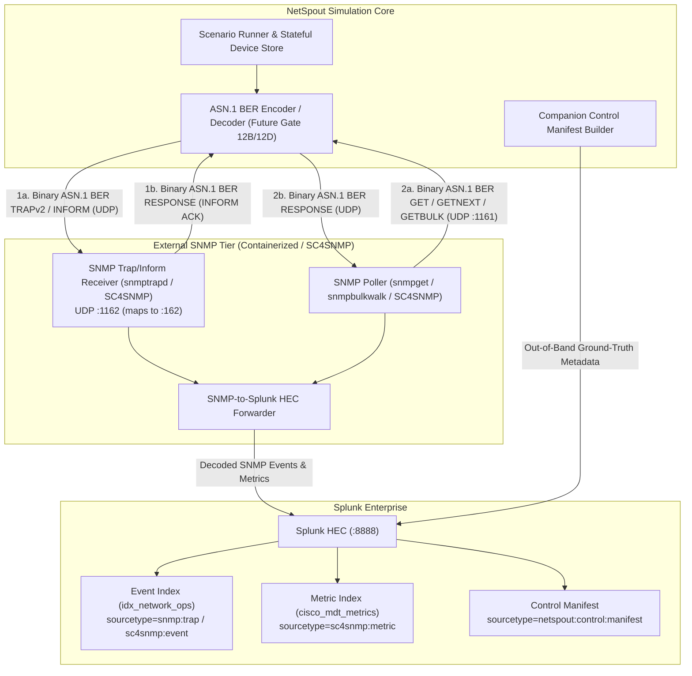

# NetSpout Gate 12 — Native SNMP Architecture & Protocol Definition

**Author:** Mahamudul Chowdhury (`machowdhury@yahoo.com`)  
**Gate:** 12 (Native SNMP Architecture & Protocol Definition)  
**Date:** 2026-09-28  
**Baseline Commit:** `ad8b29034447c1431265b83e77714fa07797dc03` (Gate 11F Certified)  
**Status:** ARCHITECTURE & SPECIFICATION COMPLETE (Zero Runtime Implementation)

---

## 1. Executive Summary & Primary Product Question

NetSpout Gate 12 defines the end-to-end architecture, wire-level ASN.1/BER protocol specifications, MIB and OID governance, external receiver/poller topology, Splunk correlation model, and security guardrails for **Native SNMP Telemetry**.

### Primary Product Problem Solved
> *"I want realistic SNMP telemetry in Splunk so I can demonstrate network monitoring, fault management, alerting, correlation, and troubleshooting use cases, but I don't have physical routers, switches, firewalls, wireless controllers, servers, or other SNMP-enabled infrastructure."*

To solve this truthfully, NetSpout must support generating and responding to **standards-compliant ASN.1 Basic Encoding Rules (BER) SNMP protocol messages over UDP** that traverse an independent external SNMP receiver/poller tier before indexing into Splunk—never faking native SNMP by sending direct JSON payloads to Splunk HEC under a misleading label.

---

## 2. Absolute Scope Boundary & Architectural Principle

### 2.1 Gate 12 Scope Boundary
Gate 12 is strictly an **architecture, specification, threat-modeling, and verification design gate**:
- **No runtime code changes:** Zero modifications to `src/netspout_core/`, `backend/app/`, `netspout/bin/`, or `frontend/`.
- **No sockets opened:** UDP ports `161`, `162`, `1161`, and `1162` remain closed.
- **No existing path disturbed:** All 29 canonical scenarios, 13 `GOLDEN_PATH_CERTIFIED` scenarios, Native NetFlow v9/IPFIX, and Splunk HEC/Syslog pipelines remain 100% untouched.

### 2.2 End-to-End Architectural Invariant



1. **No Direct HEC Shortcut:** Native SNMP packets must be serialized into binary ASN.1 BER (`ITU-T X.690` / `RFC 3416`), transmitted over UDP to an external receiver (or returned in response to an external UDP poller), decoded by that external tier, and forwarded to Splunk.
2. **Strict Fidelity Separation:**
   - **Mode A (`Fidelity: MODELED PAYLOAD`):** Existing `snmp_engine.py` direct-to-HEC JSON synthesis (`sc4snmp:event`, `sc4snmp:metric`). Retained for zero-container cloud/demo environments.
   - **Mode B (`Fidelity: NATIVE TRANSPORT`):** Binary ASN.1 BER over UDP through an external SNMP receiver/poller.

---

## 3. Three SNMP Capability Families (Section 5)

Native SNMP comprises three distinct operational paradigms that must never be conflated:

### Family A: SNMP Traps (`TRAPv2-PDU`, Tag `0xA7`)
- **Direction:** Unidirectional, device-initiated asynchronous notification (`NetSpout Simulated Device -> UDP -> External Trap Receiver -> Splunk`).
- **Acknowledgement:** None (`UDP fire-and-forget`).
- **Representative Use Cases:** `linkDown`, `linkUp`, `coldStart`, `warmStart`, `authenticationFailure`, `bgpBackwardTransition`, `bgpEstablished`, `ospfNbrStateChange`, `ciscoEnvMonTemperatureNotification`, `ciscoEnvMonFanNotification`, `jnxPowerSupplyFailure`.
- **Evidence Boundary:** Socket `sendto()` proves only `SENT`. Proof of delivery requires independent verification at the external Trap Receiver (`RECEIVER_OBSERVED`) and Splunk (`SPLUNK_OBSERVED`).

### Family B: SNMP Inform Requests (`InformRequest-PDU`, Tag `0xA6`)
- **Direction:** Bidirectional, acknowledged asynchronous notification (`NetSpout Simulated Device -> InformRequest-PDU -> External Receiver -> Response-PDU -> NetSpout`).
- **Acknowledgement:** Receiver returns a `Response-PDU` (`0xA2`) echoing the exact `request-id`, `error-status = 0 (noError)`, `error-index = 0`, and varbind list.
- **Evidence Advantage:** Unlike Traps, an Inform provides **wire-level transport confirmation (`ACKNOWLEDGED`)** directly to NetSpout before querying receiver metrics or Splunk. If no `Response-PDU` arrives within `timeout_ms`, NetSpout retries up to `max_retries` using the identical `request-id` and records an explicit timeout if unacknowledged.

### Family C: SNMP Polling / Simulated SNMP Agent (`GetRequest` `0xA0`, `GetNextRequest` `0xA1`, `GetBulkRequest` `0xA5` $\rightarrow$ `Response` `0xA2`)
- **Direction:** Poller-initiated request/response (`External Poller -> UDP Request -> NetSpout Simulated Agent -> UDP Response -> External Poller -> Splunk`).
- **Role Inversion:** NetSpout acts as a **stateful UDP listener (Simulated SNMP Agent)** maintaining an in-memory lexicographically ordered OID tree per simulated topology node (`ifOperStatus`, `ifInOctets`, `ifInErrors`, `sysUpTime`, `bgpPeerState`, `cpmCPUTotal5minRev`, temperature sensors).
- **Scenario State Coupling:** As a scenario transitions through `BASELINE -> FAULT -> PROPAGATE -> FAILOVER -> RECOVER`, the simulated agent's OID tree updates deterministically so external pollers observe realistic counter increments and state transitions.

---

## 4. Protocol Version Strategy (Section 6)

| Evaluation Dimension | SNMPv1 (`RFC 1157`) | SNMPv2c (`RFC 3416` / `RFC 1901`) | SNMPv3 (`RFC 3411–3418`) |
| :--- | :--- | :--- | :--- |
| **IETF Status** | **Historic / Obsolete** (`RFC 3584`) | Standard community-based SNMPv2 | **Full Internet Standard (`STD 62`)** |
| **Product Usefulness** | Low (legacy v1 trap header format differs from v2/v3 varbind model) | **Very High** (universal lab baseline; supports `TRAPv2`, `INFORM`, `GETBULK`, `Counter64`) | **High** (required for security-focused enterprise compliance & auth/priv demos) |
| **Implementation Complexity** | Low, but introduces bifurcated `Trap-PDU (0xA4)` code path | **Low–Moderate** (unified PDU structure across `GET`, `GETNEXT`, `RESPONSE`, `TRAPv2`, `INFORM`) | **High** (requires USM engine discovery, `engineBoots`/`engineTime` synchronization, HMAC-SHA-2, AES-128 CFB) |
| **Security Implications** | Cleartext community string | Cleartext community string (mitigated in lab via loopback/RFC1918 guardrails + `netspout-lab` community) | Authenticated & encrypted (`noAuthNoPriv`, `authNoPriv`, `authPriv`) |
| **Collector Compatibility** | Supported via RFC 3584 translation | **100% Native** across `snmptrapd`, `SC4SNMP`, `Telegraf`, `Wireshark/TShark` | Supported, but requires synchronized USM user/engineID tables across sender and receiver |
| **Splunk Ecosystem Compatibility** | Legacy | **Primary baseline** for SC4SNMP & Splunk IT Service Intelligence (ITSI) | Supported by SC4SNMP with USM secret mounting |
| **Educational & Lab Value** | Low (confuses modern `snmpTrapOID.0` varbind semantics) | **Optimal** (packets are immediately readable in Wireshark/TShark without AES key tables) | High for advanced security architecture training |
| **Recommended Phase** | **Do Not Implement** (unless explicitly requested later) | **Phase 1: Gate 12B (Traps/Informs) & Gate 12D (Polling)** | **Phase 2: Gate 12E (USM `authNoPriv` / `authPriv`)** |

### Protocol Version Decision
1. **`SNMPv2c` (`version = 1` on wire) is selected as the initial implementation target (Gates 12B–12D).** It shares the exact same PDU and varbind structure (`RFC 3416`) used inside `SNMPv3` `ScopedPDU`, meaning 100% of the `SNMPv2c` PDU encoder, OID tree, varbind serializer, `INFORM` state machine, and `GET`/`GETNEXT`/`GETBULK` engine will be reused unchanged when `SNMPv3` wraps the PDU in Gate 12E.
2. **`SNMPv3` (`version = 3` on wire) is architecturalized in Gate 12 (`NETSPOUT_SNMP_V3_FUTURE_ARCHITECTURE.md`) and scheduled for Gate 12E.**
3. **`SNMPv1` (`version = 0` on wire) is excluded** because its obsolete `Trap-PDU (0xA4)` lacks `Counter64`, `GETBULK`, `INFORM`, and standard `snmpTrapOID.0` varbind uniformity.

---

## 5. Canonical SNMP Data Model (Section 11)

The following Pydantic/dataclass models are specified for future addition to `src/netspout_core/models.py` in Gate 12B/12D:

```python
class SnmpVersion(str, Enum):
    V2C = "SNMPv2c"   # Wire integer: 1
    V3 = "SNMPv3"     # Wire integer: 3

class SnmpPduType(str, Enum):
    GET_REQUEST = "GetRequest"           # 0xA0
    GET_NEXT_REQUEST = "GetNextRequest"  # 0xA1
    RESPONSE = "Response"                # 0xA2
    SET_REQUEST = "SetRequest"           # 0xA3 (Unsupported by design for safety)
    GET_BULK_REQUEST = "GetBulkRequest"  # 0xA5
    INFORM_REQUEST = "InformRequest"     # 0xA6
    TRAP_V2 = "SNMPv2-Trap"              # 0xA7
    REPORT = "Report"                    # 0xA8 (SNMPv3 USM discovery)

class SnmpAsn1Type(str, Enum):
    INTEGER = "Integer32"                # 0x02
    OCTET_STRING = "OctetString"         # 0x04
    NULL = "Null"                        # 0x05
    OBJECT_IDENTIFIER = "ObjectIdentifier" # 0x06
    IP_ADDRESS = "IpAddress"             # 0x40
    COUNTER32 = "Counter32"              # 0x41
    GAUGE32 = "Gauge32"                  # 0x42
    TIME_TICKS = "TimeTicks"             # 0x43
    OPAQUE = "Opaque"                    # 0x44
    COUNTER64 = "Counter64"              # 0x46
    NO_SUCH_OBJECT = "noSuchObject"      # 0x80
    NO_SUCH_INSTANCE = "noSuchInstance"  # 0x81
    END_OF_MIB_VIEW = "endOfMibView"     # 0x82

class OidFidelityClass(str, Enum):
    STANDARD_VERIFIED = "STANDARD_VERIFIED"  # IETF RFC MIB (e.g., IF-MIB, BGP4-MIB)
    VENDOR_VERIFIED = "VENDOR_VERIFIED"      # Published vendor MIB (e.g., CISCO-PROCESS-MIB)
    MODELED = "MODELED"                      # Real vendor PEN with modeled subtree
    SYNTHETIC = "SYNTHETIC"                  # NetSpout experimental/lab OID
```

### Core Message & Profile Entities
1. **`SnmpVarBind`:**
   - `oid: str` — Authoritative numeric dotted-decimal OID including instance suffix (e.g., `"1.3.6.1.2.1.2.2.1.8.1"`).
   - `asn1_type: SnmpAsn1Type` — Explicit BER tag type (`Integer32`, `TimeTicks`, `ObjectIdentifier`, `Counter64`, etc.).
   - `value: Union[int, str, bytes, None]` — Typed value.
   - `mib_module: Optional[str]` — Enrichment metadata only (never serialized on wire), e.g., `"IF-MIB"`.
   - `symbolic_name: Optional[str]` — Enrichment metadata only, e.g., `"ifOperStatus.1"`.
   - `oid_fidelity: OidFidelityClass` — `STANDARD_VERIFIED | VENDOR_VERIFIED | MODELED | SYNTHETIC`.
2. **`SnmpMessage`:**
   - `version: SnmpVersion` (`SNMPv2c` or `SNMPv3`)
   - `community: str` (default `"netspout-lab"`, server-side only)
   - `pdu_type: SnmpPduType`
   - `request_id: int` (signed 32-bit integer `1 .. 2147483647`, deterministically seeded)
   - `error_status: int` (`0` for notifications; `non-repeaters` for `GetBulkRequest`)
   - `error_index: int` (`0` for notifications; `max-repetitions` for `GetBulkRequest`)
   - `varbinds: List[SnmpVarBind]`
3. **`SnmpTrap` / `SnmpInform`:**
   - High-level notification descriptors that compile into an `SnmpMessage` with mandatory varbind `[0] = sysUpTime.0 (1.3.6.1.2.1.1.3.0, TimeTicks)` and varbind `[1] = snmpTrapOID.0 (1.3.6.1.6.3.1.1.4.1.0, ObjectIdentifier)`, followed by ordered payload varbinds.
   - `SnmpInform` adds `timeout_ms: int = 1500`, `max_retries: int = 2`, `acknowledged: bool = False`, `rtt_ms: Optional[float] = None`.
4. **`SnmpRequest` / `SnmpResponse`:**
   - Used in Gate 12D polling agent mode to represent decoded incoming `GET`/`GETNEXT`/`GETBULK` PDUs and outgoing `Response-PDU` messages.
5. **`SnmpAgentProfile` & `SnmpEngineProfile`:**
   - `node_id: str`, `agent_ip: str`, `vendor: str`, `sys_object_id: str`, `boot_time_epoch_sec: float`, `engine_id_hex: str` (RFC 3411 format `8000...` enterprise-derived 12-octet identifier).

---

## 6. Telemetry Fidelity & Transport Evidence Semantics (Sections 16 & 17)

### 6.1 Orthogonal Two-Axis Fidelity Model
A valid ASN.1 BER UDP packet proves **wire transport**, not necessarily that every vendor-specific OID or value was captured from hardware ASICs. NetSpout therefore tracks **Transport Fidelity** and **OID/Payload Fidelity** independently:

| Dimension | Classification | Meaning |
| :--- | :--- | :--- |
| **Transport Axis** | `NATIVE TRANSPORT` | Binary ASN.1 BER encoded datagram sent/received over UDP via external SNMP receiver/poller. |
| **Transport Axis** | `MODELED PAYLOAD` | Direct JSON event/metric sent to Splunk HEC (`sc4snmp:event`, `sc4snmp:metric`) without UDP SNMP. |
| **OID Axis** | `STANDARD_VERIFIED` | Exact IETF RFC MIB OID, syntax, and enumeration (e.g., `IF-MIB::ifOperStatus.1 = 2`). |
| **OID Axis** | `VENDOR_VERIFIED` | Exact published enterprise MIB OID and syntax (e.g., `CISCO-PROCESS-MIB::cpmCPUTotal5minRev.1`). |
| **OID Axis** | `MODELED` | Registered vendor Enterprise PEN (`1.3.6.1.4.1.<PEN>`) with modeled subtree or value progression. |
| **OID Axis** | `SYNTHETIC` | Experimental/sandbox OID used strictly for negative testing or custom lab extensions. |

### 6.2 Strict Transport Evidence State Machines (Never Collapsed)

#### A. `TRAP` Evidence States
```text
GENERATED -> ENCODED -> SENT -> RECEIVER_OBSERVED -> SPLUNK_OBSERVED -> VALIDATED
```
- **`SENT` $\neq$ `RECEIVER_OBSERVED`:** Because UDP `TRAPv2` is unacknowledged, socket `sendto()` advances the state only to `SENT`. `RECEIVER_OBSERVED` requires the external trap receiver's health/metrics endpoint to confirm packet receipt and BER decoding.

#### B. `INFORM` Evidence States
```text
GENERATED -> ENCODED -> SENT -> ACKNOWLEDGED -> RECEIVER_OBSERVED -> SPLUNK_OBSERVED -> VALIDATED
```
- **`SENT` $\neq$ `ACKNOWLEDGED`:** `SENT` means the UDP datagram left NetSpout. `ACKNOWLEDGED` requires NetSpout to receive and BER-decode a matching `Response-PDU (0xA2)` with identical `request-id` and `error-status == 0` from the receiver within the retry window.

#### C. `POLLING` Evidence States
```text
REQUEST_RECEIVED -> REQUEST_DECODED -> RESPONSE_GENERATED -> RESPONSE_ENCODED -> RESPONSE_SENT -> POLLER_OBSERVED -> SPLUNK_OBSERVED -> VALIDATED
```

---

## 7. External Receiver & Collector Architecture (Sections 18 & 19)

### 7.1 Candidate Receiver & Poller Evaluation Matrix

| Criterion | **Net-SNMP (`snmptrapd` + `snmpwalk`) + Python HEC Forwarder** | **Splunk Connect for SNMP (SC4SNMP)** | **Telegraf (`inputs.snmp_trap` + `inputs.snmp`)** | **Vector / Fluent Bit** | **Logstash (`logstash-input-snmptrap`)** |
| :--- | :--- | :--- | :--- | :--- | :--- |
| **License** | BSD-like (Net-SNMP) + MIT/Apache | Apache 2.0 | MIT | MPL 2.0 / Apache 2.0 | Apache 2.0 / Elastic |
| **Container Footprint** | **~35 MB RAM**, `<2s` startup | **4–8 GB RAM** (requires K8s/MicroK8s, MongoDB, Redis, Celery, Worker pods) | ~90 MB RAM | Lack native full SNMP Trap/Poll MIB support | ~1.2 GB RAM (JVM) |
| **SNMP Versions** | `v1`, `v2c`, `v3` | `v1`, `v2c`, `v3` | `v1`, `v2c`, `v3` | N/A | `v1`, `v2c`, `v3` (partial) |
| **TRAPv2 Support** | **Native (`snmptrapd`)** | **Native (Trap pod)** | Native (`inputs.snmp_trap`) | No | Yes |
| **INFORM Support** | **Native (`snmptrapd` auto-ACKs `0xA6` with `0xA2`)** | **Native (via `snmptrapd` under the hood)** | Limited / inconsistent across versions | No | No |
| **Polling Support** | **Native (`snmpget`, `snmpwalk`, `snmpbulkget`)** | **Native (Celery worker pods)** | Native (`inputs.snmp`) | No | Yes |
| **Splunk Schema Compatibility** | Emits exact `sc4snmp:event`, `sc4snmp:metric`, and `snmp:trap` JSON to HEC | Native SC4SNMP HEC output | Requires custom Starlark/exec formatting to match SC4SNMP | N/A | Custom Ruby filter required |
| **macOS / Linux Docker Compose** | **100% Native (`docker compose up -d`)** | **Not supported via simple Docker Compose** (requires K8s + Helm) | 100% Native | N/A | Heavy JVM |

### 7.2 Deep Evaluation of Splunk Connect for SNMP (SC4SNMP)
- **How SC4SNMP Works:** SC4SNMP is Splunk's official Kubernetes-orchestrated SNMP solution. Internally, SC4SNMP's trap receiver container runs **Net-SNMP / PySNMP** to receive traps/informs, queues jobs in Redis/MongoDB, translates OIDs via `pysmi`, and dispatches HEC payloads (`sourcetype="sc4snmp:event"` and `sourcetype="sc4snmp:metric"`).
- **Limitations for Local NetSpout Labs:** Requiring every NetSpout user to deploy a Kubernetes cluster (`MicroK8s` or `k3d`), Helm charts, MongoDB, Redis, and Celery workers just to run a 30-second scenario violates NetSpout's zero-friction developer/SE experience.
- **Architectural Decision — Dual-Mode Receiver Strategy:**
  1. **Bundled Reference Stack (`deploy/snmp/docker-compose.snmp.yml` in Gate 12C):** NetSpout will ship a lightweight, non-root **Net-SNMP (`snmptrapd` + `snmpget`/`snmpbulkwalk`) + NetSpout SNMP Forwarder** container stack (mirroring the proven Gate 11C/11D GoFlow2 + Forwarder pattern). `snmptrapd` natively receives `TRAPv2` and automatically acknowledges `InformRequest-PDU (0xA6)` with a valid `Response-PDU (0xA2)`, writing structured JSON to a shared volume that the forwarder enriches with NetSpout's compiled OID dictionary and indexes into Splunk HEC using **SC4SNMP-compatible sourcetypes (`sc4snmp:event`, `sc4snmp:metric`, and `snmp:trap`)**.
  2. **External Enterprise SC4SNMP Compatibility:** Because NetSpout transmits standards-compliant RFC 3416 binary UDP datagrams, customers who already run an external Kubernetes **SC4SNMP** cluster can point NetSpout's `collector_host` and port directly at their SC4SNMP trap VIP or configure SC4SNMP to poll NetSpout's simulated agent port.

---

## 8. Splunk Data Model & Run Correlation Strategy (Sections 20 & 21)

### 8.1 Canonical Splunk Indexed Event Schema (`idx_network_ops`)
When an SNMP Trap or Inform is decoded by the external receiver and indexed into Splunk (`index=idx_network_ops`, `sourcetype=sc4snmp:event` or `sourcetype=snmp:trap`), each event contains:

```json
{
  "timestamp": 1774699200.125,
  "snmp_version": "SNMPv2c",
  "pdu_type": "SNMPv2-Trap",
  "source_ip": "127.0.0.1",
  "agent_address": "10.255.0.1",
  "receiver": "netspout-snmp-receiver",
  "request_id": 41829012,
  "sys_uptime": 8640000,
  "trap_oid": "1.3.6.1.2.1.15.7.2",
  "trap_name": "BGP4-MIB::bgpBackwardTransition",
  "enterprise_oid": "1.3.6.1.2.1.15",
  "varbinds": [
    {
      "oid": "1.3.6.1.2.1.1.3.0",
      "oid_name": "sysUpTime.0",
      "mib": "SNMPv2-MIB",
      "value_type": "TimeTicks",
      "value": 8640000
    },
    {
      "oid": "1.3.6.1.6.3.1.1.4.1.0",
      "oid_name": "snmpTrapOID.0",
      "mib": "SNMPv2-MIB",
      "value_type": "ObjectIdentifier",
      "value": "1.3.6.1.2.1.15.7.2"
    },
    {
      "oid": "1.3.6.1.2.1.15.3.1.14.10.255.0.2",
      "oid_name": "bgpPeerLastError.10.255.0.2",
      "mib": "BGP4-MIB",
      "value_type": "OctetString",
      "value": "0400"
    },
    {
      "oid": "1.3.6.1.2.1.15.3.1.2.10.255.0.2",
      "oid_name": "bgpPeerState.10.255.0.2",
      "mib": "BGP4-MIB",
      "value_type": "Integer32",
      "value": 1
    }
  ]
}
```

### 8.2 Run Correlation Without Corrupting Wire Fidelity
Native SNMPv2c (`RFC 3416`) has **no `netspout_run_id` header field**. Injecting a proprietary fake varbind (e.g., `1.3.6.1.4.1.99999.1.0 = "NS-2026..."`) into every standard `linkDown` or `bgpBackwardTransition` trap would corrupt wire fidelity and fail strict RFC varbind audits.

NetSpout solves run correlation using the **Deterministic Request-ID + Out-of-Band Companion Control Manifest** pattern (proven in Gate 11 for Native Flow):
1. **Deterministic Non-Colliding `request-id` Block:** Each scenario run is assigned a deterministic 31-bit `request_id_base` derived from `SHA-256(run_id + seed)` (e.g., `request_id = request_id_base + pdu_seq_index`). `request-id` is a mandatory native RFC 3416 header field in every `TRAPv2`, `INFORM`, `GET`, and `RESPONSE` PDU (`INTEGER (1..2147483647)`) and is preserved verbatim by `snmptrapd` and `TShark`.
2. **Out-of-Band Companion Control Manifest (`sourcetype="netspout:control:manifest"`):** At run completion, NetSpout emits a single ground-truth manifest event to Splunk HEC containing:
   - `run_id`, `scenario_id`, `protocol` (`"SNMPv2c"`), `operation` (`"TRAP"` / `"INFORM"` / `"POLL"`)
   - `request_id_list: List[int]` (exact `request-id` values transmitted on the wire)
   - `expected_trap_oids: List[str]`
   - `time_window: [start_epoch, end_epoch]`
3. **Zero Wire Pollution:** The binary UDP packets on port `162`/`1162` contain **100% pure RFC 3416 varbinds**—zero proprietary NetSpout strings on the wire—while Step 5 ("Prove") and Splunk SPL queries correlate indexed traps with 100% precision via `request_id IN (...)` and `(trap_oid, _time)`.

---

## 9. Scenario Mapping Audit Across All 29 Canonical Scenarios (Sections 22 & 23)

All 29 canonical scenarios in `catalog/scenarios.json` were audited for Native SNMP applicability without modifying any scenario's maturity:

| # | Canonical Scenario ID | Current Maturity | SNMP Candidate Tier | Primary SNMP Operations & Standard/Vendor MIBs |
| :-: | :--- | :--- | :---: | :--- |
| 1 | `service_provider_cisco` | `GOLDEN_PATH_CERTIFIED` | **HIGH (First Candidate)** | `TRAP` / `INFORM` / `POLL`: `IF-MIB::linkDown`, `BGP4-MIB::bgpBackwardTransition`, `IF-MIB::linkUp`, `BGP4-MIB::bgpEstablished`, `ifHCInOctets` |
| 2 | `cisco_sdwan_brownout` | `GOLDEN_PATH_CERTIFIED` | **HIGH** | `TRAP` / `POLL`: `IF-MIB::linkDown`/`linkUp`, `BGP4-MIB::bgpBackwardTransition`, `IF-MIB::ifInErrors`, `CISCO-PROCESS-MIB` |
| 3 | `cisco_campus_rogue` | `GOLDEN_PATH_CERTIFIED` | **HIGH** | `TRAP` / `POLL`: `IF-MIB::linkDown` (quarantine port), `SNMPv2-MIB::authenticationFailure`, `ENTITY-MIB` |
| 4 | `arch_lan_campus_access` | `GOLDEN_PATH_CERTIFIED` | **HIGH** | `TRAP` / `POLL`: `IF-MIB::linkDown` (err-disable), `IF-MIB::linkUp` (recovery), `BRIDGE-MIB`, `IF-MIB` |
| 5 | `arch_man_carrier_ring` | `GOLDEN_PATH_CERTIFIED` | **HIGH** | `TRAP` / `INFORM`: `IF-MIB::linkDown` (fiber cut), `IF-MIB::linkUp` (RPL unblock), `JUNIPER-ALARM-MIB` |
| 6 | `cisco_aci_microburst` | `GOLDEN_PATH_CERTIFIED` | **HIGH** | `TRAP` / `POLL`: `IF-MIB::ifOutDiscards`, `CISCO-PROCESS-MIB`, `ENTITY-MIB` |
| 7 | `arch_wan_global_backbone` | `CONTRACTED` | **HIGH** | `TRAP` / `POLL`: `BGP4-MIB::bgpBackwardTransition`, `OSPF-MIB::ospfNbrStateChange`, `IF-MIB` |
| 8 | `sdwan_connected_core` | `CONTRACTED` | **HIGH** | `TRAP` / `POLL`: `BGP4-MIB::bgpBackwardTransition`, `IF-MIB::linkDown`/`linkUp` |
| 9 | `service_provider_mixed` | `CONTRACTED` | **HIGH** | `TRAP` / `POLL`: `BGP4-MIB`, `OSPF-MIB`, `JUNIPER-MIB`, `IF-MIB` |
| 10 | `pure_cisco_enterprise` | `CONTRACTED` | **HIGH** | `TRAP` / `POLL`: `IF-MIB`, `CISCO-ENVMON-MIB`, `CISCO-PROCESS-MIB`, `CISCO-MEMORY-POOL-MIB` |
| 11 | `arch_can_multi_building` | `CONTRACTED` | **HIGH** | `TRAP` / `POLL`: `IF-MIB`, `OSPF-MIB::ospfNbrStateChange`, `LLDP-MIB`, `BRIDGE-MIB` |
| 12 | `arch_san_fibre_channel` | `CONTRACTED` | **HIGH** | `TRAP` / `POLL`: `IF-MIB::linkDown`, `ENTITY-MIB`, `CISCO-ENVMON-MIB` |
| 13 | `mixed_backbone_optical` | `GOLDEN_PATH_CERTIFIED` | **MEDIUM** | Already certified for Native Flow (NetFlow v9/IPFIX); can optionally emit `IF-MIB::linkDown`/`linkUp` |
| 14 | `arch_wlan_meraki_catalyst` | `GOLDEN_PATH_CERTIFIED` | **MEDIUM** | `TRAP` / `POLL`: `IF-MIB`, `ENTITY-MIB`, wireless controller radio interface counters |
| 15 | `wireless_connected_core_cisco` | `CONTRACTED` | **MEDIUM** | `TRAP` / `POLL`: `IF-MIB`, `CISCO-PROCESS-MIB` |
| 16 | `wireless_connected_core_mixed` | `CONTRACTED` | **MEDIUM** | `TRAP` / `POLL`: `IF-MIB`, `ARISTA-QUEUE-MIB` |
| 17 | `arch_nas_storage_cluster` | `CONTRACTED` | **MEDIUM** | `TRAP` / `POLL`: `HOST-RESOURCES-MIB`, `IF-MIB` |
| 18 | `arch_epn_isolated_intranet` | `CONTRACTED` | **MEDIUM** | `TRAP` / `POLL`: `IF-MIB`, `SNMPv2-MIB::authenticationFailure` |
| 19 | `mixed_vendor_enterprise` | `CONTRACTED` | **MEDIUM** | `TRAP` / `POLL`: `IF-MIB`, `ENTITY-MIB`, `JUNIPER-MIB` |
| 20 | `openconfig_mdt_streaming` | `GOLDEN_PATH_CERTIFIED` | **LOW** | Dedicated to YANG/gNMI Model-Driven Telemetry (`cisco:ios:mdt`); SNMP is secondary |
| 21 | `arch_vpn_remote_workforce` | `GOLDEN_PATH_CERTIFIED` | **LOW** | Focused on AnyConnect SSL-VPN & Duo Cloud MFA logs (`cisco:duo:*`) |
| 22 | `ddos_attack` | `E2E_VALIDATED` | **LOW** | Primarily firewall/ADC security logs (`TCP-MIB::tcpAttemptFails` possible as secondary metric) |
| 23 | `mixed_edge_breach` | `GOLDEN_PATH_CERTIFIED` | **LOW** | Application/perimeter threat logs (`pan:threat`, `fortinet:fortigate:utm`) |
| 24 | `mixed_sase_degradation` | `GOLDEN_PATH_CERTIFIED` | **LOW** | Cloud SWG (`zscaler:zia`) & ThousandEyes synthetic cloud assurance |
| 25 | `arch_gan_subsea_cloud` | `CONTRACTED` | **LOW** | Cloud/SASE/ThousandEyes synthetic focus |
| 26 | `arch_pan_iot_mesh` | `CONTRACTED` | **LOW** | BLE/IoT sensor mesh telemetry |
| 27 | `normal_traffic` | `FORMAT_VALIDATED` | **LOW** | Baseline multi-tier web/firewall log validation |
| 28 | `sql_injection` | `GOLDEN_PATH_CERTIFIED` | **NOT_APPLICABLE** | Application-layer HTTP/SQL injection (`nginx:plus:kv`, `postgresql:audit`) |
| 29 | `lateral_movement` | `FORMAT_VALIDATED` | **NOT_APPLICABLE** | Host/database authentication lateral movement |

### Summary of Scenario Audit
- **HIGH Candidates:** 12 scenarios
- **MEDIUM Candidates:** 7 scenarios
- **LOW Candidates:** 8 scenarios
- **NOT_APPLICABLE:** 2 scenarios
- **Total Audited:** 29 scenarios

### Selection of First Native SNMP Golden Candidate (Section 23)
**Recommended Scenario:** **`service_provider_cisco`** (*Service Provider Network - All Cisco (Cisco 8000, NCS 5500, IOS-XR SRv6)*)
- **Why `service_provider_cisco` is Optimal:**
  1. **Crystal-Clear Operational Progression:** Carrier link failure (`IF-MIB::linkDown` `1.3.6.1.6.3.1.1.5.3`) $\rightarrow$ eBGP peer drop (`BGP4-MIB::bgpBackwardTransition` `1.3.6.1.2.1.15.7.2` with `bgpPeerState = 1 (idle)`) $\rightarrow$ TI-LFA fast reroute $\rightarrow$ carrier link restoration (`IF-MIB::linkUp` `1.3.6.1.6.3.1.1.5.4`) $\rightarrow$ eBGP peer recovery (`BGP4-MIB::bgpEstablished` `1.3.6.1.2.1.15.7.1` with `bgpPeerState = 6 (established)`).
  2. **100% Standard IETF RFC OIDs:** Uses `SNMPv2-MIB` (`RFC 3418`), `IF-MIB` (`RFC 2863`), and `BGP4-MIB` (`RFC 4273`). Every varbind is decoded natively out-of-the-box by `TShark`, `Wireshark`, and `snmptrapd` without requiring proprietary vendor MIB files.
  3. **Existing Maturity:** Already `GOLDEN_PATH_CERTIFIED` for HEC control-plane telemetry, providing a rock-solid baseline.

---

## 10. Engineering Sequence & Gate 12B Scope (Section 24)

| Gate | Scope | Key Deliverables |
| :--- | :--- | :--- |
| **Gate 12 (Current)** | **Architecture & Protocol Definition** | Architecture, ASN.1 BER spec, SNMPv3 blueprint, Threat Model, MIB Strategy, Gate 12B Test Plan. |
| **Gate 12B** | **Native SNMPv2c Trap & Inform Encoder + Safe UDP Transport** | Pure-Python ASN.1 BER encoder/decoder (`TRAPv2` `0xA7`, `INFORM` `0xA6`, `RESPONSE` `0xA2`), `INFORM` ACK/retry state machine, RFC 1918 destination safety, token-bucket rate limiter, golden hex fixtures, loopback & `TShark` verification (`0 malformed warnings`). |
| **Gate 12C** | **External Receiver (`snmptrapd` + Forwarder) $\rightarrow$ Splunk E2E** | Containerized non-root receiver stack (`deploy/snmp/`), `RECEIVER_OBSERVED` & `SPLUNK_OBSERVED` evidence adapters, `service_provider_cisco` Native SNMP E2E integration, controlled failure matrix. |
| **Gate 12D** | **Simulated SNMP Agent / Polling (`GET`, `GETNEXT`, `GETBULK`)** | Stateful per-node OID tree, lexicographic walk engine (`noSuchObject`, `noSuchInstance`, `endOfMibView`), external poller verification (`snmpget`, `snmpwalk`, `snmpbulkget`). |
| **Gate 12E** | **SNMPv3 USM Security (`noAuthNoPriv`, `authNoPriv`, `authPriv`)** | RFC 3414 USM engine discovery, `engineBoots`/`engineTime` timeliness, HMAC-SHA-256 authentication, AES-128-CFB privacy, environment/ephemeral secret injection. |

**Why `SNMPv2c Traps + Informs` is Selected for Gate 12B:**
- `TRAPv2 (0xA7)` and `InformRequest (0xA6)` have **identical BER PDU wire layouts** (differing only in the 1-byte context tag `0xA7` vs `0xA6` and the receiver's `0xA2` acknowledgement). Including `INFORM` alongside `TRAPv2` in Gate 12B adds minimal encoding overhead while delivering deterministic transport-level acknowledgement (`ACKNOWLEDGED`) and retry testing right in Gate 12B. Polling (`GET`/`GETNEXT`/`GETBULK`) requires a persistent UDP listener and lexicographic MIB tree, which is cleanly isolated into Gate 12D.

---

## 11. Deterministic Generation, Time Semantics & Stateful Agent Design (Sections 25–30)

### 11.1 Deterministic Generation Rules (Section 25)
Given `(scenario_id, seed, node_id, phase, timestamp_base)`:
- **PRNG Isolation:** `rng = random.Random(f"{scenario_id}:{seed}:{node_id}:{phase}")`.
- **`request-id` Sequence:** `request_id = ((zlib.crc32(f"{run_id}:{seed}".encode()) & 0x3FFFFFFF) + seq_num)`—guaranteed positive 31-bit signed `Integer32` (`1 .. 2147483647`).
- **Deterministic Varbind Ordering:** Strictly ordered per RFC 3416 (`sysUpTime.0` at index 0, `snmpTrapOID.0` at index 1, followed by canonical MIB OBJECTS clause order).

### 11.2 Time Semantics & `sysUpTime` Invariant (Section 26)
- **`TimeTicks` Definition:** Hundredths of a second ($10\text{ ms}$) since the network management portion of the system was last re-initialized (`uint32` modulo $2^{32}$, wrapping every $\approx 497.1\text{ days}$).
- **Consistency Invariant:** Each simulated node has a deterministic `device_boot_epoch = scenario_start_epoch - initial_uptime_sec` (default `initial_uptime_sec = 86400` = 24 hours = `8,640,000` centiseconds, unless the scenario triggers a `coldStart`/`warmStart` reset).
- At any scenario event timestamp $t_{\text{event}} \ge \text{device\_boot\_epoch}$:
  $$\text{sysUpTime} = \left\lfloor (t_{\text{event}} - \text{device\_boot\_epoch}) \times 100 \right\rfloor \bmod 2^{32}$$
- **Reboot Rule:** If a scenario emits `coldStart` or `warmStart` at $t_{\text{reboot}}$, `device_boot_epoch` resets to $t_{\text{reboot}}$ and `sysUpTime` resets to `< 500` centiseconds ($< 5\text{ s}$). A node may never report `sysUpTime = 3 days` after a reboot 5 minutes earlier.

### 11.3 `INFORM` Retry & Acknowledgement Semantics (Section 27)
1. NetSpout sends `InformRequest-PDU (0xA6)` with `request_id = R` and enters state `SENT`.
2. NetSpout waits on the ephemeral UDP source socket up to `timeout_ms` (default `1500 ms`).
3. If a `Response-PDU (0xA2)` arrives with `request_id == R` and `error_status == 0`, state transitions to `ACKNOWLEDGED` and `rtt_ms` is recorded.
4. If timeout expires without a matching `Response-PDU`, NetSpout retransmits the **exact same BER payload with identical `request_id = R`** (per RFC 3416 Section 4.2.6 so the receiver can deduplicate) up to `max_retries` (default `2`).
5. Late acknowledgements arriving after timeout expiration or with mismatched `request_id` are logged and ignored (`late_ack_ignored_total += 1`).

### 11.4 Future Polling Agent & Lexicographic Walk Behavior (Sections 28–30)
For Gate 12D (`SIMULATED SNMP AGENT` mode):
- **OID Tree Representation:** Each simulated node maintains a sorted tuple-keyed B-tree/list of `((1, 3, 6, 1, ...), SnmpVarBind)` where OID arcs are compared as **unsigned integers** (e.g., `(1, 3, 6, 1, 2, 1, 2, 2, 1, 8, 2) < (1, 3, 6, 1, 2, 1, 2, 2, 1, 8, 10)`—never string-sorted where `"10" < "2"`).
- **`GetRequest (0xA0)`:** Exact OID lookup:
  - If exact OID + instance exists $\rightarrow$ return value.
  - If base OID prefix exists in agent MIB tree but instance suffix does not $\rightarrow$ return varbind with tag `noSuchInstance (0x81)`.
  - If OID prefix is unknown $\rightarrow$ return varbind with tag `noSuchObject (0x80)`.
- **`GetNextRequest (0xA1)`:** Binary search (`bisect_right`) for the strictly next lexicographical OID tuple $> \text{requested\_oid}$:
  - If found $\rightarrow$ return next `(oid, value)`.
  - If requested OID is $\ge$ the last OID in the agent's MIB view $\rightarrow$ return requested OID with tag `endOfMibView (0x82)`.
- **`GetBulkRequest (0xA5)`:** Uses `error-status` as `non-repeaters` ($N$) and `error-index` as `max-repetitions` ($M$, capped at `max_repetitions_cap = 50` to prevent amplification):
  - Performs 1 `GetNext` for the first $N$ varbinds and up to $M$ successive `GetNext` iterations for the remaining $R$ repeater varbinds, stopping early if `endOfMibView (0x82)` is reached or the UDP payload approaches `1472 bytes`.
- **Stateful Device Coupling (Section 30):**
  - `BASELINE`: `ifOperStatus.1 = 1 (up)`, `ifInErrors.1 = 2`, `cpmCPUTotal5minRev.1 = 18`, `ciscoEnvMonTemperatureStatusValue.1 = 42`
  - `FAULT`: `ifOperStatus.1 = 2 (down)`, `ifInErrors.1 = 385`, `cpmCPUTotal5minRev.1 = 94`, `ciscoEnvMonTemperatureStatusValue.1 = 71`
  - `RECOVER`: `ifOperStatus.1 = 1 (up)`, `ifInErrors.1 = 385` (monotonic counter stops incrementing, never decreases unless `ifCounterDiscontinuityTime` updates), `cpmCPUTotal5minRev.1 = 22`, `ciscoEnvMonTemperatureStatusValue.1 = 45`.

---

## 12. Safety, Privileged Ports, Community Policy & Performance Boundaries (Sections 34, 35, 37–39)

### 12.1 Safety Controls & Privileged Port Strategy
1. **Default Loopback / Private RFC 1918 Enforcement:** Reuses `transport_safety.py` (`127.0.0.0/8`, `10.0.0.0/8`, `172.16.0.0/12`, `192.168.0.0/16`). Any public IP, broadcast (`255.255.255.255`), or multicast (`224.0.0.0/4`) destination raises `DestinationSecurityException` unless explicitly overridden in isolated lab settings.
2. **Privileged Port Strategy (`UDP/161` & `UDP/162`):**
   - POSIX operating systems restrict binding ports `< 1024` (`161`, `162`) to root or `CAP_NET_BIND_SERVICE`.
   - **NetSpout Rule:** Neither NetSpout nor its containerized receiver may run as `root`.
   - **Default Host/Container Ports:**
     - Trap/Inform Receiver binds non-root container port `1162/udp` and maps `127.0.0.1:1162:1162/udp` by default (configurable to `162/udp` only when the user's container runtime supports rootless port forwarding).
     - Simulated SNMP Polling Agent binds non-root port `127.0.0.1:1161/udp`.
3. **Community String Policy (Section 37):**
   - Default lab community string: **`netspout-lab`** (instead of `public` or `private`), making it unmistakable in packet captures that traffic is synthetic lab telemetry and preventing accidental authentication against production devices using default `public` strings.
   - Community strings and future SNMPv3 USM secrets are stored **server-side only** (resolved via environment variables `NETSPOUT_SNMP_COMMUNITY` or ephemeral session config) and never persisted to git or exposed in public catalog JSONs.

### 12.2 Conservative Performance & Packet Size / MTU Boundaries (Sections 38 & 39)

| Boundary Parameter | Default Limit | Hard Cap | Rationale |
| :--- | :--- | :--- | :--- |
| **Trap Rate Limit** | `50 traps/sec` | `250 traps/sec` | Token-bucket rate limiter prevents trap storms |
| **Inform Rate Limit** | `25 informs/sec` | `100 informs/sec` | Bounded by RTT acknowledgement wait |
| **Concurrent Pending Informs** | `8` | `32` | Prevents socket/descriptor exhaustion |
| **Max Packet Cap per Run** | `1,000 packets` | `5,000 packets` | Hard circuit-breaker per scenario execution |
| **Max Varbinds per Message** | `32 varbinds` | `64 varbinds` | Keeps BER depth and packet size within MTU |
| **Recommended Max UDP Payload** | **`1,472 bytes`** | **`1,472 bytes`** (`1500 MTU - 20 IPv4 - 8 UDP`) | Eliminates IPv4 UDP fragmentation across standard Ethernet |
| **RFC 3416 Minimum Receiver MaxSize** | `484 bytes` | `1,472 bytes` | Compliant with RFC 3416 Section 4.2.5 `tooBig` rules |
| **Varbind Splitting Policy** | Automatic split for `TRAP`/`INFORM`; `tooBig` or truncation for `GetBulk` | N/A | If a trap batch exceeds `1,472 bytes`, split payload varbinds across multiple PDUs while repeating mandatory `sysUpTime.0` and `snmpTrapOID.0` in each PDU |

---

## 13. UI/UX, Preflight, 8-State Health & Observability (Sections 40–43)

### 13.1 UI/UX Telemetry Badges (Section 40)
- **Trap / Inform Mode:**
  ```text
  Telemetry Model: SNMP
  Protocol:        SNMPv2c
  Operation:       TRAP (or INFORM)
  Transport:       Native UDP
  Destination:     127.0.0.1:1162
  Fidelity:        NATIVE TRANSPORT
  OID Fidelity:    STANDARD_VERIFIED
  Receiver:        Net-SNMP snmptrapd / SC4SNMP Forwarder
  Storage:         Splunk Event Index (idx_network_ops)
  ```
- **Simulated Polling Agent Mode:**
  ```text
  Mode:            SIMULATED SNMP AGENT
  Protocol:        SNMPv2c
  Operations:      GET / GETNEXT / GETBULK
  Listen Address:  127.0.0.1:1161
  Fidelity:        NATIVE TRANSPORT
  ```

### 13.2 Pre-Flight Readiness Audit (Section 41)
1. `destination_safety`: Validates target IP is loopback/RFC 1918 (`PASS`/`FAIL`).
2. `udp_socket_feasibility`: Verifies local OS UDP socket creation. Explicitly notes: *"Standard UDP is connectionless; socket creation confirms local stack capability, not remote trap listener state."*
3. `snmp_version_and_profile`: Confirms `SNMPv2c` community or `SNMPv3` USM profile is valid.
4. `mib_oid_registry`: Confirms compiled OID registry (`STANDARD_VERIFIED` / `VENDOR_VERIFIED`) is loaded.
5. `receiver_health`: Probes external SNMP receiver/forwarder health endpoint (`http://127.0.0.1:8084/status`).
6. `splunk_hec_reachability`: Probes Splunk HEC (`https://127.0.0.1:8888/services/collector/health`).

### 13.3 Canonical 8-State SNMP Health Model (Section 42)
1. `NOT_CONFIGURED` — Native SNMP mode not enabled or receiver endpoint unset.
2. `READY` — Pre-flight checks pass; receiver and Splunk HEC reachable; idle.
3. `HEALTHY` — Actively sending/receiving native SNMP messages with zero decode or INFORM timeout errors.
4. `RECEIVER_UNAVAILABLE` — External `snmptrapd`/forwarder container unreachable or INFORM requests timing out (`inform_timeouts_total > 0` with `0` ACKs).
5. `SPLUNK_UNAVAILABLE` — Receiver decoded SNMP PDUs (`RECEIVER_OBSERVED`), but Splunk HEC forwarding is failing.
6. `PARTIAL` — Some traps/polls observed in Splunk, or INFORM retries succeeded after transient packet loss.
7. `DEGRADED` — Receiver reports ASN.1/BER parse errors (`snmpInASNParseErrs > 0`) or community mismatches (`snmpInBadCommunityNames > 0`).
8. `FAILED` — Fatal transport or destination security violation (`DestinationSecurityException`).

### 13.4 Observability Metrics (Section 43)
- `messages_generated_total`, `messages_encoded_total`, `messages_sent_total`
- `traps_sent_total`, `informs_sent_total`, `informs_acknowledged_total`, `inform_retries_total`, `inform_timeouts_total`
- `requests_received_total`, `responses_sent_total`, `decode_errors_total`
- `receiver_observed_total`, `splunk_observed_total`

---

## 14. Coexistence with Modeled SC4SNMP Path & Redundancy Audit (Sections 44 & 45)

### 14.1 Coexistence Strategy (`MODELED PAYLOAD` vs `NATIVE SNMP`)
NetSpout's existing `src/netspout_core/snmp_engine.py` synthesizes SC4SNMP-formatted JSON events (`sc4snmp:event`) and metrics (`sc4snmp:metric`) directly to Splunk HEC.
- **Mode A (`MODELED PAYLOAD / HEC PATH`):** Retained as the default when no external SNMP receiver container is running. Always badged `Fidelity: MODELED PAYLOAD` and `Transport: Splunk HEC`.
- **Mode B (`NATIVE SNMP / UDP PATH`):** Activated when Native SNMP transport is selected. Uses the canonical OID registry from `snmp_engine.py`, encodes real ASN.1 BER packets over UDP to the external receiver, and is badged `Fidelity: NATIVE TRANSPORT`.

### 14.2 Redundancy Audit Table (Section 45)

| Existing Component / File | Classification | Architectural Rationale |
| :--- | :---: | :--- |
| `src/netspout_core/snmp_engine.py` (`RAW_MIB_DEFINITIONS` & `TRAP_DEFINITIONS`) | **MERGE** | Normalize into the authoritative compiled OID/MIB dictionary (`oid_fidelity`, `.0` scalar vs table instance metadata, fix `sysObjectID` type from `OctetString` to `ObjectIdentifier`) shared by both Mode A (HEC) and Mode B (Native BER). |
| `src/netspout_core/snmp_engine.py` (`to_sc4snmp_hec_trap_payload` & `simulate_snmp_poll`) | **KEEP** | Required for Mode A (`MODELED PAYLOAD` direct-to-HEC execution) and reusable inside the Gate 12C external forwarder container. |
| `src/netspout_core/snmp_engine.py` (`to_otel_metric_payload` & `to_telegraf_influx_line`) | **KEEP** | Used by multi-pipeline export tests and formatters. |
| `src/netspout_core/transport_safety.py` & `rate_limiter.py` | **KEEP** | Shared directly between Native Flow (Gate 11) and Native SNMP (Gate 12B) for RFC 1918 enforcement and token-bucket rate limiting. |
| `src/netspout_core/companion_manifest.py` | **KEEP** | Extended in Gate 12B/12C to support SNMP companion manifests alongside NetFlow/IPFIX. |
| Unverified Arista sub-OIDs in `RAW_MIB_DEFINITIONS` (`1.3.6.1.4.1.30065.3.1.1...`) | **DEPRECATE_LATER** | Reclassify explicitly as `oid_fidelity = MODELED` and supplement with verified `ARISTA-QUEUE-MIB` (`1.3.6.1.4.1.30065.3.6`) and standard `ENTITY-SENSOR-MIB` OIDs. |

---

## 15. Architecture Decision Record (ADR — Section 49)

```text
Preferred first SNMP version:
SNMPv2c (RFC 3416 / RFC 1901, wire version = 1)
Why:
Supports TRAPv2, INFORM, GETBULK, Counter64, and standard exception tags (noSuchObject, noSuchInstance, endOfMibView) with a unified PDU structure identical to SNMPv3 ScopedPDU, while remaining immediately inspectable in Wireshark/TShark without AES decryption keys.

Preferred first operation:
TRAP + INFORM (SNMPv2-Trap PDU 0xA7 and InformRequest-PDU 0xA6 with Response-PDU 0xA2 acknowledgement)

Preferred receiver:
Containerized Net-SNMP (snmptrapd + snmpwalk) + NetSpout SC4SNMP-Compatible HEC Forwarder (running non-root on 127.0.0.1:1162/udp), with direct wire compatibility for external Kubernetes SC4SNMP receivers.
Why:
Runs in <35 MB RAM via single-command Docker Compose on macOS/Linux (whereas full SC4SNMP requires Kubernetes, Helm, MongoDB, Redis, and 4–8 GB RAM), while snmptrapd provides an industry-standard independent C reference decoder and native InformRequest (0xA6 -> 0xA2) acknowledgement.

Preferred Splunk integration:
External SNMP Receiver -> JSON File/Queue -> Non-Root HEC Forwarder -> Splunk HEC (idx_network_ops / cisco_mdt_metrics) using sc4snmp:event, sc4snmp:metric, and snmp:trap sourcetypes.
Why:
Preserves the strict architectural separation between binary UDP SNMP transport and Splunk HEC indexing while producing events compatible with Splunk IT Service Intelligence (ITSI) and SC4SNMP dashboards.

Preferred MIB strategy:
Precompiled, version-controlled JSON/Python Canonical OID Registry (RFC public domain standard MIBs + verified vendor OID metadata) with zero runtime ASN.1 SMI text compilation and zero redistribution of proprietary vendor MIB files.
Why:
Eliminates vendor copyright/redistribution risk, avoids fragile runtime SMI parser vulnerabilities, guarantees sub-millisecond deterministic OID lookups, and enforces explicit OID fidelity classification (STANDARD_VERIFIED, VENDOR_VERIFIED, MODELED, SYNTHETIC).

Preferred run-correlation strategy:
Deterministic seeded 31-bit RFC 3416 request-id range + Out-of-Band Companion Control Manifest (sourcetype="netspout:control:manifest") + (agent_address, trap_oid, sysUpTime) correlation.
Why:
Achieves 100% deterministic per-run correlation in Splunk without injecting non-standard proprietary varbinds into binary SNMP packets on the wire.

Preferred first scenario:
service_provider_cisco (Service Provider Network - All Cisco)
Why:
Already GOLDEN_PATH_CERTIFIED, features a clear link-failure and BGP adjacency recovery progression (IF-MIB::linkDown -> BGP4-MIB::bgpBackwardTransition -> IF-MIB::linkUp -> BGP4-MIB::bgpEstablished), and relies 100% on standard IETF RFC OIDs natively decoded by Wireshark/TShark and snmptrapd.

Gate 12B implementation scope:
Native SNMPv2c Trap (0xA7) and Inform (0xA6 / Response 0xA2) ASN.1 BER Encoder/Decoder, deterministic varbind builder, INFORM retry/ACK state machine, RFC 1918 destination safety & token-bucket rate limiter, golden hex fixtures, loopback receiver tests, and independent TShark protocol dissection verification (0 malformed warnings).
```
