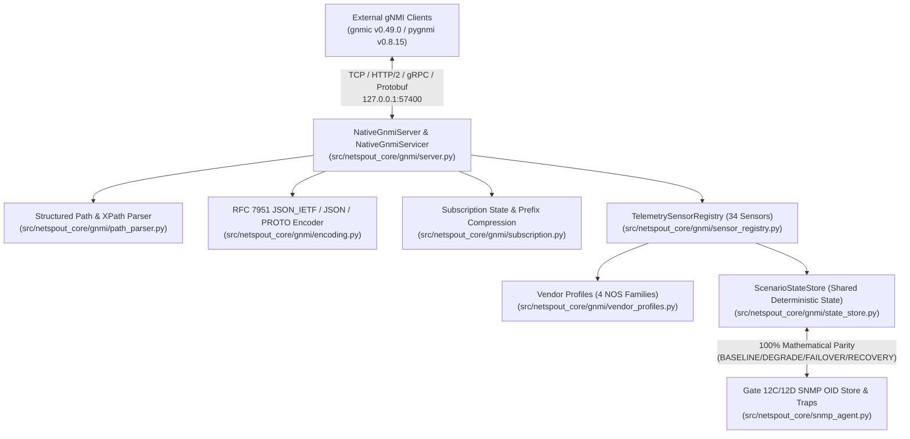

# NETSPOUT GATE 13B — NATIVE gNMI SERVER + OPENCONFIG CORE ENGINE IMPLEMENTATION

| Field | Value |
|---|---|
| **Document ID** | `NETSPOUT-ARCH-GATE-13B-IMPL` |
| **Gate** | Gate 13B — Native gNMI Server + OpenConfig Core Engine Implementation |
| **Starting Commit** | `4bb547eea4094093fd6755943588a7dfcb90ff7a` |
| **Protocol Version** | OpenConfig gNMI `0.10.0` over TCP $\rightarrow$ HTTP/2 $\rightarrow$ gRPC $\rightarrow$ Protobuf |
| **Default Endpoint** | `127.0.0.1:57400` (loopback-only default with explicit non-loopback guard) |
| **Golden Scenario** | `openconfig_mdt_streaming` (`topology_id: openconfig_core`) |
| **Splunk E2E Status** | **DEFERRED TO GATE 13D** (`SPLUNK_DISPATCHED: NOT VERIFIED`, `SPLUNK_OBSERVED: NOT VERIFIED`) |

---

## 1. Executive Summary

Gate 13B implements NetSpout's standards-compliant, read-only **Native gNMI Server and OpenConfig Core Engine** under [`src/netspout_core/gnmi/`](file:///Users/mahamudc/Documents/NetSpout/src/netspout_core/gnmi/__init__.py) and synchronizes it across [`netspout/bin/netspout_core/gnmi/`](file:///Users/mahamudc/Documents/NetSpout/netspout/bin/netspout_core/gnmi/__init__.py) and [`backend/app/gnmi/`](file:///Users/mahamudc/Documents/NetSpout/backend/app/gnmi/__init__.py).

Unlike legacy JSON-over-HEC telemetry simulations, the Gate 13B engine exposes real **TCP $\rightarrow$ HTTP/2 $\rightarrow$ gRPC $\rightarrow$ gNMI Protobuf** wire endpoints (`gnmi.gNMI/Capabilities`, `gnmi.gNMI/Get`, `gnmi.gNMI/Set`, `gnmi.gNMI/Subscribe`) verified against two independent external gNMI clients:
- **`gnmic` `v0.49.0`** (`/opt/homebrew/bin/gnmic`)
- **`pygnmi` `v0.8.15`** (`pygnmi.client.gNMIclient`)

---

## 2. Module Architecture (`src/netspout_core/gnmi/`)

| Module | File Path | Responsibility |
|---|---|---|
| `proto/` | [`src/netspout_core/gnmi/proto/gnmi.proto`](file:///Users/mahamudc/Documents/NetSpout/src/netspout_core/gnmi/proto/gnmi.proto), [`gnmi_pb2.py`](file:///Users/mahamudc/Documents/NetSpout/src/netspout_core/gnmi/proto/gnmi_pb2.py), [`gnmi_pb2_grpc.py`](file:///Users/mahamudc/Documents/NetSpout/src/netspout_core/gnmi/proto/gnmi_pb2_grpc.py) | Canonical OpenConfig `gnmi.proto` and `gnmi_ext.proto` definitions and compiled Python/gRPC stubs with descriptor-pool coexistence guards. |
| `vendor_profiles.py` | [`src/netspout_core/gnmi/vendor_profiles.py`](file:///Users/mahamudc/Documents/NetSpout/src/netspout_core/gnmi/vendor_profiles.py) | Defines `CISCO_IOS_XR`, `CISCO_IOS_XE`, `ARISTA_EOS`, and `JUNIPER_JUNOS` profiles, supported YANG `ModelDataSpec` catalogs, allowed origins, and target aliases (`node-cisco8k`, `cisco-asr9k-pe1`, `node-cat-leaf`, `node-arista-spine`, `node-juniper-ptx`). |
| `state_store.py` | [`src/netspout_core/gnmi/state_store.py`](file:///Users/mahamudc/Documents/NetSpout/src/netspout_core/gnmi/state_store.py) | Thread-safe `ScenarioStateStore` producing deterministic `DeviceStateSnapshot` instances across `BASELINE`, `DEGRADE`, `FAILOVER`, and `RECOVERY` with phase-transition listeners for `ON_CHANGE` streams and 100% mathematical parity with SNMP, Syslog, and NetFlow/IPFIX. |
| `path_parser.py` | [`src/netspout_core/gnmi/path_parser.py`](file:///Users/mahamudc/Documents/NetSpout/src/netspout_core/gnmi/path_parser.py) | Parses `gnmi_pb2.Path` (`origin`, `target`, `PathElem.name`, `PathElem.key`) and string XPaths, merges `prefix` + relative `path`, supports wildcard keys (`[name=*]`), and rejects malformed brackets/predicates with `GnmiPathParseError` (`StatusCode.INVALID_ARGUMENT`). |
| `encoding.py` | [`src/netspout_core/gnmi/encoding.py`](file:///Users/mahamudc/Documents/NetSpout/src/netspout_core/gnmi/encoding.py) | Implements `JSON_IETF` (RFC 7951 stringified 64-bit counters), `JSON`, and `PROTO` (`TypedValue` scalar `uint_val`, `int_val`, `string_val`, `bool_val`, `double_val`), and rejects `BYTES`/`ASCII` with `StatusCode.UNIMPLEMENTED`. |
| `sensor_registry.py` | [`src/netspout_core/gnmi/sensor_registry.py`](file:///Users/mahamudc/Documents/NetSpout/src/netspout_core/gnmi/sensor_registry.py) | Registers 34 canonical sensors across 11 OpenConfig domains and 4 vendor-native origins, enforcing vendor origin isolation (`GnmiForeignOriginError`) and explicit `VERIFIED` / `MODELED` / `NOT_SUPPORTED` fidelity classifications. |
| `subscription.py` | [`src/netspout_core/gnmi/subscription.py`](file:///Users/mahamudc/Documents/NetSpout/src/netspout_core/gnmi/subscription.py) | Builds prefix-compressed `Notification` messages and tracks `suppress_redundant`, `heartbeat_interval`, and `ON_CHANGE` payload fingerprints via `SubscriptionItemTracker`. |
| `server.py` | [`src/netspout_core/gnmi/server.py`](file:///Users/mahamudc/Documents/NetSpout/src/netspout_core/gnmi/server.py) | Implements `NativeGnmiServicer`, `NativeGnmiServer`, `NativeGnmiServerConfig`, `GnmiServerDiagnostics`, and in-memory ephemeral X.509 certificate generation (`generate_ephemeral_tls_material`). |

---

## 3. gNMI RPC Implementation Details

### 3.1 `Capabilities` RPC
- Returns `gNMI_version = "0.10.0"`.
- Returns `supported_encodings = [JSON (0), PROTO (2), JSON_IETF (4)]`.
- Resolves target device via `x-netspout-target` / `target` gRPC metadata or `config.default_target` and returns that vendor profile's exact OpenConfig + vendor-native `ModelData` list:
  - `CISCO_IOS_XR` (`node-cisco8k`): 23 models (13 OpenConfig + 10 `Cisco-IOS-XR-*-oper`)
  - `CISCO_IOS_XE` (`node-cat-leaf`): 19 models (13 OpenConfig + 6 `Cisco-IOS-XE-*-oper`)
  - `ARISTA_EOS` (`node-arista-spine`): 15 models (13 OpenConfig + `eos_native`, `arista-exp-eos-lanz`)
  - `JUNIPER_JUNOS` (`node-juniper-ptx`): 16 models (13 OpenConfig + 3 `junos-*` JTI models)

### 3.2 `Get` RPC
- Supports all four `GetRequest.DataType` modes (`ALL`, `CONFIG`, `STATE`, `OPERATIONAL`).
- Supports `prefix` + multiple `path` entries, leaf queries, subtree queries, and `[key=*]` wildcard expansion.
- Enforces `max_paths_per_request = 64` (aborts with `StatusCode.INVALID_ARGUMENT` if exceeded).

### 3.3 `Set` RPC (Read-Only Security Policy)
- Unconditionally aborts every `Set` request with `grpc.StatusCode.UNIMPLEMENTED` and message:
  `"NetSpout gNMI target is read-only; Set RPC is disabled by security policy."`
- Increments `diagnostics.set_requests_rejected` and `diagnostics.unimplemented_errors`.

### 3.4 `Subscribe` RPC (`ONCE`, `POLL`, `STREAM / SAMPLE`, `STREAM / ON_CHANGE`)
- **`ONCE`**: Resolves all subscribed paths against a consistent `DeviceStateSnapshot`, streams `SubscribeResponse(update=Notification)` messages, emits `SubscribeResponse(sync_response=True)`, and closes the RPC cleanly.
- **`POLL`**: Emits initial snapshot + `sync_response=True`, then awaits client `SubscribeRequest(poll=Poll())` frames on the bidirectional stream, emitting fresh snapshot notifications + `sync_response=True` on each poll.
- **`STREAM / SAMPLE`**: Enforces `min_sample_interval_ns = 500_000_000` (500ms floor — rejecting `< 500ms` with `StatusCode.INVALID_ARGUMENT` by default or clamping when `clamp_sample_interval=True`), emits initial snapshot + `sync_response=True`, and streams periodic counter samples on the configured cadence.
- **`STREAM / ON_CHANGE`**: Emits initial snapshot + `sync_response=True`, registers a phase-transition callback on `ScenarioStateStore`, and immediately pushes delta notifications when leaf/subtree fingerprints change across `BASELINE` $\rightarrow$ `DEGRADE` $\rightarrow$ `FAILOVER` $\rightarrow$ `RECOVERY` (plus optional `heartbeat_interval` re-assertions).

---

## 4. Security, Resource Limits & Backpressure Controls

| Control | Default Value | Enforcement Mechanism |
|---|---|---|
| Loopback Bind Guard | `127.0.0.1:57400` (`allow_non_loopback=False`) | Raises `ValueError("NON_LOOPBACK_BIND_REJECTED")` if non-loopback bind is attempted without opt-in. |
| Transport Security Modes | `INSECURE_LOCAL_LAB`, `TLS_SERVER_AUTH`, `MTLS_CLIENT_AUTH` | Ephemeral X.509 CA, server cert, and client cert generated in memory via `cryptography.x509`; zero private keys committed to git. |
| Metadata Authentication | `username` / `password` headers | Aborts with `StatusCode.UNAUTHENTICATED` on invalid/missing credentials; secrets redacted (`***REDACTED***`) in `to_redacted_dict()`. |
| Max Active Streams | `32` | Aborts excess `Subscribe` streams with `StatusCode.RESOURCE_EXHAUSTED` (`MAX_ACTIVE_STREAMS_EXCEEDED`). |
| Max Paths Per Request | `64` | Aborts `Get` / `Subscribe` with `StatusCode.INVALID_ARGUMENT` (`MAX_PATHS_EXCEEDED`). |
| Slow Consumer Protection | `max_queue_size_per_stream = 256` | Bounded per-stream queue; aborts overflowed stream with `StatusCode.RESOURCE_EXHAUSTED` (`STREAM_QUEUE_OVERFLOW`). |
| Sample Interval Floor | `500_000_000` ns (`500ms`) | Aborts `< 500ms` with `StatusCode.INVALID_ARGUMENT` (`SAMPLE_INTERVAL_BELOW_FLOOR`) or clamps when `clamp_sample_interval=True`. |
