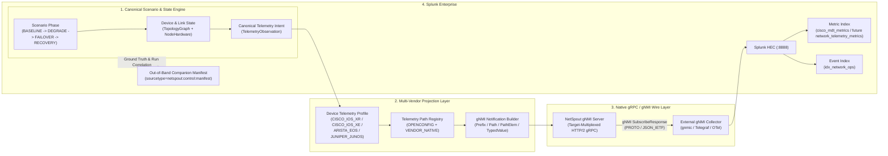

# NetSpout Gate 13 — Native gNMI / OpenConfig Architecture & Multi-Vendor Rich Telemetry Definition

**Author:** Mahamudul Chowdhury (`machowdhury@yahoo.com`)  
**Gate:** 13 (Native gNMI / OpenConfig Architecture & Multi-Vendor Rich Telemetry Definition)  
**Date:** 2026-09-29  
**Baseline Commit:** `8c4f857e8187228c2dd0b4e1bc470b4e1eeae5d0` (Gate 12F Accepted & Closed)  
**Status:** ARCHITECTURE, PROTOCOL DEFINITION & MULTI-VENDOR MODELING COMPLETE (Zero Runtime Implementation)

---

## 1. Executive Summary & Product Objective

### 1.1 Primary Customer Problem Statement
> *"I need rich streaming telemetry from Cisco, Arista, and Juniper devices in Splunk to prove monitoring, troubleshooting, assurance, performance, capacity, fault, and optimization use cases, but I do not have the physical network infrastructure."*

NetSpout Gate 13 defines the complete architecture for **Native gNMI / OpenConfig Streaming Telemetry**, enabling NetSpout to behave sufficiently like telemetry-capable network devices (`Cisco IOS XR`, `Cisco IOS XE`, `Arista EOS`, and `Juniper Junos`) that an independent external gNMI client (`gnmic`, `pygnmi`, `Telegraf inputs.gnmi`, or `OpenTelemetry Collector`) can establish real HTTP/2 gRPC connections, query `Capabilities` and `Get`, subscribe via `Subscribe` (`ONCE`, `POLL`, `STREAM/SAMPLE`, `STREAM/ON_CHANGE`, with `heartbeat_interval` and `suppress_redundant`), receive standards-compliant `gnmi.SubscribeResponse` protobuf messages, and forward normalized and raw-path-preserving telemetry into Splunk.

### 1.2 Gate 13 Scope Boundary
Gate 13 is strictly an **architecture, protocol specification, vendor YANG/sensor modeling, security threat-modeling, and verification design gate**:
- **Zero runtime code changes:** No modifications to `src/netspout_core/`, `backend/app/`, `netspout/bin/`, or `frontend/`.
- **Zero gRPC listeners opened:** No gRPC ports (`57400`, `6030`, `32767`, `9339`) are bound in Gate 13.
- **Zero new dependencies installed:** `grpcio` / `protobuf` / `gnmi.proto` compilation is specified for future Gate 13B, not installed in Gate 13.
- **Zero scenario additions:** All 29 canonical scenarios and 13 `GOLDEN_PATH_CERTIFIED` scenarios remain unchanged.
- **Identity Preserved:** NetSpout remains a **scenario-driven network telemetry and event simulator**, not a hardware ASIC, control-plane daemon, or router OS emulator.

---

## 2. Core Design Principle: Single Scenario State $\rightarrow$ Multi-Vendor Projection

NetSpout explicitly rejects creating independent per-vendor simulation engines (`CiscoTelemetryEngine`, `AristaTelemetryEngine`, `JuniperTelemetryEngine`). Instead, **the scenario state engine is the single source of operational truth**, and vendor-specific gNMI telemetry is a deterministic projection of that shared state:



---

## 3. Cross-Vendor Canonical Telemetry Model (`TelemetryObservation`)

To prevent untyped dictionary sprawl across transports and vendors, Gate 13 defines a bounded, strongly typed internal model (`TelemetryObservation`) that represents a single point-in-time operational measurement or state transition emitted by the scenario engine:

```python
from dataclasses import dataclass, field
from enum import Enum
from typing import Dict, Optional, Union

class TelemetryCategory(str, Enum):
    INTERFACES = "INTERFACES"
    ROUTING_BGP = "ROUTING_BGP"
    MPLS_SR = "MPLS_SR"
    QUEUES_QOS = "QUEUES_QOS"
    SYSTEM = "SYSTEM"
    PLATFORM = "PLATFORM"
    OPTICS = "OPTICS"
    FORWARDING_AFT = "FORWARDING_AFT"
    LLDP = "LLDP"
    L2_VLAN = "L2_VLAN"
    ENVIRONMENTAL = "ENVIRONMENTAL"

class SignalKind(str, Enum):
    COUNTER = "COUNTER"      # Monotonically increasing (e.g., in-octets, out-pkts, queue-drops)
    GAUGE = "GAUGE"          # Point-in-time continuous/discrete measurement (e.g., cpu-pct, rx-power-dbm)
    STATE = "STATE"          # Discrete operational state / enum (e.g., oper-status=UP, session-state=ESTABLISHED)
    EVENT = "EVENT"          # Asynchronous state-transition or fault notification

class ValueType(str, Enum):
    UINT64 = "UINT64"
    INT64 = "INT64"
    DOUBLE = "DOUBLE"
    STRING = "STRING"
    BOOL = "BOOL"

class SplunkRoutingTarget(str, Enum):
    METRIC = "METRIC"        # Routed to Splunk Metric Index (mstats-compatible)
    EVENT = "EVENT"          # Routed to Splunk Event Index (state transitions, alarms, BGP flaps)
    BOTH = "BOTH"            # Numeric gauge/counter + state transition event on ON_CHANGE

class PathSupportLevel(str, Enum):
    CROSS_VENDOR_VERIFIED = "CROSS_VENDOR_VERIFIED"
    VENDOR_VERIFIED = "VENDOR_VERIFIED"
    MODELED_MAPPING = "MODELED_MAPPING"
    UNSUPPORTED = "UNSUPPORTED"

@dataclass(frozen=True)
class VendorPathBinding:
    origin: str                          # e.g., "openconfig", "Cisco-IOS-XR-infra-statsd-oper", "eos_native", "junos"
    gnmi_path: str                       # Parameterized path template, e.g., "/interfaces/interface[name={if_name}]/state/oper-status"
    yang_module: str                     # Authoritative module name
    support_level: PathSupportLevel      # CROSS_VENDOR_VERIFIED | VENDOR_VERIFIED | MODELED_MAPPING | UNSUPPORTED
    evidence_basis: str                  # DOCUMENTED | VERIFIED | INFERRED | MODELED
    value_transform: Optional[str] = None # e.g., "dbm_to_0_01_dbm_int", "uppercase_enum", "pct_to_uint8"

@dataclass(frozen=True)
class TelemetryObservation:
    signal_id: str                       # Canonical ID, e.g., "interface.oper_status", "optics.rx_power_dbm"
    scenario_id: str                     # Source scenario ID, e.g., "openconfig_mdt_streaming"
    run_id: str                          # Deterministic NetSpout run UUID
    phase: str                           # BASELINE | DEGRADE | FAILOVER | RECOVERY
    device_id: str                       # Canonical topology node ID, e.g., "node-cisco8k"
    vendor_profile_id: str               # CISCO_IOS_XR | CISCO_IOS_XE | ARISTA_EOS | JUNIPER_JUNOS
    network_instance: str                # Default "default" (or VRF name)
    component_key: Dict[str, str]        # e.g., {"if_name": "HundredGigE0/0/0/0", "queue_id": "0"}
    timestamp_ns: int                    # Unix epoch nanoseconds (gNMI Notification.timestamp)
    value: Union[int, float, str, bool]  # Canonical value
    value_type: ValueType                # UINT64 | INT64 | DOUBLE | STRING | BOOL
    unit: str                            # bytes | packets | percent | dbm | celsius | mv | count | state
    category: TelemetryCategory          # Domain classification
    signal_kind: SignalKind              # COUNTER | GAUGE | STATE | EVENT
    splunk_routing: SplunkRoutingTarget  # METRIC | EVENT | BOTH
    transport_fidelity: str              # "NATIVE_TRANSPORT" (Mode B) or "MODELED_PAYLOAD" (Mode A)
    device_state_fidelity: str           # Always "MODELED_DEVICE_STATE"
    openconfig_binding: Optional[VendorPathBinding] = None
    vendor_native_binding: Optional[VendorPathBinding] = None
    ground_truth_fault: bool = False
```

---

## 4. Cross-Transport State Coherence Contract

### 4.1 The Cross-Transport Coherence Invariant
A core NetSpout architectural invariant established in Gate 13 is **Cross-Transport State Coherence**:
> *For any given `(scenario_id, run_id, phase, device_id, component_key)`, every active telemetry transport (`gNMI/OpenConfig`, `SNMPv2c Trap/Inform/Poll`, `Syslog RFC 5424/3164`, `NetFlow v9 / IPFIX`, and `HEC Modeled Payload`) MUST project mutually consistent operational state.*

Contradictions across transports—such as SNMP reporting `IF-MIB::ifOperStatus = down(2)` while gNMI reports `/interfaces/interface/state/oper-status = UP`, or gNMI reporting `in-octets = 0` while IPFIX exports active flows on that interface—are architectural defects.

### 4.2 Unified State-to-Transport Projection Matrix

| Canonical Scenario Event / State | `ScenarioPhaseState` Ground Truth | Syslog Projection (`log_engine.py`) | SNMPv2c Projection (`snmp_engine.py` / `snmp_agent.py`) | gNMI / OpenConfig Projection (Gate 13 Architecture) | NetFlow v9 / IPFIX Projection (`transport_native_flow.py`) |
| :--- | :--- | :--- | :--- | :--- | :--- |
| **Interface Link Down (`DEGRADE` / `FAULT`)** | `interface.oper_status = DOWN`, `carrier_transitions += 1` | `%LINK-3-UPDOWN: Interface <if>, changed state to down` / `UI_DBASE_LOGOUT_EVENT` | `IF-MIB::linkDown` Trap (`1.3.6.1.6.3.1.1.5.3`) + Polled `ifOperStatus.<idx> = 2 (down)` | `ON_CHANGE` Notification: `/interfaces/interface[name=<if>]/state/oper-status = "DOWN"` | Flow export shifts off failed ingress/egress `ifIndex` to backup interface |
| **BGP Peer Adjacency Drop (`DEGRADE` / `FAILOVER`)** | `bgp.session_state = IDLE`, `bgp.prefixes_installed = 0` | `%BGP-5-ADJCHANGE: neighbor <peer> Down` / `RPD_BGP_NEIGHBOR_STATE_CHANGED` | `BGP4-MIB::bgpBackwardTransition` Trap (`1.3.6.1.2.1.15.7.2`) + `bgpPeerState.<peer> = 1 (idle)` | `ON_CHANGE`: `.../bgp/neighbors/neighbor[neighbor-address=<peer>]/state/session-state = "IDLE"` | Next-hop IPv4/IPv6 (`ipNextHopIPv4Address`) updates to backup BGP peer |
| **Interface Microburst / Congestion (`DEGRADE`)** | `interface.utilization_pct = 96.4`, `queue.depth_bytes` high, `queue.drop_pkts` rising | `%HARDWARE-2-BURST_THRESHOLD` / `LANZ_CONGESTION_DETECTED` | `ifOutDiscards.<idx>` & `ifInErrors.<idx>` counter increments | `SAMPLE` (1s): `/qos/interfaces/interface/output/queues/queue/state/transmit-octets`, `dropped-pkts`, `max-queue-len` | High packet/octet rate flows (`octetDeltaCount`, `packetDeltaCount`) on congested port |
| **Optical Carrier Degrade (`DEGRADE`)** | `optics.rx_power_dbm = -24.8`, `optics.pre_fec_ber = 1.2e-3`, `optics.osnr_db = 11.5` | `%PKT_INFRA-LINK-3-UPDOWN` / `OPTICS_LOW_RX_POWER` | Optical alarm trap + `entSensorValue` degraded | `SAMPLE`: `/components/component[name=<port>]/transceiver/state/input-power/instant = -24.8` + native optics path | Packet loss increase reflected in reduced flow completion bytes |
| **Recovery (`RECOVERY`)** | `interface.oper_status = UP`, `bgp.session_state = ESTABLISHED`, counters stabilize | `%LINK-3-UPDOWN: Interface <if>, changed state to up`, `%BGP-5-ADJCHANGE: Up` | `IF-MIB::linkUp` Trap + `bgpEstablished` Trap + `ifOperStatus.<idx> = 1 (up)` | `ON_CHANGE`: `oper-status = "UP"`, `session-state = "ESTABLISHED"`, `installed = received` | Traffic returns to primary path `ifIndex` and primary BGP next-hop |

### 4.3 Audit of Current Architecture & Consolidation Path
- **What already exists:** `TopologyGraph` in [`src/netspout_core/graph_engine.py`](file:///Users/mahamudc/Documents/NetSpout/src/netspout_core/graph_engine.py#L236-L433) already synchronizes `Node.hardware.interfaces` and `OpenConfigYANGStore` (`yang_store.update_interface_oper_status`, `yang_store.update_bgp_session_state`, `yang_store.update_platform_utilization`) during `propagate_link_failure`, `propagate_node_exhaustion`, `restore_link`, and `restore_node`.
- **Identified Gap for Gate 13B/13C Consolidation:** Currently, `build_service_provider_cisco_oid_store()` in [`src/netspout_core/snmp_agent.py`](file:///Users/mahamudc/Documents/NetSpout/src/netspout_core/snmp_agent.py#L410) computes phase-deterministic counters (`BASELINE`, `DEGRADE`, `FAILOVER`, `RECOVERY`) independently of `OpenConfigYANGStore` in [`src/netspout_core/gnmi_engine.py`](file:///Users/mahamudc/Documents/NetSpout/src/netspout_core/gnmi_engine.py#L40) (which still uses `random.randint` for initial counters on lines 79–82). In Gate 13B, both `SimulatedSnmpAgent` and the native gNMI server will read from a shared deterministic `ScenarioPhaseState` snapshot seeded by `(scenario_id, phase, seed, tick)` so that `ifHCInOctets` (SNMP) and `/interfaces/interface/state/counters/in-octets` (gNMI) report identical values for the same `(device_id, if_name, phase)`.

---

## 5. Device Role, Multi-Device Multiplexing & Deployment Architecture

### 5.1 Device Role: `DIAL-IN` Primary vs `DIAL-OUT` Secondary

| Dimension | `DIAL-IN` (gNMI Server on NetSpout) | `DIAL-OUT` (NetSpout Initiates Stream to Collector) |
| :--- | :--- | :--- |
| **Standardization** | **Canonical gNMI Specification (`gnmi.proto` `gNMI` service)** | Vendor-specific (Cisco MDT gRPC dial-out `MdtDialout`, Juniper JTI UDP/gRPC dial-out, OpenConfig `gNMI-Reverse`) |
| **RPC Coverage** | Supports `Capabilities`, `Get`, and `Subscribe` (`ONCE`, `POLL`, `STREAM`) | Push-only streaming; cannot test `Capabilities`, `Get`, `ONCE`, or `POLL` |
| **Collector Compatibility** | Supported by **all** standard gNMI tools (`gnmic`, `pygnmi`, `Telegraf inputs.gnmi`, `OTel gnmi receiver`) | Requires vendor-specific dial-out receivers (e.g., `telegraf inputs.cisco_telemetry_mdt`) |
| **Gate 13 Architectural Decision** | **PRIMARY — Implement First in Gate 13B** | **SECONDARY — Deferred Future Option** |

### 5.2 Multi-Device Emulation: Target-Multiplexed Single Listener + Optional Loopback Port Pool
Scenarios such as `openconfig_mdt_streaming` (`4` nodes), `service_provider_cisco` (`8` nodes), `service_provider_mixed` (`8` nodes), and `mixed_vendor_enterprise` (`8` nodes) contain multiple routers and switches across Cisco, Arista, and Juniper. Opening dozens of arbitrary TCP ports is brittle and unfriendly to container orchestration.

NetSpout Gate 13 defines a **two-tier multi-device addressing architecture**:
1. **Primary Mechanism — gNMI `Prefix.target` Multiplexing on a Single Loopback gRPC Port (`127.0.0.1:57400` or ephemeral port):**
   - The gNMI specification (`gnmi.Path.target` in `SubscribeRequest.subscribe.prefix.target` and `GetRequest.prefix.target`) was explicitly designed for target multiplexing.
   - A client connects to `127.0.0.1:<gnmi_port>` and sets `prefix.target = "node-cisco8k"` (or `"Cisco-8000-Core01"`, `"node-juniper-ptx"`, `"node-arista-spine"`, `"cisco-asr9k-pe1"`, or `"*"` for all active scenario devices).
   - NetSpout's `GnmiTargetRouter` routes the request to the corresponding `DeviceTelemetryInstance` and stamps `Notification.prefix.target = <device_id>` on every emitted `SubscribeResponse`.
   - For `CapabilitiesRequest` (which in `gnmi.proto` does not carry a `Path.target` field), NetSpout supports gRPC request metadata header `x-netspout-target: <device_id>` (or standard `target` metadata key) to return the exact vendor profile's `SupportedModels` (`Cisco IOS XR`, `Arista EOS`, or `Juniper Junos`), defaulting to the scenario's primary device or union capability set when no metadata key is provided.
2. **Secondary Mechanism — Bounded Virtual Loopback Alias / Ephemeral Port Map (Max 8 Ports per Run):**
   - For external collectors that associate one TCP `host:port` endpoint per device without setting `prefix.target`, NetSpout can optionally bind up to `MAX_SIMULATED_DEVICE_PORTS = 8` ephemeral loopback ports (`127.0.0.1:<ephemeral_port>`) where each port is pre-bound to a specific `device_id`.

### 5.3 Deployment Architecture & Splunk Cloud / AppInspect Assessment

| Option | Architecture | Splunk Cloud / AppInspect Impact | Decision |
| :--- | :--- | :--- | :--- |
| **Option A** | Embed gNMI gRPC server directly inside Splunk App Python runtime (`netspout/bin/`) | **FAILS Splunk Cloud & AppInspect.** Splunk Cloud prohibits persistent arbitrary inbound TCP/gRPC listening sockets, native C-extension `grpcio` wheels inside search-head apps, and unapproved inbound network listeners. | **REJECTED** |
| **Option B** | Embed gNMI server inside the NetSpout Companion Backend (`backend/app/` / `src/netspout_core/`) | **PASSES.** Matches the proven Gate 11D/12C/12D architecture where `SimulatedSnmpAgent` runs in the companion backend on loopback (`127.0.0.1`) while the Splunk App (`netspout/`) remains pure AppInspect-safe REST/UI/HEC orchestration. | **SELECTED FOR LOCAL / STANDALONE LAB (Gate 13B)** |
| **Option C** | Dedicated Telemetry Device-Emulator Container (`netspout-gnmi-emulator`) | **PASSES.** Ideal for multi-container Docker Compose deployments alongside external `gnmic` / `Telegraf` / `OTel Collector` containers. | **SELECTED FOR CONTAINERIZED E2E (Gate 13C)** |
| **Option D** | **Hybrid (Shared `src/netspout_core/` engine runnable in Companion Backend OR Dedicated Emulator Container, strictly outside the Splunk App)** | **OPTIMAL.** The Splunk App (`netspout/`) never binds gRPC sockets or bundles `grpcio`; native gNMI runs in the companion backend / emulator service, while Mode A (`MODELED_PAYLOAD`) remains available for pure Splunk Cloud environments without a companion container. | **CANONICAL ARCHITECTURE DECISION** |

---

## 6. Splunk Ingestion, Event vs Metric Routing & Data Model

### 6.1 Evaluation of gNMI-to-Splunk Collector Pipelines

| Pipeline Option | Flow | Strengths | Tradeoffs | Gate 13 Recommendation |
| :--- | :--- | :--- | :--- | :--- |
| **Option A: `gnmic` / gNMI Collector $\rightarrow$ OTel Collector $\rightarrow$ Splunk HEC** | `NetSpout gNMI -> gnmic / OTel gNMI Receiver -> OTLP -> Splunk HEC` | Vendor-neutral, aligns with Splunk OTel Collector ecosystem (`otel-collector-config.standalone.yaml` already in repo). | The `openconfig`/`gnmi` receiver in `otel-collector-contrib` has historically had experimental stability and can flatten raw vendor YANG paths unless carefully configured. | **Secondary / Supported Enterprise Reference Path** |
| **Option B: Telegraf `inputs.gnmi` $\rightarrow$ `outputs.http` (Splunk HEC)** | `NetSpout gNMI -> Telegraf (inputs.gnmi) -> Splunk HEC (metric + event)` | Industry-standard for Cisco MDT, Arista EOS, and Juniper JTI; natively supports path aliases, `origin`, `target`, `SAMPLE`, and `ON_CHANGE`. | Requires Telegraf binary/container in the E2E environment. | **Co-Primary Production Collector Reference** |
| **Option C: Independent gNMI Client (`gnmic` / `pygnmi`) $\rightarrow$ Normalized Bridge $\rightarrow$ Splunk HEC** | `NetSpout gNMI -> gnmic / pygnmi client -> NetSpout GnmiSplunkBridge -> Splunk HEC` | Mirrors the proven Gate 12D/12F `snmptrapd`/`snmpbulkwalk` $\rightarrow$ `SnmpSplunkBridge` pattern; preserves 100% of raw gNMI path provenance, normalized canonical fields, and `COLLECTOR_OBSERVED` evidence stages. | Uses a thin bridge normalizer between the external gNMI client output and Splunk HEC. | **PRIMARY E2E TEST PATH (Future Gate 13C)** |
| **Option D: Direct Splunk OTel Collector Only** | `NetSpout gNMI -> Splunk OTel Collector -> Splunk HEC` | Single collector binary. | Less granular gNMI CLI debugging than `gnmic` / `pygnmi` for protocol-level verification. | **Optional Integration Path** |

### 6.2 Event vs Metric Routing Contract (Gate 8 Unified Evidence Alignment)

In accordance with Gate 8 Unified Evidence principles, gNMI updates must **never** be dumped indiscriminately into a single event index:

1. **`METRIC` Routing (`SignalKind.COUNTER` and `SignalKind.GAUGE`):**
   - **Signals:** Interface counters (`in-octets`, `out-octets`, `in-unicast-pkts`, `in-errors`, `out-discards`, `utilization_pct`), Queue/QoS metrics (`queue.depth_bytes`, `queue.dropped_pkts`, `queue.transmit_octets`, `buffer_utilization_pct`), System metrics (`system.cpu_utilization_pct`, `system.memory_utilization_pct`), Optical gauges (`optics.rx_power_dbm`, `optics.tx_power_dbm`, `optics.pre_fec_ber`, `optics.osnr_db`, `optics.laser_bias_ma`), Platform environmentals (`platform.temperature_celsius`, `platform.fan_speed_rpm`, `platform.psu_input_power_watts`), MPLS/SR traffic counters, BGP prefix counts (`bgp.prefixes_received`, `bgp.prefixes_installed`).
   - **Splunk Destination:** Metric Index (`event: "metric"`, queryable via `| mstats`).
   - **Sourcetype:** `openconfig:gnmi:metric` (or existing `cisco:ios:mdt:metric` for backward compatibility).
2. **`EVENT` Routing (`SignalKind.STATE` and `SignalKind.EVENT` via `ON_CHANGE`):**
   - **Signals:** Interface operational state transitions (`interface.oper_status` `UP -> DOWN -> UP`), BGP neighbor state transitions (`bgp.session_state` `ESTABLISHED -> IDLE -> ACTIVE -> ESTABLISHED`), MPLS/SR LSP path switchovers (`mpls.lsp_oper_state`, `sr.ti_lfa_active`), Hardware/Optical alarms (`platform.alarm_state`, `optics.los_alarm`), FIB/AFT next-hop changes (`aft.ipv4_prefix_nh_group`).
   - **Splunk Destination:** Event Index (`idx_network_ops`).
   - **Sourcetype:** `netspout:gnmi:event` / `openconfig:gnmi:telemetry`.

### 6.3 Splunk Metric Index Naming Evaluation (`cisco_mdt_metrics` vs `network_telemetry_metrics`)
- **Architectural Finding:** Existing NetSpout scenarios route metrics to `index=cisco_mdt_metrics`. While appropriate for Cisco-only scenarios, `cisco_mdt_metrics` is architecturally misleading when indexing native `Arista EOS` (`eos_native` / OpenConfig) and `Juniper Junos` (`junos` JTI / OpenConfig) gNMI metrics.
- **Gate 13 Recommendation (No Rename in Gate 13):**
  1. **Do NOT rename or remove `cisco_mdt_metrics` in Gate 13** (preserving 100% compatibility with all 13 `GOLDEN_PATH_CERTIFIED` scenarios and Gate 12D/12F).
  2. **Future Gate 13C Dual-Compat Strategy:** Introduce vendor-neutral metric index `network_telemetry_metrics` as the canonical multi-vendor metric destination, while allowing scenarios that already contractually specify `cisco_mdt_metrics` (or installations that alias `network_telemetry_metrics` to `cisco_mdt_metrics`) to continue passing without breaking a single existing SPL validation rule.

### 6.4 Two-Layer Telemetry Normalization & Searchable Splunk Field Contract
Every Splunk record produced from native gNMI preserves **both** the **Raw / Protocol View** and the **Normalized Cross-Vendor View**:

| Field Category | Field Name | Example Value (`Cisco IOS XR`) | Example Value (`Arista EOS`) | Example Value (`Juniper Junos`) |
| :--- | :--- | :--- | :--- | :--- |
| **Out-of-Band / Bridge Correlation** | `netspout_run_id` | `run-9f8a7b6c` | `run-9f8a7b6c` | `run-9f8a7b6c` |
| | `netspout_scenario_id` | `openconfig_mdt_streaming` | `openconfig_mdt_streaming` | `openconfig_mdt_streaming` |
| | `netspout_phase` | `DEGRADE` | `DEGRADE` | `DEGRADE` |
| | `netspout_device_id` | `node-cisco8k` | `node-arista-spine` | `node-juniper-ptx` |
| **Device & Vendor Provenance** | `vendor` | `cisco` | `arista` | `juniper` |
| | `platform` | `cisco_ios_xr` | `arista_eos` | `juniper_junos` |
| | `telemetry_model` | `CISCO_NATIVE` or `OPENCONFIG` | `OPENCONFIG` or `EOS_NATIVE` | `JUNOS_NATIVE` or `OPENCONFIG` |
| **Raw gNMI Protocol View** | `gnmi_target` | `node-cisco8k` | `node-arista-spine` | `node-juniper-ptx` |
| | `gnmi_origin` | `Cisco-IOS-XR-infra-statsd-oper` | `openconfig` | `junos` |
| | `gnmi_path` | `/infra-statistics/interfaces/interface[interface-name=HundredGigE0/0/0/0]/latest/generic-counters/bytes-received` | `/interfaces/interface[name=Ethernet1/1]/state/counters/in-octets` | `/junos/system/linecard/interface[name=et-0/0/0]/traffic/ibytes` |
| | `openconfig_path` | `/interfaces/interface[name=HundredGigE0/0/0/0]/state/counters/in-octets` | `/interfaces/interface[name=Ethernet1/1]/state/counters/in-octets` | `/interfaces/interface[name=et-0/0/0]/state/counters/in-octets` |
| | `vendor_native_path` | `Cisco-IOS-XR-infra-statsd-oper:infra-statistics/interfaces/interface/latest/generic-counters/bytes-received` | `Sysdb/interface/counter/eth/slice/phy/1/intfCounterDir/Ethernet1/1/intfCounter` | `/junos/system/linecard/interface/traffic/` |
| | `subscription_mode` | `SAMPLE` | `SAMPLE` | `SAMPLE` |
| | `sample_interval` | `5000ms` | `5000ms` | `5000ms` |
| **Normalized Cross-Vendor View** | `metric_name` / `canonical_signal` | `interface.in_octets` | `interface.in_octets` | `interface.in_octets` |
| | `value` | `984512000` | `984512000` | `984512000` |
| | `value_type` | `UINT64` | `UINT64` | `UINT64` |
| | `unit` | `bytes` | `bytes` | `bytes` |
| **Fidelity & Evidence Provenance** | `fidelity` | `NATIVE_TRANSPORT` | `NATIVE_TRANSPORT` | `NATIVE_TRANSPORT` |
| | `device_state_fidelity` | `MODELED_DEVICE_STATE` | `MODELED_DEVICE_STATE` | `MODELED_DEVICE_STATE` |
| | `transport` | `gnmi_grpc` | `gnmi_grpc` | `gnmi_grpc` |
| | `collector` | `gnmic` | `gnmic` | `gnmic` |
| | `origin_evidence_stage` | `COLLECTOR_OBSERVED` | `COLLECTOR_OBSERVED` | `COLLECTOR_OBSERVED` |
| | `current_evidence_stage` | `VALIDATED` | `VALIDATED` | `VALIDATED` |

> **Out-of-Band Correlation Rule:** Native gNMI wire messages (`gnmi.SubscribeResponse`) MUST NOT be polluted with non-standard `netspout_run_id` or `netspout_phase` leaves inside the YANG payload tree. Instead, `netspout_run_id`, `netspout_scenario_id`, and `netspout_phase` are correlated via `(gnmi_target, timestamp_ns)` against the out-of-band `CompanionManifest` (`sourcetype=netspout:control:manifest`) and injected only at the external collector/bridge normalization boundary when formatting HEC events.

---

## 7. Evidence Ladder for Native gNMI

Extending the Gate 6 / Gate 12D/12F evidence semantics, Native gNMI defines a strict **7-Stage Evidence Ladder**:

```text
1. STATE_GENERATED        (Deterministic ScenarioPhaseState & TelemetryObservation created in memory)
   ↓
2. GNMI_UPDATE_ENCODED    (Serialized into gnmi.Update / gnmi.Notification with PathElem & TypedValue)
   ↓
3. STREAMED               (Transmitted over an active HTTP/2 gRPC stream to a connected subscriber;
                           NEVER claimed if no subscriber is connected!)
   ↓
4. COLLECTOR_OBSERVED     (Independently received and decoded by external client: gnmic / pygnmi / Telegraf)
   ↓
5. SPLUNK_DISPATCHED      (Forwarded by collector/bridge to Splunk HEC with HTTP 200 acknowledgement)
   ↓
6. SPLUNK_OBSERVED        (Verified searchable in Splunk index via REST API query)
   ↓
7. VALIDATED              (Scenario contract validation rules & cross-vendor parity assertions PASS)
```

---

## 8. Redundancy Audit & Lifecycle Disposition

NetSpout currently contains modeled OpenConfig/MDT components in [`src/netspout_core/gnmi_engine.py`](file:///Users/mahamudc/Documents/NetSpout/src/netspout_core/gnmi_engine.py). Nothing is deleted in Gate 13; each existing component is assigned an explicit lifecycle disposition:

| Existing Component | Location | Disposition | Rationale |
| :--- | :--- | :--- | :--- |
| **Mode A Direct-to-HEC MDT Payload Generator (`MockGNMIServer.generate_sample_telemetry`, `emit_on_change_event`)** | [`src/netspout_core/gnmi_engine.py`](file:///Users/mahamudc/Documents/NetSpout/src/netspout_core/gnmi_engine.py#L281-L407) | **`KEEP` (as Mode A `MODELED_PAYLOAD`)** | Required for zero-container Splunk Cloud / demo mode and existing Mode A Golden Paths. Must be clearly badged `MODELED PAYLOAD` in the UI (matching the Gate 12F Mode A SC4SNMP pattern). |
| **`OpenConfigYANGStore` state tree builder** | [`src/netspout_core/gnmi_engine.py`](file:///Users/mahamudc/Documents/NetSpout/src/netspout_core/gnmi_engine.py#L40-L279) | **`REUSE` & `EXTEND`** | Provides the RFC 7951 JSON-IETF tree foundation. Will be extended in Gate 13B to replace `random.randint` initializers with deterministic `ScenarioPhaseState` projections and multi-vendor path bindings. |
| **`to_otel_metric_payload` & `to_telegraf_influx_line` formatters** | [`src/netspout_core/gnmi_engine.py`](file:///Users/mahamudc/Documents/NetSpout/src/netspout_core/gnmi_engine.py#L408-L478) | **`KEEP`** | Useful for Mode A OTLP/Telegraf HTTP previews and reference payload inspection. |
| **`to_rfc5424_syslog_mdt`** | [`src/netspout_core/gnmi_engine.py`](file:///Users/mahamudc/Documents/NetSpout/src/netspout_core/gnmi_engine.py#L479-L496) | **`DEPRECATE_LATER`** | Wrapping gNMI notifications inside RFC 5424 syslog (`<134>1 ... gnmi-telemetry`) is a synthetic convenience, not how native gNMI operates. Retain for backward compatibility only. |
| **Random counter jitter inside `OpenConfigYANGStore` (`random.randint`)** | [`src/netspout_core/gnmi_engine.py`](file:///Users/mahamudc/Documents/NetSpout/src/netspout_core/gnmi_engine.py#L79-L82) | **`REPLACE_LATER` (Gate 13B)** | Will be replaced by deterministic, seed-driven `ScenarioPhaseState` counters coherent with SNMP `IF-MIB` and NetFlow/IPFIX. |
| **Native NetFlow v9 / IPFIX (`transport_native_flow.py`) & Native SNMPv2c (`transport_native_snmp.py`, `snmp_agent.py`, `snmp_splunk_e2e.py`)** | `src/netspout_core/` | **`KEEP`** | Completed and certified in Gates 11B–11F and 12B–12F; forms the peer native transport pillars alongside Native gNMI. |

---

## 9. Multi-Vendor Golden Test Selection & Gate 13B Scope Recommendation

### 9.1 Selected Multi-Vendor Golden Scenario: `openconfig_mdt_streaming`
Without creating any new scenario, we audited all 29 canonical scenarios in [`catalog/scenarios.json`](file:///Users/mahamudc/Documents/NetSpout/catalog/scenarios.json) and [`src/netspout_core/scenario_runner.py`](file:///Users/mahamudc/Documents/NetSpout/src/netspout_core/scenario_runner.py#L207-L220). **`openconfig_mdt_streaming`** (`topology_id: "openconfig_core"`, already `GOLDEN_PATH_CERTIFIED`) is uniquely suited as the primary Gate 13B implementation candidate because its existing topology already contains **all four target vendor platforms** in a realistic carrier/DC core-to-leaf path:
1. **`node-cisco8k`** (`Cisco-8000-Core01`, `10.100.1.1`, `HundredGigE0/0/0/0`) $\rightarrow$ Profile: **`CISCO_IOS_XR`**
2. **`node-juniper-ptx`** (`Juniper-PTX10K-PE01`, `10.100.1.2`, `et-0/0/0`, `et-0/0/1`) $\rightarrow$ Profile: **`JUNIPER_JUNOS`**
3. **`node-arista-spine`** (`Arista-7280R-Spine`, `10.100.2.1`, `Ethernet1/1`, `Ethernet2/1`) $\rightarrow$ Profile: **`ARISTA_EOS`**
4. **`node-cat-leaf`** (`Catalyst-9600-Leaf`, `10.100.2.2`, `FortyGigE1/0/1`) $\rightarrow$ Profile: **`CISCO_IOS_XE`**

Furthermore, secondary multi-vendor validation is supported by existing scenarios `mixed_backbone_optical` (`Nokia + Juniper MX960 + Arista 7280R`), `service_provider_cisco` (`Cisco 8000 + NCS 5500 + ASR 9000`), and `cisco_aci_microburst` (`Cisco Nexus 9336/9508`).

### 9.2 Recommended Tightly Bounded Gate 13B Scope
- **In Scope for Gate 13B:**
  1. Native gNMI gRPC server (`Capabilities`, `Get`, `Subscribe` supporting `ONCE`, `POLL`, `STREAM/SAMPLE`, and `STREAM/ON_CHANGE` with `heartbeat_interval` and `suppress_redundant`).
  2. Encodings: `JSON_IETF` (RFC 7951) and `PROTO` (`gnmi.TypedValue` scalar/sub-tree updates).
  3. Core domains: `INTERFACES` (oper-status, counters, errors, utilization), `ROUTING_BGP` (session-state, prefixes received/installed), `SYSTEM` / `PLATFORM` (CPU, memory, temperature), and `OPTICS` / `QUEUES` for the 4 vendor profiles (`CISCO_IOS_XR`, `CISCO_IOS_XE`, `ARISTA_EOS`, `JUNIPER_JUNOS`) across both `OPENCONFIG` and `VENDOR_NATIVE` origins.
  4. Independent verification using an external gNMI client (**`pygnmi`** as primary Python-native independent verifier + **`gnmic`** CLI compatibility).
  5. **NO Splunk E2E in Gate 13B** (Splunk E2E collector bridge is isolated to Gate 13C, mirroring the Gate 11B/11C and Gate 12B/12C/12D progression).
