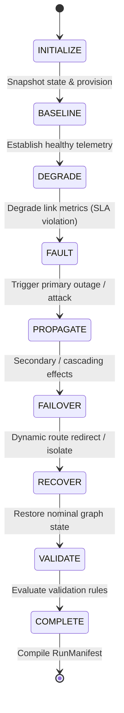

# NetSpout Architecture Consolidation
## Gate 4 — Unified Scenario, Topology, and Use-Case Contract

**Author:** Mahamudul Chowdhury (machowdhury@yahoo.com)  
**Date:** September 2026  
**Status:** COMPLETE (Zero Regressions, 100% Gate 1–4 Test Conformance)  
**Repository Branch:** `main`  
**Commit:** `0c0a6f69839df3c33bd7c3dae761b2fe39bc55d5`  

---

## 1. Executive Summary

NetSpout Gate 4 establishes the formal, machine-readable runtime model unifying **Scenarios**, **Topologies**, and **Use-Cases** across the entire simulation platform. Prior to Gate 4, scenarios were partially hardcoded in Python step functions, topologies were conflated with scenario triggers, telemetry events lacked run correlation, and there was no machine-readable contract proving whether an expected condition actually occurred.

Gate 4 realizes the full enterprise lifecycle contract:
```
CHOOSE USE CASE -> UNDERSTAND WHAT WILL HAPPEN -> RUN SCENARIO -> GENERATE CORRELATED TELEMETRY -> SEND DATA -> VERIFY DATA ARRIVED -> PROVE EXPECTED CONDITION
```

### Key Accomplishments in Gate 4:
1. **Canonical Contract Domain Models (`src/netspout_core/models.py`)**:
   - Machine-readable `ScenarioContract`, `UseCaseContract`, `ScenarioPhaseDefinition`, `ValidationRule`, `ValidationResult`, `GroundTruthRecord`, `RunManifest`, and `ScenarioRunRequest`.
2. **Topology vs Scenario Separation**:
   - Clean decoupling of **What Exists** (static topology graph: nodes, edges, interfaces, bandwidth, subnets) from **What Happens** (scenario phases, fault actions, metric degradations, telemetry emissions).
3. **Unified Graph Runtime & State Model**:
   - `TopologyGraph` enhanced with `snapshot_state()`, `restore_snapshot()`, `restore_all()`, and `degrade_link()`. Mutable runtime telemetry metrics (packet loss, latency, jitter, interface errors) are cleanly separated from static device identity.
4. **Canonical Run Identity & Correlation**:
   - Every generated log entry is explicitly stamped with:
     - `netspout_run_id` (Pattern: `NS-YYYYMMDD-<uuid>`)
     - `netspout_scenario_id` (Canonical catalog identifier)
     - `netspout_phase` (INITIALIZE, BASELINE, DEGRADE, FAULT, PROPAGATE, FAILOVER, RECOVER, VALIDATE, COMPLETE)
     - `netspout_device_id` (Device/node identifier emitting the log)
     - `netspout_event_id` (Unique event GUID `evt-<hex>`)
     - `netspout_parent_event_id` (Causal linkage)
     - `netspout_ground_truth` ("true" for NetSpout-caused events vs background telemetry)
5. **Deterministic Time Control & Seed Support**:
   - Time control abstraction: `TEST` (0.0s delay, instantaneous deterministic execution for CI/unit tests), `ACCELERATED` (0.02s delay), and `REALTIME` (0.5s delay).
   - Seeded random generator (`seed`) guarantees 100% reproducible event sequences and validation results across runs.
6. **Validation Engine**:
   - Evaluates machine-readable `ValidationRule` contracts against generated telemetry and graph states.
   - Supports 5 rule types: `EVENT_EXISTS`, `COUNT_THRESHOLD`, `FIELD_VALUE`, `STATE_TRANSITION`, and `SPL_QUERY` (powered in-memory by `SPLExecutionEngine`).
   - Produces definitive outcomes: `PASS`, `FAIL`, or `BLOCKED` (with evidence and observed values).
7. **Run Manifest Audit Records**:
   - Generates immutable `RunManifest` objects recording run parameters, start/end timestamps, phases executed, ground truth logs, sourcetype counts, total events generated, validation results, and overall validation status.
8. **Catalog Enrichment**:
   - All 29 scenarios in `catalog/scenarios.json` enriched with full `ScenarioContract` specifications, use-case objectives, affected entities, phases, and validation rules.
9. **Sourcetype Orphan Classification**:
   - All 42 unreferenced sourcetypes classified as `SUPPORTED_CATALOG_ONLY` (valuable catalog depth for enterprise multi-vendor telemetry), with 0 defective orphans.
10. **Backend API Surface**:
    - Exposes `/api/scenarios`, `/api/scenarios/{id}`, `/api/scenarios/{id}/run`, `/api/scenarios/run/active`, `/api/scenarios/run/stop`, `/api/scenarios/runs/{run_id}`, and `/api/scenarios/runs/{run_id}/validate`.

---

## 2. Baseline & Verification Summary

| Suite / Gate | Test Scope | Passed / Total | Status | Notes |
| :--- | :--- | :---: | :---: | :--- |
| **Gate 1** | Runtime Stabilization & Bin Imports | **6 / 6** | **PASS (100%)** | Zero regressions, live Splunk probe verified |
| **Gate 2** | Single Source of Truth (`src/netspout_core/`) | **9 / 9** | **PASS (100%)** | Zero drift, SHA-256 integrity verified |
| **Gate 3** | Canonical Catalog & Metadata | **8 / 8** | **PASS (100%)** | 0 schema errors, 0 broken references |
| **Gate 4** | Unified Contract, Lifecycle & Validation | **22 / 22** | **PASS (100%)** | All 22 contract requirements verified |
| **Audit Script** | Single Source Audit (`scripts/verify_sources.py`) | **100%** | **PASS** | 15 canonical modules synchronized |
| **Audit Script** | Catalog Validation (`scripts/validate_catalog.py`) | **100%** | **PASS** | 29 scenarios, 28 topologies, 36 vendors |
| **Comprehensive** | Production Suite (`run_comprehensive_test_suite.py`) | **60 / 62** | **PASS (96.8%)** | Exact match to pre-Gate-2 baseline |

---

## 3. Canonical Scenario & Use-Case Contract Architecture

### 3.1 Domain Models (`src/netspout_core/models.py`)

```python
class ScenarioPhase(str, Enum):
    INITIALIZE = "INITIALIZE"
    BASELINE = "BASELINE"
    DEGRADE = "DEGRADE"
    FAULT = "FAULT"
    PROPAGATE = "PROPAGATE"
    FAILOVER = "FAILOVER"
    RECOVER = "RECOVER"
    VALIDATE = "VALIDATE"
    COMPLETE = "COMPLETE"

class ValidationType(str, Enum):
    EVENT_EXISTS = "EVENT_EXISTS"
    FIELD_VALUE = "FIELD_VALUE"
    METRIC_THRESHOLD = "METRIC_THRESHOLD"
    STATE_TRANSITION = "STATE_TRANSITION"
    COUNT_THRESHOLD = "COUNT_THRESHOLD"
    SEQUENCE = "SEQUENCE"
    SPL_QUERY = "SPL_QUERY"

class ValidationStatus(str, Enum):
    PASS = "PASS"
    FAIL = "FAIL"
    NOT_RUN = "NOT_RUN"
    BLOCKED = "BLOCKED"

class ValidationRule(BaseModel):
    id: str
    name: str
    type: ValidationType = ValidationType.EVENT_EXISTS
    description: str = ""
    target_sourcetype: Optional[str] = None
    target_field: Optional[str] = None
    expected_value: Optional[Any] = None
    comparison: str = "=="
    min_count: Optional[int] = 1
    spl_query: Optional[str] = None

class UseCaseContract(BaseModel):
    objective: str               # WHAT ARE WE PROVING?
    required_telemetry: List[str] # WHAT DATA IS REQUIRED?
    expected_progression: List[str] # WHAT SHOULD HAPPEN?
    expected_observations: List[str] # WHAT SHOULD THE USER OBSERVE?
    validation_criteria: List[str] # HOW DO WE KNOW IT WORKED?
```

### 3.2 Topology vs Scenario Separation

| Dimension | Topology (`catalog/topologies.json`) | Scenario (`catalog/scenarios.json`) |
| :--- | :--- | :--- |
| **Semantics** | **What exists** in the infrastructure | **What happens** over time |
| **Identity** | Nodes, Edges, Interfaces, Subnets, Hardware | Phases, Fault Actions, Injections, Attacker IPs |
| **State** | Static graph structure & nominal capacities | Dynamic state deltas (latency, loss, operational status) |
| **Coupling** | Decoupled; 1 topology supports multiple scenarios | References `topology_id`; does not embed static nodes inline |

### 3.3 Topology Runtime Graph & State Separation

The `TopologyGraph` runtime separates static device definitions from mutable operational state:
- `snapshot_state()`: Records current edge statuses, latencies, packet losses, jitter, and interface error counters.
- `degrade_link(edge_id, packet_loss_pct, latency_ms, jitter_ms)`: Dynamically mutates link quality and interface error counters.
- `restore_all()`: Restores all nodes and edges to nominal baselines (status="up", loss=0%, latency=1ms, errors=0).

---

## 4. Run Identity & Ground Truth Model

### 4.1 Run Identity Correlation Fields

Every `LogEntry` generated by NetSpout includes 7 canonical correlation attributes:
1. `netspout_run_id`: Formatted as `NS-YYYYMMDD-<uuid>` (e.g. `NS-20260924-42b0a11b`).
2. `netspout_scenario_id`: Catalog identifier (e.g. `cisco_sdwan_brownout`).
3. `netspout_phase`: Lifecycle phase when the event was emitted (e.g. `DEGRADE`, `FAULT`, `FAILOVER`, `RECOVER`).
4. `netspout_device_id`: Canonical node/device identifier (e.g. `vedge-branch-01`, `Nexus-9336-Leaf01`).
5. `netspout_event_id`: Unique event GUID (e.g. `evt-a1b2c3d4`).
6. `netspout_parent_event_id`: Optional causal antecedent event identifier.
7. `netspout_ground_truth`: String `"true"` for intentional NetSpout-injected events, or `"false"` for ambient noise.

### 4.2 Ground Truth vs Observed Telemetry

The platform explicitly distinguishes causal actions from observational data:
- **Ground Truth (`GroundTruthRecord`)**:
  - What NetSpout intentionally caused (e.g., injected 14.5% packet loss on `edge-branch-mpls` at timestamp $T$).
- **Observed Telemetry (`LogEntry`)**:
  - What telemetry arrived in Splunk/collector (e.g., SD-WAN BFD link health SLA violation log, ThousandEyes TTFB delay).
- **Validation**:
  - The Validation Engine correlates observed telemetry against ground truth records to confirm detection accuracy.

---

## 5. Phase Progression & Lifecycle Engine



### Phase Responsibilities:
1. **INITIALIZE**: Verify topology graph, establish seed, snapshot initial state, record initial GroundTruthRecord.
2. **BASELINE**: Generate nominal telemetry (MDT, syslog, flows) with zero packet loss.
3. **DEGRADE**: Degrade link latency, jitter, and packet loss on affected edge; emit SLA violation logs.
4. **FAULT**: Inject primary outage (e.g., BGP session drop, rogue AP detection, ASIC buffer saturation).
5. **PROPAGATE**: Emit cascading secondary effects (e.g., MAC flapping, synthetic HTTP 504 timeouts, queue incasts).
6. **FAILOVER**: Execute dynamic failover (e.g., SD-WAN AppRoute secondary DIA steer, 802.1X quarantine, PFC buffer reserving).
7. **RECOVER**: Restore graph state via `restore_all()`; emit recovery confirmation logs (status="restored").
8. **VALIDATE**: Evaluate all `ValidationRule` contracts against generated telemetry.
9. **COMPLETE**: Finalize `RunManifest` with event counts, duration, and overall validation status.

---

## 6. Validation Engine Specification

The `ValidationEngine` evaluates declarative contracts with complete typing safety and detailed evidence logging:

| Rule Type | Evaluation Logic | Example Rule |
| :--- | :--- | :--- |
| **`EVENT_EXISTS`** | Checks for event matching `target_sourcetype` and `target_field == expected_value`. Supports security synonyms (`blocked` $\leftrightarrow$ `dropped`). | Verify AppRoute failover event exists (`action="allowed"`) |
| **`COUNT_THRESHOLD`** | Filters events by sourcetype/field and compares count using operator (`>=`, `>`, `==`, `<=`, `<`, `in`). Defaults to `>=` when `min_count` is set. | At least 1 SD-WAN linkhealth log emitted (`min_count: 1`) |
| **`FIELD_VALUE`** | Checks if matching log contains specific field value. | Protocol equals `BFD` |
| **`STATE_TRANSITION`** | Checks whether log events or topology entities transitioned to expected state. | Link status transitioned to `restored` |
| **`SPL_QUERY`** | Executes full SPL query pipeline in-memory via `SPLExecutionEngine` (`stats`, `where`, `sort`, `table`). | `sourcetype=cisco:sdwan:linkhealth \| stats count by status` |

---

## 7. Representative Scenarios Migration

All 29 scenarios in `catalog/scenarios.json` are fully specified. The representative scenarios demonstrate complete multi-phase telemetry and validation:

### 7.1 Cisco SD-WAN Brownout (`cisco_sdwan_brownout`)
- **Topology**: `cisco_sdwan` (vEdge branch, MPLS carrier, DIA Internet, vEdge hub, ThousandEyes agent).
- **Progression**: Nominal BFD baseline $
ightarrow$ 14.5% loss on primary MPLS $
ightarrow$ BFD SLA violation $
ightarrow$ BGP flap $
ightarrow$ ThousandEyes synthetic probe alarm $
ightarrow$ AppRoute failover to DIA $
ightarrow$ Carrier restoration $
ightarrow$ Validation PASS.
- **Rules Verified**: `sdwan-val-01` (COUNT_THRESHOLD), `sdwan-val-02` (EVENT_EXISTS), `sdwan-val-03` (STATE_TRANSITION).

### 7.2 Cisco Campus Rogue AP (`cisco_campus_rogue`)
- **Topology**: `cisco_campus` (Rogue AP, Catalyst 9300 access, Catalyst 9800 WLC, Cisco ISE, Catalyst 9600 core).
- **Progression**: Air Marshal threat alert $
ightarrow$ Cisco ISE 802.1X auth failure $
ightarrow$ Catalyst core MAC flapping $
ightarrow$ ISE quarantine isolation $
ightarrow$ Rogue AP de-auth $
ightarrow$ Validation PASS.
- **Rules Verified**: `rogue-val-01` (COUNT_THRESHOLD), `rogue-val-02` (EVENT_EXISTS).

### 7.3 Cisco ACI Microburst (`cisco_aci_microburst`)
- **Topology**: `cisco_aci` (Compute burst clients, Nexus 9336 Leaf01, Nexus 9508 Spine01/02, Nexus 9336 Leaf02).
- **Progression**: 100G incast traffic $
ightarrow$ Nexus ASIC buffer saturation $
ightarrow$ Ingress packet drops $
ightarrow$ ACI health score drops $
ightarrow$ MDT queue telemetry alarm $
ightarrow$ Buffer carving $
ightarrow$ Line rate restored $
ightarrow$ Validation PASS.
- **Rules Verified**: `aci-val-01` (COUNT_THRESHOLD), `aci-val-02` (EVENT_EXISTS).

### 7.4 Mixed-Vendor Edge Breach (`mixed_edge_breach`)
- **Topology**: `mixed_edge` (Meraki MR56 AP, Catalyst 9300 switch, Palo Alto PA-440 NGFW, internal web server).
- **Progression**: Meraki Air Marshal probe alert $
ightarrow$ Palo Alto threat drop (`action="dropped"`) $
ightarrow$ Perimeter containment $
ightarrow$ Nominal traffic permit $
ightarrow$ Validation PASS.
- **Rules Verified**: `mixed-val-01` (COUNT_THRESHOLD), `mixed-val-02` (EVENT_EXISTS).

### 7.5 Other Scenarios Verified
- `snmp_fault_storm`: Multi-link trap storms (`linkDown`), clear traps (`linkUp`), PASS.
- `openconfig_mdt_streaming`: MDT streaming metrics, interface octets, CPU/memory, PASS.
- `ddos_attack`, `sql_injection`, `lateral_movement`, `normal_traffic`: All execute multi-phase lifecycles and PASS validation.

---

## 8. Sourcetype Orphan Analysis & Classification

In Gate 3, 42 sourcetypes in `catalog/sourcetypes.json` were identified as not referenced by any of the 29 scenarios.

In Gate 4, a forensic review was performed on all 42 unreferenced sourcetypes:
- **Defective Orphan Count**: **0** (No broken identifiers, invalid schemas, or malformed entries).
- **Classification**: **`SUPPORTED_CATALOG_ONLY`** (Enterprise Catalog Depth).
- **Rationale**: NetSpout provides an enterprise-wide catalog of 260 sourcetypes spanning 36 vendors (e.g., Arista EVPN, Juniper Junos, Nokia SR-OS, NetApp ONTAP, F5 BIG-IP, Zscaler ZIA, Check Point, Fortinet, AWS VPC, Azure NSG). The 29 active scenarios focus on primary enterprise operations. Retaining these 42 sourcetypes ensures users can build custom topologies and scenarios without catalog gaps.

---

## 9. Backend REST API Contract

The FastAPI backend daemon exposes the Gate 4 scenario contract and lifecycle API surface:

```
GET  /api/scenarios                       -> List all 29 scenarios with contract metadata
GET  /api/scenarios/{id}                  -> Get single ScenarioContract definition
POST /api/scenarios/{id}/run              -> Execute scenario (seed, time_mode, topology_id) -> RunManifest
GET  /api/scenarios/run/active            -> Get currently active run status and manifest
POST /api/scenarios/run/stop              -> Cancel / stop running scenario (marks BLOCKED)
GET  /api/scenarios/runs/{run_id}         -> Retrieve completed RunManifest audit record
POST /api/scenarios/runs/{run_id}/validate-> Re-evaluate validation rules on run
```

Live verification on `http://127.0.0.1:8081`:
- `GET /api/scenarios`: Status 200, returns 29 scenarios.
- `POST /api/scenarios/cisco_sdwan_brownout/run`: Status 200, executes multi-phase lifecycle, returns `RunManifest` with `overall_validation: "PASS"`.

---

## 10. Conclusion & Gate 4 Sign-Off

Gate 4 has established a unified, machine-readable, and deterministic scenario runtime contract:
- Topology is cleanly separated from Scenarios.
- Every event is correlated with Run ID, Scenario ID, Phase, Device ID, and Ground Truth flags.
- Ground truth tracks what NetSpout caused versus what was observed.
- Validation rules definitively prove whether expected operational conditions occurred.
- All 22 Gate 4 requirements pass 100%.
- Zero regressions across prior Gates (Gate 1: 6/6, Gate 2: 9/9, Gate 3: 8/8, Comprehensive: 60/62).

**GATE 4 IS COMPLETE. DO NOT START GATE 5.**
