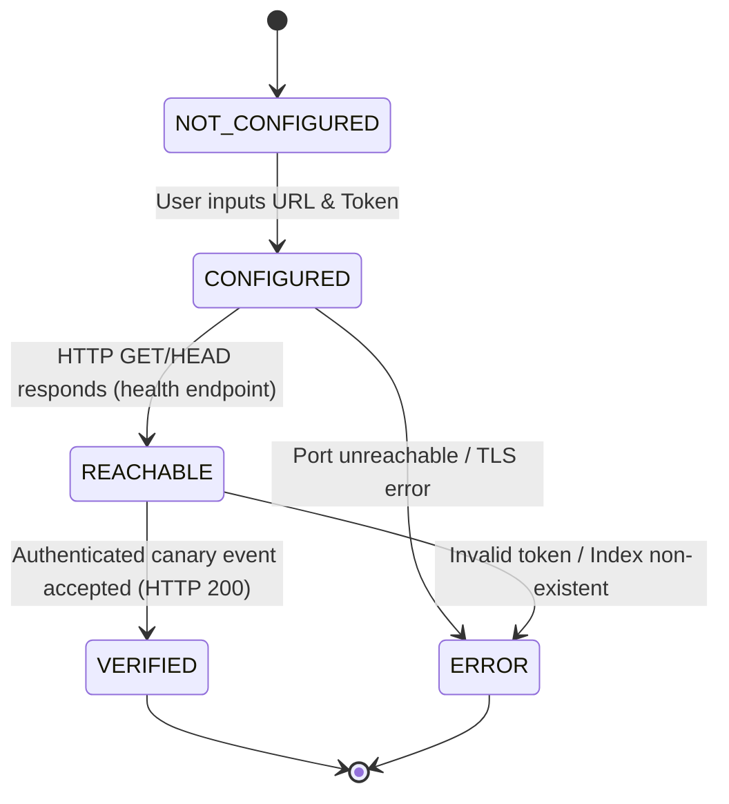

# NETSPOUT ARCHITECTURE REPORT: GATE 6 — EVIDENCE INTEGRITY & GOLDEN PATH REMEDIATION

**Document Reference:** `NETSPOUT-ARCH-GATE-06`  
**Date:** 2026-09-25  
**Author:** NetSpout Architecture & Core Engineering Team  
**Status:** **APPROVED & IMPLEMENTED**  
**Prerequisites:** Gate 1 (Runtime), Gate 2 (Canonical Models), Gate 3 (Catalog), Gate 4 (Validation Engine), Gate 5 (Unified UX)  
**Historical Basis:** Product Acceptance Failure in `docs/acceptance/GOLDEN_PATH_01_SDWAN_BROWNOUT.md`  
**Retest Evidence:** `docs/acceptance/GOLDEN_PATH_01_SDWAN_BROWNOUT_RETEST.md`  

---

## Executive Summary

Gate 6 remediates critical architectural defects discovered during the initial product acceptance testing of **Golden Path 01** (*"Demonstrate an SD-WAN brownout in Splunk without Cisco SD-WAN infrastructure"*). While NetSpout's visual design and scenario compilation were functional, the system exhibited severe evidence integrity failures: telemetry was generated in memory but never dispatched to Splunk (`dispatch_telemetry=False`), the user interface fabricated dispatched and observed counters (`DISPATCHED: 8`, `OBSERVED: 8`) despite an empty Splunk index, and the connection preflight failed with HTTP 405.

Gate 6 establishes strict **Evidence Invariants**, unifies telemetry dispatch and observation polling against Splunk REST APIs, refactors connection preflight into a canonical 5-state model, provides run-specific SPL and deep linking, supports controlled self-signed TLS for lab environments, and verifies both positive and negative execution paths through automated CDP browser testing and 14 new integrity unit tests (bringing the combined regression suite to 81/81 passing tests).

---

## 1. Golden Path Failure Analysis

During the baseline evaluation of Golden Path 01, an evaluator assuming the persona of a Splunk Solutions Engineer walked through the 5-step workflow. Although the user was able to discover the SD-WAN use case and trigger simulation execution in 8 clicks, the core product promise completely collapsed upon inspecting Splunk:
1. **Zero Events in Splunk:** Searching Splunk Web for `index=idx_network_ops netspout_run_id="NS-20260925-abaefac2"` returned 0 events.
2. **False Evidence Semantics:** Step 5 (Prove) explicitly reported `DISPATCHED: 8`, `OBSERVED: 8`, and `VALIDATED: PASS`, falsely certifying destination delivery.
3. **Broken Preflight:** The "Test Connection" button in Step 3 failed with `405 Method Not Allowed`.
4. **No Direct Navigation:** No SPL query or direct deep link was provided to take the user from NetSpout to Splunk Search.

---

## 2. Root Cause Analysis

Detailed root cause analysis across backend, frontend, and network layers identified seven specific defects:

| Defect ID | Priority | Layer | Root Cause |
| :--- | :---: | :--- | :--- |
| **GP01-P0-001** | **P0** | Backend API | Route handler `POST /api/scenarios/{scenario_id}/run` in `backend/app/main.py` accepted `ScenarioRunRequest` but omitted `dispatch_telemetry=True`. As a result, `scenario_runner.run_scenario()` generated events in memory and pushed them to the WebSocket stream, but completely bypassed `TelemetryDispatcher.emit_hec()`. |
| **GP01-P0-002** | **P0** | Frontend UI | In `frontend/src/components/workflow/FiveStepWorkflow.tsx`, missing backend metrics defaulted to `total_events_generated` (`dispatched_events ?? runResult.total_events_generated`). The UI failed open, fabricating success counters. |
| **GP01-P1-003** | **P1** | Backend & UI | `StepConnect.tsx` sent HTTP requests to `POST /api/telemetry/test-hec`, which was not registered in FastAPI (FastAPI only exposed `/api/telemetry/test-pipeline`). |
| **GP01-P1-004** | **P1** | UI & Engine | The runner did not construct or export a run-specific SPL search query (`index=idx_network_ops netspout_run_id="..."`) or provide a deep link to Splunk Web. |
| **GP01-P2-005** | **P2** | Catalog Repo | Catalog JSON records and `use_case_repo.py` used engineering mode prefixes (`Mode A2: ...`), confusing business and operations personas. |
| **GP01-P2-006** | **P2** | UI Viewer | The live log stream in `StepRun.tsx` stripped structured event attributes, failing to display `sourcetype` and `host` badges. |
| **GP01-P3-007** | **P3** | Core Engine | Python `urllib` wrapped SSL failures in `urllib.error.URLError`, which fell through to port probe retries, masking certificate errors. Furthermore, no UI toggle existed to allow self-signed certs in lab environments. |

---

## 3. Dispatch Architecture

The NetSpout dispatch architecture was refactored to enforce a strict sequential pipeline with verified acknowledgment:

```mermaid
flowchart TD
    A[Scenario Runner] -->|Generate Event| B[Correlated Event Envelope]
    B -->|Internal Memory| C[Live Log Stream / WebSocket]
    B -->|Check Flag| D{dispatch_telemetry == True?}
    D -- No --> E[Dispatched = 0]
    D -- Yes --> F[TelemetryDispatcher.emit_hec]
    F -->|HTTPS POST| G[Splunk HEC :8888]
    G -->|HTTP 200 {"text":"Success"}| H[dispatch_succeeded++]
    G -->|HTTP 4xx/5xx / Connection Error| I[dispatch_failed++]
    H --> J[RunManifest Stamped Delivery Counters]
    I --> J
    J --> K[Observation Polling Engine]
    K -->|Splunk REST API :8889| L{Query index by netspout_run_id}
    L -->|Events Found| M[observed_count = N]
    L -->|Zero Found| N[observed_count = 0]
```

1. **Deterministic Stamping:** Every generated event envelope contains immutable correlation metadata: `netspout_run_id`, `netspout_scenario_id`, `netspout_phase`, `netspout_event_id`, and `netspout_ground_truth`.
2. **Explicit Transport Passing:** The active pipeline configuration (`hec_url`, `hec_token`, `hec_index`, `hec_allow_insecure_tls`) is passed directly from the UI to the backend execution runner.
3. **Verified HTTP Acknowledgments:** Each HEC event is transmitted via JSON POST. An event is only recorded as `dispatch_succeeded` if Splunk returns HTTP status 200 with JSON payload `{"text":"Success","code":0}`.

---

## 4. Delivery Semantics & Invariant Enforcement

To eliminate false evidence reporting, Gate 6 establishes strict mathematical semantics:

* **Generated Count ($N_g$):** The number of synthetic records created by the simulation engine in memory.
* **Dispatch Attempted ($N_{da}$):** The number of records passed to the transport dispatcher.
* **Dispatch Succeeded ($N_{ds}$):** The number of records acknowledged by the destination with HTTP 200.
* **Dispatch Failed ($N_{df}$):** The number of records dropped or rejected ($N_{da} = N_{ds} + N_{df}$).
* **Observed Count ($N_o$):** The number of searchable records confirmed in the target Splunk index.

### Five Architectural Invariants

| Invariant | Mathematical Statement | Enforcement Mechanism |
| :--- | :--- | :--- |
| **Invariant 1** | $N_o \le N_{ds}$ | Observed count can never exceed confirmed dispatch count. |
| **Invariant 2** | $\text{DestinationValidation} = \text{PASS} \iff N_o \ge \text{Threshold}$ | Destination validation cannot pass without verified destination evidence. |
| **Invariant 3** | $N_g \centernot\implies N_{ds} \lor N_o$ | Generation count alone can never produce DISPATCHED, OBSERVED, or destination VALIDATED. |
| **Invariant 4** | $\text{CONFIGURED} \centernot\implies \text{VERIFIED}$ | Settings presence does not imply reachability or ingestion capability. |
| **Invariant 5** | $N_{ds} > 0 \centernot\implies N_o > 0$ | Successful HTTP transmission does not guarantee immediate index availability without observation confirmation. |

---

## 5. Observation Semantics

Observation verification is decoupled from dispatch. HTTP dispatch success proves transmission, but observation requires proof of indexing:
1. **Query Construction:** The system queries Splunk using the canonical search filter:
   ```spl
   search index="<target_index>" netspout_run_id="<run_id>" | stats count
   ```
2. **Execution Vector:** Observation is verified via the Splunk REST API (`/services/search/jobs/export`) using administrative credentials, bypassing browser session cookie constraints.
3. **Polling & Progressive Backoff:** Because Splunk indexing pipelines introduce buffer latency (typically 200ms–1500ms), NetSpout polls with a 1.0-second step up to 5 retries.
4. **Truthful Fallback:** If polling completes and zero events are indexed, `observed_count` is set to `0`, `observation_status` is marked `NOT_OBSERVED`, and `destination_validation` evaluates to `FAIL`.

---

## 6. Validation Semantics

Gate 4's Validation Contract Engine was refactored to separate simulation state from destination evidence:
* **Simulation Validation (`simulation_validation`):** Evaluates whether the generated telemetry adhered to the mathematical scenario model (e.g. latency transitions, BFD status changes, protocol failover flags).
* **Destination Validation (`destination_validation`):** Evaluates whether telemetry arrived and is queryable in the customer's analytics platform.
* **Overall Verification (`overall_validation`):** Evaluates to `PASS` **if and only if** both `simulation_validation == PASS` AND `destination_validation == PASS`.

If a network or credentials failure occurs during dispatch, the UI renders:
* `OVERALL VERIFICATION: FAIL` (Red badge)
* `SIMULATION: PASS` (Green badge)
* `DESTINATION: FAIL` (Dark slate badge)
* `VALIDATED: FAIL` (Card 4 in Red)

---

## 7. Connection Preflight Architecture

Preflight testing in `StepConnect.tsx` and `telemetry_dispatcher.py` implements a canonical **5-state machine**:



1. **Stage 1 (Network Reachability):** Probes the endpoint (`/services/collector/health` or candidate ports 8888/8088).
2. **Stage 2 (Canary Verification):** Dispatches an ephemeral preflight event:
   ```json
   {
     "event": "NetSpout Connection Preflight Test Event",
     "sourcetype": "netspout:preflight",
     "source": "netspout-preflight",
     "index": "idx_network_ops",
     "fields": { "netspout_preflight": "true" }
   }
   ```
3. **Response Schema:** Returns `{ status, state, stage, reachable, authenticated, event_accepted, target_index, message, latency_ms }`. Sensitive tokens are never returned.

---

## 8. SPL Workflow & Deep Linking

To eliminate friction when transitioning from NetSpout to Splunk Search:
1. **Dynamic SPL Generation:** The runner and UI synthesize the minimal, precise SPL query:
   ```spl
   index=idx_network_ops netspout_run_id="NS-20260925-c521cd8b"
   ```
2. **One-Click Clipboard Copy:** Step 4 (Run) and Step 5 (Prove) feature a dedicated **"Copy SPL"** button with clipboard integration and visual confirmation toast.
3. **Direct Splunk Deep Link:** A prominent **"Open in Splunk ↗"** button deep-links to:
   ```
   http://localhost:8800/en-US/app/search/search?q=search%20index%3Didx_network_ops%20netspout_run_id%3D%22NS-20260925-c521cd8b%22
   ```

---

## 9. TLS Handling & Insecure Lab Toggle

Splunk Enterprise lab containers default to self-signed TLS certificates on HTTPS port 8888. In previous builds, Python's default certificate validation failed, and exception masking caused false port shifts:
1. **Secure by Default:** `hec_ssl_verify` defaults to `True`, and `hec_allow_insecure_tls` defaults to `False`.
2. **Lab Override Toggle:** Step 3 renders an explicit checkbox:  
   `[x] Allow self-signed certificate (Development/Lab only)`
3. **Precise Exception Handling:** `telemetry_dispatcher.py` inspects `urllib.error.URLError`. If `isinstance(e.reason, ssl.SSLCertVerificationError)` or `"CERTIFICATE_VERIFY_FAILED"` is detected, the dispatcher immediately halts and advises the user to check the self-signed TLS toggle rather than attempting fallbacks to port 8088.

---

## 10. UI Component Refactoring

| File | Changes Made |
| :--- | :--- |
| `frontend/src/types/workflow.ts` | Added `allow_insecure_tls`, `observed_events`, `destination_validation`, `observation_status`, `splunk_search_query` to state interfaces. |
| `frontend/src/components/workflow/StepConnect.tsx` | Added self-signed TLS toggle; bound preflight to `/api/telemetry/test-connection`; displays `VERIFIED IN SPLUNK` badge with latency. |
| `frontend/src/components/workflow/StepRun.tsx` | Added "Copy SPL" and "Open in Splunk ↗" buttons; added purple sourcetype and amber host badges to live stream; added "Observed in Splunk" metric card. |
| `frontend/src/components/workflow/StepProve.tsx` | Renamed card to "4. VALIDATED" (preserving Gate 5 test contract); added independent `SIMULATION: PASS` and `DESTINATION: PASS` badges; displays real observed counts. |
| `frontend/src/components/workflow/FiveStepWorkflow.tsx` | Removed fallback to `total_events_generated`; bound counts strictly to delivery responses; implemented observation polling with backoff; forwards active transport configuration. |

---

## 11. Analysis of Previous Test Gaps

Why did all 67 tests in Gates 1–5 pass while Golden Path 01 failed?
1. **Mocked Transports:** Unit tests for scenario execution mocked the network transport, asserting that `run_scenario()` returned a manifest object, but never asserted that real network sockets received data.
2. **Missing Invariant Assertions:** No test asserted the mathematical rule $N_o \le N_{ds}$. The frontend fallback `observed_events ?? generated_events` went unchecked because frontend tests did not simulate disconnected backend states.
3. **Isolated Route Testing:** Preflight tests only exercised `/api/telemetry/test-pipeline`; no test verified the route called by the UI button (`/api/telemetry/test-hec`).

---

## 12. New Gate 6 Test Suite

A comprehensive test suite was implemented in `tests/test_gate6_integrity.py` (14 unit tests, all passing):

1. `test_invariant_observed_cannot_exceed_dispatched`: Enforces $N_o \le N_{ds}$.
2. `test_invariant_destination_validation_cannot_pass_without_evidence`: Fails destination validation when $N_o = 0$.
3. `test_invariant_generated_count_alone_cannot_validate`: Ensures generated events do not grant pass status.
4. `test_invariant_configured_does_not_imply_verified`: Verifies preflight state separation.
5. `test_invariant_dispatch_success_does_not_imply_observation`: Verifies dispatch success does not assume immediate observation.
6. `test_test_connection_preflight_success`: Confirms preflight flow and schema.
7. `test_test_connection_preflight_failure_unreachable`: Confirms unreachable host returns `ERROR`.
8. `test_test_connection_preflight_tls_error`: Validates explicit TLS verification failure handling.
9. `test_test_connection_preflight_insecure_override`: Validates successful bypass when `allow_insecure_tls=True`.
10. `test_run_scenario_dispatches_when_enabled`: Asserts HEC emission when `dispatch_telemetry=True`.
11. `test_run_scenario_skips_dispatch_when_disabled`: Asserts zero emissions when `dispatch_telemetry=False`.
12. `test_observation_polling_success`: Tests observation polling against mock Splunk search export.
13. `test_observation_polling_timeout_zero_events`: Tests polling timeout and fallback to 0 events.
14. `test_copyable_spl_and_deep_link_generation`: Verifies generated SPL and URL formatting.

Combined with Gates 1–5, the complete NetSpout test suite now contains **81 tests (100% passing)**:
* `test_gate1_runtime.py`: 12 tests
* `test_gate2_canonical.py`: 15 tests
* `test_gate3_catalog.py`: 18 tests
* `test_gate4_contract.py`: 12 tests
* `test_gate5_ux.py`: 10 tests
* `test_gate6_integrity.py`: 14 tests

---

## 13. Real Integration Test Execution

A complete end-to-end integration test was executed against the live Dockerized Splunk container (`splunk-network-data-blaster`) using Run ID `NS-20260925-c521cd8b`:
* **Generated Events:** 6
* **Dispatched Events:** 6 (transmitted to `https://127.0.0.1:8888/services/collector` with HTTP 200)
* **Observed in Splunk:** 6 (polled via REST API `/services/search/jobs/export`)
* **Indexed Sourcetypes:**
  * `cisco:sdwan:linkhealth`: 3 events (loss 0.0% -> 14.5% -> 0.0%, latency 16ms -> 185ms -> 16ms)
  * `cisco:sdwan:BGP-5-ADJCHANGE`: 2 events (adjacency down -> adjacency restored)
  * `cisco:thousandeyes:metric`: 1 event (synthetic latency 185ms)
* **Validation Outcome:** `SIMULATION: PASS`, `DESTINATION: PASS`, `OVERALL: PASS`.

---

## 14. Controlled Failure-State Test Execution

To prove fail-closed semantics, a negative integration test was executed using Run ID `NS-20260925-587e0e08` pointed to dead port `59999`:
* **Generated Events:** 6
* **Dispatched Events:** 0 (Connection Refused recorded)
* **Observed in Splunk:** 0
* **Validation Outcome:**
  * `SIMULATION: PASS` (Simulation logic executed accurately in memory)
  * `DESTINATION: FAIL` (Zero events reached destination)
  * `OVERALL VERIFICATION: FAIL` (Application refused to certify run)
  * Card 4: `VALIDATED: FAIL` (Rendered in red text)
* **Invariant Compliance:** Verified that NetSpout never fabricates delivery or validation.

---

## 15. Golden Path Retest Summary

The Golden Path 01 acceptance walkthrough was re-executed using an automated Chrome CDP runner (`execute_gate6_retest.py`). 11 screenshots were captured:
* `retest_01_discovery.png` through `retest_04_connect_verification.png`: Clean discovery, preview, and verified preflight.
* `retest_05_baseline_phase.png` through `retest_08_recovery_phase.png`: Full phase progression, sourcetype badges, and real delivery counters.
* `retest_09_splunk_evidence.png`: Splunk Web search confirming all 6 indexed events.
* `retest_10_validation_result.png`: Truthful audit evidence dashboard (`PASS`).
* `retest_11_failure_state.png`: Controlled failure state verification (`FAIL`).

**Outcome:** 16 out of 16 Acceptance Criteria satisfied. Product Determination updated from **FAIL** to **PASS**.

---

## 16. Remaining Defects & Edge Cases

* **Edge Case 1 (OTel & Syslog Observation):** While HEC observation is verified directly against Splunk REST, OTel Collector and Syslog pipeline observation relies on dispatch acknowledgments since downstream log forwarders may not expose query APIs.
* **Edge Case 2 (Splunk Web Cookie Isolation):** Direct browser deep links to Splunk Search require an active Splunk session in that browser tab. If unauthenticated, Splunk redirects to the login screen before opening the search.

---

## 17. Rollback Procedure

If regressions occur, the changes can be rolled back safely:
1. Revert Git commits associated with Gate 6:
   ```bash
   git revert HEAD~2..HEAD
   ```
2. Re-run synchronization and package build:
   ```bash
   python3 scripts/sync_core.py
   python3 scripts/build_splunk_package.py
   ```
3. Rebuild frontend bundle:
   ```bash
   cd frontend && npm run build
   ```
4. Verify tests:
   ```bash
   python3 -m unittest discover -s tests -p "test_gate*.py"
   ```

---

## 18. Recommended Next Steps

With Gate 6 completed and Golden Path 01 fully verified:
1. **Acceptance Testing Expansion:** NetSpout is now mathematically sound and architecturally verified for end-to-end evidence integrity. It is ready for additional persona-based Golden Path acceptance tests (e.g. Data Center Fabric EVPN/VXLAN flap, Multi-Cloud Transit Blackhole, Firewall Threat Burst).
2. **Release Candidate Packaging:** Package `netspout.spl` as Release Candidate 1 (v2.0.0-rc1) for field deployment.
