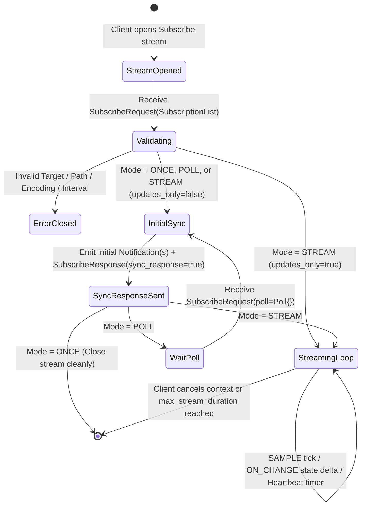

# NetSpout Gate 13 — gNMI Wire Protocol & RPC Specification

**Author:** Mahamudul Chowdhury (`machowdhury@yahoo.com`)  
**Gate:** 13 (Native gNMI / OpenConfig Protocol Specification)  
**Date:** 2026-09-29  
**Protocol Baseline:** OpenConfig gNMI Specification v0.7.0 / v0.8.0 (`github.com/openconfig/gnmi/proto/gnmi/gnmi.proto`)  
**Status:** SPECIFICATION COMPLETE (No Runtime Implementation in Gate 13)

---

## 1. Purpose & Normative References

This document specifies the exact wire-level gRPC service contract, protobuf message structures, path encoding rules, subscription state machines (`ONCE`, `POLL`, `STREAM/SAMPLE`, `STREAM/ON_CHANGE`, heartbeat, and redundant suppression), encodings (`PROTO`, `JSON_IETF`, `JSON`, `BYTES`), temporal semantics, and error model for NetSpout's future Native gNMI server (Gate 13B).

### Normative Specifications Cited
1. **OpenConfig gNMI Specification (`VERIFIED`):** `https://github.com/openconfig/reference/blob/master/rpc/gnmi/gnmi-specification.md`
2. **OpenConfig `gnmi.proto` & `gnmi_ext.proto` (`VERIFIED`):** `https://github.com/openconfig/gnmi/blob/master/proto/gnmi/gnmi.proto` (Apache-2.0 License)
3. **IETF RFC 7951 (`VERIFIED`):** *JSON Encoding of Data Modeled with YANG* (`JSON_IETF`)
4. **Cisco IOS XR gNMI Architecture (`DOCUMENTED`):** `https://xrdocs.io/telemetry`
5. **Arista EOS gNMI & `goarista` (`DOCUMENTED`):** `https://github.com/aristanetworks/goarista` (Apache-2.0 License)
6. **Juniper Junos OpenConfig & JTI gNMI (`DOCUMENTED`):** `https://www.juniper.net/documentation/us/en/software/junos/open-config/index.html`

---

## 2. gNMI Service & RPC Scope Decision

The official `gnmi.gNMI` gRPC service defines four RPCs:

```protobuf
service gNMI {
  rpc Capabilities(CapabilitiesRequest) returns (CapabilitiesResponse);
  rpc Get(GetRequest) returns (GetResponse);
  rpc Set(SetRequest) returns (SetResponse);
  rpc Subscribe(stream SubscribeRequest) returns (stream SubscribeResponse);
}
```

### 2.1 RPC Scope Matrix for NetSpout

| gNMI RPC | Gate 13 Architecture Scope | Rationale |
| :--- | :--- | :--- |
| **`Capabilities`** | **IN SCOPE (Required in Gate 13B)** | External collectors (`gnmic`, `pygnmi`, `Telegraf`) invoke `Capabilities` on connection startup to verify `gNMI_version`, `supported_encodings`, and `supported_models` (`ModelData` name, organization, version). |
| **`Get`** | **IN SCOPE (Required in Gate 13B)** | Enables point-in-time snapshot retrieval (`DataType`: `ALL`, `CONFIG`, `STATE`, `OPERATIONAL`) for preflight checks, collector discovery, and ad-hoc troubleshooting. |
| **`Subscribe`** | **IN SCOPE (Required in Gate 13B)** | The core streaming telemetry RPC supporting `ONCE`, `POLL`, and `STREAM` (`SAMPLE`, `ON_CHANGE`, `TARGET_DEFINED`). |
| **`Set`** | **OUT OF SCOPE (Explicitly Rejected)** | NetSpout is a **scenario-driven telemetry simulator**, not a configuration-management or router-emulation appliance. Allowing external clients to mutate device state via `Set` would conflict with deterministic scenario phase state. A `Set` call to NetSpout MUST return gRPC status `UNIMPLEMENTED` (`Code = 12`) with message `"NETSPOUT_READ_ONLY_SIMULATOR: gNMI Set is not supported; device state is controlled by the NetSpout scenario engine"`. |

---

## 3. Core Protobuf Message Contracts (`gnmi.proto`)

### 3.1 `Path` and `PathElem` Representation
NetSpout strictly enforces the modern structured `Path.elem` (`repeated PathElem`) encoding introduced in gNMI v0.4.0+ and deprecates legacy string-slice `Path.element`:

```protobuf
message Path {
  repeated string element = 1 [deprecated = true];
  string origin = 2;             // e.g., "openconfig", "Cisco-IOS-XR-infra-statsd-oper", "eos_native", "junos"
  repeated PathElem elem = 3;    // Ordered path segments with key-value predicates
  string target = 4;             // Simulated device ID, e.g., "node-cisco8k", "cisco-asr9k-pe1"
}

message PathElem {
  string name = 1;               // YANG container/list/leaf identifier, e.g., "interface"
  map<string, string> key = 2;   // List keys, e.g., {"name": "HundredGigE0/0/0/0"}
}
```

- **Prefix + Relative Path Composition:**
  - `Notification.prefix` carries `target` (e.g., `"node-cisco8k"`), `origin` (e.g., `"openconfig"`), and common base elements (e.g., `/interfaces/interface[name=HundredGigE0/0/0/0]/state`).
  - Individual `Update.path` entries inside `Notification.update` carry the relative leaf path (e.g., `oper-status`, `counters/in-octets`).
  - Wildcard keys (`*` or `...`) in `GetRequest` or `SubscribeRequest` (e.g., `/interfaces/interface[name=*]/state/counters`) are expanded by NetSpout into concrete per-interface `PathElem` keys in every emitted `Notification`.

### 3.2 `Notification`, `Update`, and `TypedValue`

```protobuf
message Notification {
  int64 timestamp = 1;           // Nanoseconds since Unix epoch (1970-01-01T00:00:00Z)
  Path prefix = 2;               // Common prefix (target, origin, base path)
  repeated Update update = 4;    // Updated leaf/subtree values
  repeated Path delete = 5;      // Deleted paths (e.g., withdrawn BGP route in FAILOVER)
  bool atomic = 6;               // True when updates in this Notification form an atomic group
}

message Update {
  Path path = 1;
  TypedValue val = 3;
  uint32 duplicates = 4;
}

message TypedValue {
  oneof value {
    string string_val = 1;       // e.g., "UP", "DOWN", "ESTABLISHED", "IDLE"
    int64 int_val = 2;           // Signed 64-bit integer (e.g., temperature, optical 0.01 dBm)
    uint64 uint_val = 3;         // Unsigned 64-bit counter/gauge (e.g., in-octets, out-pkts, speed)
    bool bool_val = 4;           // Boolean state (e.g., enabled, valid-route, laser-state)
    bytes bytes_val = 5;         // Raw byte array (BYTES encoding)
    float float_val = 6 [deprecated = true];
    Decimal64 decimal_val = 7;   // Fixed-point decimal (digits, precision) for OpenConfig Dec64
    ScalarArray leaflist_val = 8;// Leaf-list values
    google.protobuf.Any any_val = 9;
    bytes json_val = 10;         // JSON encoding (UTF-8 bytes)
    bytes json_ietf_val = 11;    // RFC 7951 JSON_IETF encoding (UTF-8 bytes)
    string ascii_val = 12;
    bytes proto_bytes = 13;
  }
}
```

> **Floating-Point Precision Rule:** In gNMI v0.7.0+, `double_val` (`field 14` in newer drafts) or `Decimal64` (`decimal_val = {digits: -2480, precision: 2}` for `-24.80 dBm`) and `json_ietf_val` are used for fractional values. NetSpout's encoder will support `uint_val`, `int_val`, `string_val`, `bool_val`, `decimal_val`, `json_val`, and `json_ietf_val` to ensure 100% compatibility with `pygnmi`, `gnmic`, and `Telegraf`.

---

## 4. Encoding Evaluation & Selection

| Encoding (`gnmi.Encoding`) | Enum Value | Wire Representation | Vendor & Collector Interoperability | NetSpout Gate 13 Decision |
| :--- | :--- | :--- | :--- | :--- |
| **`JSON_IETF` (`RFC 7951`)** | `2` | `TypedValue.json_ietf_val` containing UTF-8 JSON with module-qualified root keys (`openconfig-interfaces:interfaces`) | Supported by Cisco IOS XR, Cisco IOS XE, Arista EOS, Juniper Junos, `gnmic`, `pygnmi`, and `Telegraf`. Ideal for subtree `Get` and subtree `Subscribe`. | **CO-PRIMARY DEFAULT (Subtree & `Get` Default)** |
| **`PROTO`** | `0` | Leaf-level `Update` entries using native scalar `TypedValue` fields (`uint_val`, `int_val`, `string_val`, `bool_val`, `decimal_val`) | Highest efficiency for streaming leaf counters/gauges; default streaming encoding for `Telegraf inputs.gnmi`, `gnmic`, and Juniper/Arista leaf subscriptions. | **CO-PRIMARY DEFAULT (Streaming `Subscribe` Default)** |
| **`JSON`** | `1` | `TypedValue.json_val` (unqualified JSON keys without RFC 7951 module prefixes) | Used by Arista EOS and `gnmic --encoding json`. | **SUPPORTED** |
| **`BYTES`** | `3` | `TypedValue.bytes_val` | Rarely used for YANG telemetry; lacks self-describing schema structure. | **UNSUPPORTED** (Returns `UNIMPLEMENTED` / `INVALID_ARGUMENT`) |
| **`ASCII`** | `4` | `TypedValue.ascii_val` | Legacy CLI output wrapper; not used for structured OpenConfig/MDT. | **UNSUPPORTED** |

---

## 5. Subscription Modes & State Machine (`Subscribe`)



### 5.1 Subscription List Modes (`SubscriptionList.Mode`)
1. **`ONCE` (`mode = 1`):**
   - Evaluates all requested paths against the current `ScenarioPhaseState`, sends one or more `SubscribeResponse{update: Notification}`, sends `SubscribeResponse{sync_response: true}`, and immediately closes the gRPC stream with `StatusCode.OK`.
2. **`POLL` (`mode = 2`):**
   - Performs an initial sync (`Notification`(s) + `sync_response: true`), then waits on the bidirectional stream. Each time the client sends `SubscribeRequest{poll: Poll{}}`, NetSpout emits a fresh snapshot of the subscribed paths followed by `sync_response: true`.
3. **`STREAM` (`mode = 0`):**
   - If `updates_only == false` (default): Emits initial state for all subscribed paths, sends `SubscribeResponse{sync_response: true}`, and enters the continuous streaming loop.
   - If `updates_only == true`: Immediately sends `SubscribeResponse{sync_response: true}` and emits `Notification` messages only on subsequent `SAMPLE` ticks or `ON_CHANGE` transitions.

### 5.2 Per-Subscription Stream Modes (`Subscription.mode`)
1. **`SAMPLE` (`SubscriptionMode = 2`):**
   - Emits periodic `Notification` updates at `sample_interval` nanoseconds (converted from milliseconds/seconds; if `sample_interval == 0`, uses the device profile's default sample interval of `5,000,000,000 ns` = `5s`, subject to safety floor `MIN_SAMPLE_INTERVAL_NS = 500,000,000 ns` = `500ms`).
   - **`suppress_redundant` (`bool`):** When `true`, NetSpout suppresses periodic `SAMPLE` emission for any leaf/subtree whose value has not changed since the last emitted notification, **unless** `heartbeat_interval` has elapsed.
   - **`heartbeat_interval` (`uint64` ns):** When specified on a `SAMPLE` (with `suppress_redundant=true`) or `ON_CHANGE` subscription, forces a full confirmation `Notification` at least once every `heartbeat_interval` nanoseconds even if the value has not changed.
2. **`ON_CHANGE` (`SubscriptionMode = 1`):**
   - Emits a `Notification` **only** when the underlying `ScenarioPhaseState` transitions (e.g., `BASELINE -> DEGRADE` drops `oper-status` from `"UP"` to `"DOWN"` and `bgp/neighbors/neighbor/state/session-state` from `"ESTABLISHED"` to `"IDLE"`, or `FAILOVER -> RECOVERY` restores them).
   - Rejects or maps purely monotonic counter-only paths if subscribed with `ON_CHANGE` on profiles that forbid counter `ON_CHANGE` (or honors `heartbeat_interval` for state confirmation).
3. **`TARGET_DEFINED` (`SubscriptionMode = 0`):**
   - NetSpout inspects the canonical signal's `SignalKind`: `COUNTER` and `GAUGE` signals automatically execute as `SAMPLE`, while `STATE` and `EVENT` signals execute as `ON_CHANGE`.

---

## 6. Temporal & Cadence Model

### 6.1 Decoupling Simulated Network Rate from Telemetry Update Rate
A simulated `100 Gbps` (`HundredGigE0/0/0/0`) or `400 Gbps` interface carries millions of simulated packets per second (`in-octets` incrementing by gigabytes per second in `ScenarioPhaseState`), **not** thousands of gNMI messages per second!
- **Simulated Network Rate:** Mathematical counter slope (`delta_bytes_per_sec = interface_speed_bps / 8 * utilization_ratio`) applied deterministically to `in-octets`, `out-octets`, `in-unicast-pkts`, and `queue-drops` as a function of elapsed scenario time.
- **Telemetry Update Rate:** Controlled strictly by the gNMI subscription's `sample_interval` (e.g., `1s`, `5s`, `10s`, `30s`, `60s`), capped by NetSpout's `TransportSafetyPolicy`.

### 6.2 Five-Timestamp Ordering Contract
To prevent impossible causal ordering in Splunk investigations, NetSpout defines strict monotonic relationships across five timestamps:
1. **`scenario_time_ns`:** Logical timestamp of the scenario phase transition (`T_phase`).
2. **`device_time_ns`:** Simulated device wall clock (`scenario_time_ns + configured_clock_offset_ns`, where `configured_clock_offset_ns == 0` by default).
3. **`gnmi_notification_timestamp_ns` (`Notification.timestamp`):** Equal to `device_time_ns` at the instant the sensor sample or `ON_CHANGE` transition occurs (`int64` nanoseconds since Unix epoch).
4. **`collector_receive_time_ns`:** Timestamp recorded by the external collector (`gnmic` / `pygnmi` / `Telegraf`) upon receiving `SubscribeResponse` (`>= gnmi_notification_timestamp_ns`).
5. **`splunk_time` (`_time`):** Mapped from `Notification.timestamp / 1e9` (preserving millisecond/microsecond fractional precision in HEC `"time"` field), while `collector_receive_time` and `ingest_time` are preserved as separate metadata fields.

---

## 7. Protobuf & Dependency Strategy (Gate 13 Architectural Decision)

To guarantee deterministic builds, zero license contamination, and strict Splunk AppInspect compliance:
1. **Vendored Official Proto Definitions:** In Gate 13B, NetSpout will vendor the official Apache-2.0 `gnmi.proto` and `gnmi_ext.proto` files from `github.com/openconfig/gnmi` into `src/netspout_core/proto/gnmi/` and pre-compile `gnmi_pb2.py` and `gnmi_pb2_grpc.py` during build time using `grpcio-tools`.
2. **Runtime Dependencies Confined to Companion Backend (`backend/requirements.txt`):**
   - `grpcio>=1.62.0` and `protobuf>=4.25.0` will be added **only** to `backend/requirements.txt` (and optional test dependencies in Gate 13B), **never** bundled into the Splunk App tarball (`netspout.spl` / `netspout/bin/`).
3. **Independent Verification Client (`pygnmi` / `gnmic`):**
   - Used strictly as an external test/collector process connecting over loopback TCP/HTTP2, never sharing in-memory state with the server.

---

## 8. Structured gNMI Error Model

NetSpout maps operational and validation errors to standard gRPC status codes (`grpc.StatusCode`) while attaching a machine-readable NetSpout error code in `Status.message` (and `google.rpc.Status` details) so the UI and preflight diagnostics never collapse failures into opaque generic gRPC errors:

| NetSpout Error Code | gRPC `StatusCode` | Trigger Condition | Diagnostic Remediation Message |
| :--- | :--- | :--- | :--- |
| **`INVALID_TARGET`** / **`DEVICE_NOT_FOUND`** | `NOT_FOUND` (`5`) | `prefix.target` does not match any active node in the scenario topology | Lists valid `device_id` targets for the active scenario (e.g., `node-cisco8k`, `node-juniper-ptx`, `node-arista-spine`, `node-cat-leaf`). |
| **`UNSUPPORTED_PATH`** | `NOT_FOUND` (`5`) | Requested YANG path is not registered in the target device's `TelemetryPathRegistry` | Reports the unrecognized path, target `vendor_profile_id`, and closest supported OpenConfig / vendor-native path. |
| **`MODEL_NOT_SUPPORTED`** | `FAILED_PRECONDITION` (`9`) | Client requests a `Cisco-IOS-XR-*` origin on an `ARISTA_EOS` or `JUNIPER_JUNOS` target (or vice versa) | Reports the target's `CapabilitiesResponse.supported_models` and valid origins. |
| **`UNSUPPORTED_ENCODING`** | `UNIMPLEMENTED` (`12`) | Client requests `BYTES` or `ASCII` encoding | Reports supported encodings (`JSON_IETF`, `PROTO`, `JSON`). |
| **`INVALID_SUBSCRIPTION`** | `INVALID_ARGUMENT` (`3`) | Empty `SubscriptionList`, missing `Path`, or invalid `SubscriptionMode` | Details the missing or malformed `SubscribeRequest` field. |
| **`SAMPLE_INTERVAL_TOO_LOW`** | `INVALID_ARGUMENT` (`3`) | `sample_interval` is non-zero and `< MIN_SAMPLE_INTERVAL_NS` (`500ms` default lab floor) | States the configured minimum sample interval (`500ms`) to prevent subscription storms. |
| **`SUBSCRIPTION_LIMIT_EXCEEDED`** | `RESOURCE_EXHAUSTED` (`8`) | Client exceeds `max_subscriptions_per_client` (`16`), `max_paths_per_subscription` (`64`), or `max_concurrent_clients` (`8`) | Reports current active subscription count and configured safety cap. |
| **`AUTHENTICATION_FAILED`** | `UNAUTHENTICATED` (`16`) | Missing or invalid gRPC metadata `username`/`password` or client TLS cert when auth is enabled | Instructs user to check lab credentials or TLS mode in Step 3 (`Connect Pipeline`). |
| **`SET_NOT_SUPPORTED`** | `UNIMPLEMENTED` (`12`) | Client invokes `gNMI.Set` | Explains that NetSpout is a read-only telemetry simulator driven by scenario state. |
