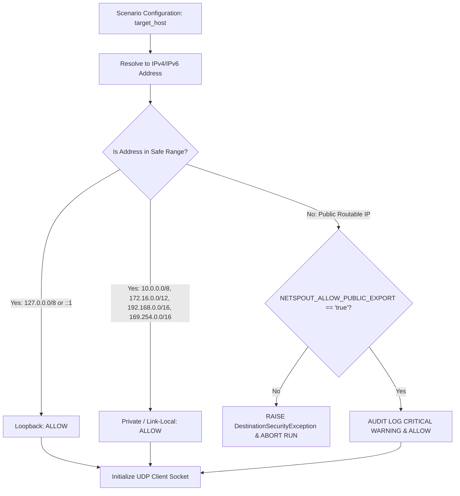

# NETSPOUT NATIVE TRANSPORT THREAT MODEL & SAFETY SPECIFICATION

**Gate:** NetSpout Gate 11 (Native Transport Architecture & NetFlow/IPFIX Protocol Definition)  
**Status:** SPECIFICATION COMPLETE (FOR GATE 11B IMPLEMENTATION)  
**Author:** Mahamudul Chowdhury (`machowdhury@yahoo.com`)  
**Repository:** [https://github.com/machowdhury/NetSpout](https://github.com/machowdhury/NetSpout)  

---

## 1. Executive Summary & Philosophy

NetSpout is a network telemetry and scenario simulation engine designed to run in diverse customer environments—including developer laptops, enterprise lab servers, CI/CD test runners, and Splunk Enterprise deployments.

Introducing **Mode B (Native Transport)** empowers NetSpout to transmit raw UDP datagrams containing binary NetFlow v9 and IPFIX packets. Because UDP is a connectionless, unauthenticated, and spoofable transport protocol, introducing native UDP transmission introduces distinct operational and security risks:
1. Inadvertent transmission of high-volume traffic to public internet destinations.
2. Accidental saturation or denial of service against customer production switches, firewalls, or SIEM collectors.
3. Vulnerabilities to UDP reflection or amplification abuse.
4. Supply chain and AppInspect compliance failures if unauthorized low-level network hooks are introduced.

**Core Philosophy: "Safe by Default, Hardened in Practice."**  
NetSpout Native Transport MUST refuse to transmit packets to any public or unapproved IP address out of the box, MUST enforce non-bypassable rate limits, MUST never require root privileges, and MUST keep the Splunk Enterprise App bundle (`netspout.spl`) completely isolated from socket operations.

---

## 2. Threat Analysis & Risk Matrix

The following table catalogs the specific threats analyzed for NetSpout native flow transmission:

| Threat ID | Threat Name | Severity | Attack / Failure Scenario | NetSpout Countermeasure & Defensive Architecture |
| :---: | :--- | :---: | :--- | :--- |
| **THREAT-01** | **Public IP Telemetry Leak / Blast** | **CRITICAL** | Misconfiguration or malicious input directs NetSpout to export thousands of UDP flow packets to a public routable IP address (e.g. `8.8.8.8`). | **RFC 1918 & Loopback Safe-by-Default Blocker.** Target IP validation strictly permits private and loopback ranges only. Public IPs raise an immediate exception. |
| **THREAT-02** | **UDP Flood / Collector DoS** | **HIGH** | Simulation loop runs unbounded at CPU speed, transmitting millions of UDP packets that overwhelm collector CPU, fill disk partitions, or crash collection services. | **Mandatory Token-Bucket Rate Limiter & Run Cap.** Hard caps: default max 100 packets/sec; absolute max 10,000 packets per scenario run. Circuit breaker on repeated socket errors. |
| **THREAT-03** | **UDP Reflection / Amplification** | **MEDIUM** | Attacker leverages NetSpout to send spoofed requests or uses NetSpout as an open listening reflector. | **Strict Outbound Client-Only Socket Architecture.** NetSpout opens only client sockets (`SOCK_DGRAM`) bound to ephemeral local ports for outbound export. Zero listening UDP ports. |
| **THREAT-04** | **Privilege Escalation via Raw Sockets** | **HIGH** | Implementation attempts to use raw IP sockets (`SOCK_RAW`), requiring `CAP_NET_RAW` or root/administrator privileges. | **Standard UDP Sockets Only (`SOCK_DGRAM`).** NetSpout constructs protocol payloads entirely in user space. Zero root privileges or kernel capabilities required. |
| **THREAT-05** | **Splunk AppInspect Rejection** | **CRITICAL** | Introducing raw socket calls into the Splunk App package causes AppInspect automated checks to fail, blocking Splunkbase publication. | **Strict Process Isolation Boundary.** Socket transmission code is strictly confined to the backend service runtime (`backend/run.py`). The Splunk App (`netspout.spl`) contains zero outbound socket code. |
| **THREAT-06** | **Buffer Overflow / Memory Corruption** | **MEDIUM** | Malformed scenario records cause memory corruption, segmentation faults, or buffer overruns in binary packet construction. | **Pure Python `struct` Encoding with Schema Validation.** Fixed format strings in Python standard library provide memory safety. Every field is bounds-checked and cast before packing. |
| **THREAT-07** | **IP Fragmentation Exploitation** | **LOW** | Generated datagrams exceed the MTU of intermediate networks, resulting in fragmentation and firewall/IDS drops. | **Conservative Datagram Sizing.** Maximum payload size is capped at 1400 bytes, guaranteeing that IP + UDP + NetFlow/IPFIX payloads remain safely under the standard 1500-byte Ethernet MTU. |

---

## 3. Defensive Controls & Security Architecture

### 3.1. RFC 1918 & Loopback Safe-by-Default Destination Policy
NetSpout enforces destination IP validation before any UDP socket binding or transmission occurs:



#### Safe IP Ranges (Allowed by Default)
1. `127.0.0.0/8` (IPv4 Loopback)
2. `::1/128` (IPv6 Loopback)
3. `10.0.0.0/8` (RFC 1918 Class A)
4. `172.16.0.0/12` (RFC 1918 Class B)
5. `192.168.0.0/16` (RFC 1918 Class C)
6. `169.254.0.0/16` (RFC 3927 IPv4 Link-Local)
7. `fe80::/10` (RFC 4291 IPv6 Link-Local)

#### Destination Validation Logic (Python Implementation Prototype)
```python
import ipaddress
import os
import socket
import logging

logger = logging.getLogger("netspout.security")

SAFE_NETWORKS = [
    ipaddress.ip_network("127.0.0.0/8"),
    ipaddress.ip_network("10.0.0.0/8"),
    ipaddress.ip_network("172.16.0.0/12"),
    ipaddress.ip_network("192.168.0.0/16"),
    ipaddress.ip_network("169.254.0.0/16"),
    ipaddress.ip_network("::1/128"),
    ipaddress.ip_network("fe80::/10"),
]

class DestinationSecurityException(PermissionError):
    """Raised when an unapproved or public destination IP is targeted for native flow export."""
    pass

def validate_destination_target(host: str, port: int) -> str:
    """
    Validates that the target host resolves strictly to a permitted private or loopback IP.
    """
    # 1. Resolve host
    try:
        resolved_ip_str = socket.gethostbyname(host)
        target_ip = ipaddress.ip_address(resolved_ip_str)
    except Exception as exc:
        raise DestinationSecurityException(f"Failed to resolve target host '{host}': {exc}")

    # 2. Check safe ranges
    is_safe = any(target_ip in network for network in SAFE_NETWORKS)
    if is_safe:
        return resolved_ip_str

    # 3. Explicit override check
    allow_public = os.environ.get("NETSPOUT_ALLOW_PUBLIC_EXPORT", "").lower() in ("true", "1", "yes")
    if allow_public:
        logger.warning(
            "SECURITY AUDIT: Outbound native flow transmission to PUBLIC IP %s:%d explicitly permitted via NETSPOUT_ALLOW_PUBLIC_EXPORT.",
            resolved_ip_str, port
        )
        return resolved_ip_str

    raise DestinationSecurityException(
        f"SECURITY VIOLATION: Native flow transmission to public IP '{resolved_ip_str}' is forbidden by default. "
        f"NetSpout only permits export to RFC 1918 private networks and loopback addresses. "
        f"To override for designated lab environments, set environment variable NETSPOUT_ALLOW_PUBLIC_EXPORT=true."
    )
```

---

### 3.2. Rate Limiting & Transmission Guardrails

To prevent accidental resource starvation of the host machine or destination network equipment, NetSpout implements a strict two-tier transmission guardrail:

1. **Token-Bucket Rate Limiter:**
   - Default Rate: **100 packets per second (pps)** (Configurable via `NETSPOUT_FLOW_RATE_PPS`, upper bound capped at 1,000 pps).
   - Smooths transmission bursts to mimic real network router export behavior rather than a microburst flood.
2. **Absolute Scenario Run Cap:**
   - Default Limit: **10,000 packets per scenario run** (Configurable via `NETSPOUT_FLOW_MAX_PACKETS_PER_RUN`).
   - If a simulation scenario attempts to emit beyond this ceiling, transmission is cleanly terminated, and a warning is logged in the simulation manifest.
3. **Socket Error Circuit Breaker:**
   - If the socket encounters **5 consecutive transmission errors** (e.g. `ECONNREFUSED` via ICMP port unreachable, `ENETUNREACH`, or `EPERM`), native transmission halts immediately to prevent log spam and CPU spinning.

---

### 3.3. Pure Client Exporter Architecture

In compliance with network security best practices:
- **No Listening Sockets:** NetSpout Native Transport operates exclusively as a UDP client (`socket.socket(socket.AF_INET, socket.SOCK_DGRAM)`).
- **Ephemeral Port Binding:** NetSpout binds to an OS-assigned ephemeral source port (e.g. 50000–65000) and sends datagrams to the collector's ingress port (e.g. 2055, 4739).
- **Inbound Packet Drop:** Because the socket never calls `.listen()` or `.accept()`, and standard UDP client sockets ignore unprompted inbound packets unless explicitly read, NetSpout cannot be weaponized as an open reflector or DNS/NTP-style amplifier.

---

### 3.4. Splunk AppInspect & Environment Isolation

NetSpout is architected with a strict separation of concerns to guarantee zero compliance issues during Splunk AppInspect validation:

```
┌─────────────────────────────────────────────────────────────┐
│ SPLUNK ENTERPRISE / CLOUD ENVIRONMENT                       │
│                                                             │
│  ┌───────────────────────────────────────────────────────┐  │
│  │ NetSpout Splunk App (netspout.spl)                    │  │
│  │  - Dashboard XML & SimpleXML                          │  │
│  │  - AppInspect Certified Code                          │  │
│  │  - Zero raw sockets, zero subprocess network tools   │  │
│  │  - Mode A HEC Dispatcher only                         │  │
│  └──────────────────────────┬────────────────────────────┘  │
└─────────────────────────────┼───────────────────────────────┘
                              │
               REST / JSON Control Instructions
                              │
                              ▼
┌─────────────────────────────────────────────────────────────┐
│ NETSPOUT COMPANION BACKEND SERVICE (backend/run.py)         │
│  - Python 3.10+ Native Process (Docker / Local / Pod)       │
│  - Outbound UDP Native Flow Transport (NetFlow v9 / IPFIX)  │
│  - Strict RFC 1918 Blocker & Rate Limiter                   │
│  - Zero Impact on Splunk AppInspect                         │
└─────────────────────────────────────────────────────────────┘
```

---

## 4. Verification & Audit Trail

Every native transmission run generates a cryptographic evidence record containing:
1. `target_host` and resolved `target_ip`.
2. `target_port` and `protocol` (`NETFLOW_V9` or `IPFIX`).
3. Total `packets_attempted`, `packets_sent`, and `bytes_sent`.
4. Total `transmission_duration_sec` and calculated average `pps`.
5. Error summary (if any circuit breaker was triggered).

This manifest is logged to standard output and, in dual-export scenarios, cross-indexed to Splunk via the companion HEC channel for complete operational visibility.

---

## 5. Threat Model Sign-off & Gate 11 Acceptance

- [x] All 7 threat vectors (public leak, DoS, reflection, raw socket privileges, AppInspect rejection, memory corruption, MTU fragmentation) analyzed and mitigated.
- [x] Safe-by-default RFC 1918 / Loopback address validation designed with code-level prototype.
- [x] Rate limiting token-bucket parameters and run caps established.
- [x] Pure client socket architecture verified (zero listening sockets).
- [x] AppInspect boundary confirmed clean.
